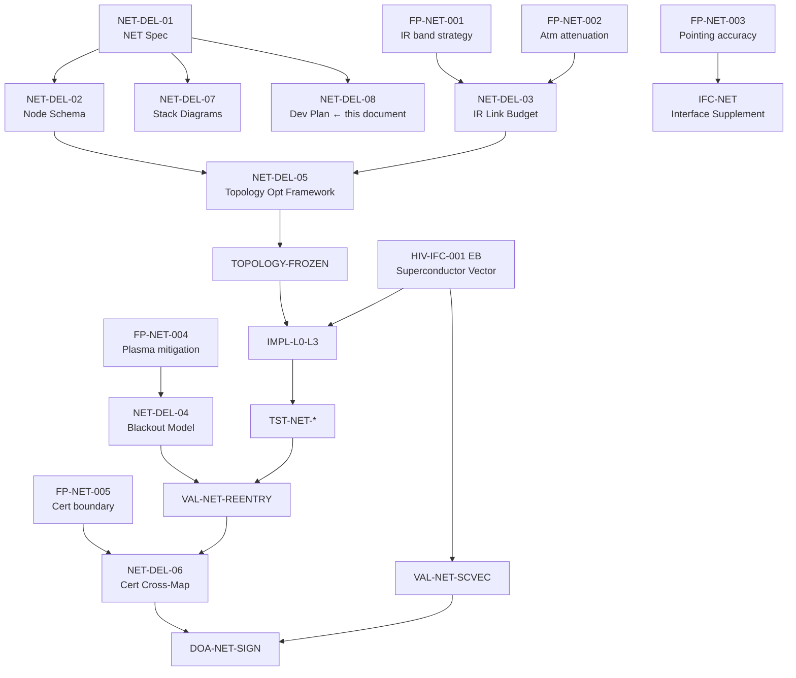

---
##############################################################################
# pluma-gai-net.yaml
# PLUMA-GAI NET — Performant Link Ubiquitous Map Architecture
# Ground–Aerospace Infrared Networks Integration Layer
##############################################################################

document_id: PLUMA-GAI-NET-001
document_type: network_architecture_extension
title: "PLUMA-GAI NET — Performant Link Ubiquitous Map Architecture"
subtitle: "Ground–Aerospace Infrared Networks"
lifecycle_stage: "System Integration Layer"
version: "0.1.0"
schema_version: "1.0.0"
status: draft
parent: PLUMA-GAI-001
last_updated: "2026-02-28T12:00:00Z"

purpose: >
  PLUMA-GAI NET is a network-centric extension of PLUMA-GAI introducing a
  high-performance, ubiquitous, infrared-augmented communication and sensing
  mesh spanning ground, air, and space. It is not merely a communication
  system; it is a mapped, governed, performance-bounded link architecture
  embedded into the programme lifecycle. The network is lifecycle-governed,
  not merely engineered.

one_line_definition: >
  PLUMA-GAI NET is a sovereign ground–air–space infrared mesh with lifecycle
  governance binding AMPEL360, GAIA, and ground infrastructure through a
  deterministic, performance-characterised, ubiquitous topological map of
  trust, capacity, and coherence.

##############################################################################
# 1  Architectural Positioning
##############################################################################

architectural_positioning:
  parent_architecture: PLUMA-GAI-001
  nature: fork_and_extension
  description: >
    PLUMA-GAI NET extends the two-node GAIA ↔ AMPEL360 governed channel into
    a full network architecture. It binds all three programme tiers through a
    mapped, infrared-augmented communication and sensing mesh.

  binds:
    - node: AMPEL360
      scope: "Aircraft + RSP (all flight regimes including re-entry)"
    - node: GAIA
      scope: "Satellite assets + quantum processing + UAS fleet"
    - node: GROUND
      scope: "Mission control, data centres, IR sensor grids"

##############################################################################
# 2  System Overview — Network Layers
##############################################################################

network_layers:

  - layer: 0
    name: "Physical"
    description: "IR emitters, detectors, optics, cryogenic sensors"
    elements:
      - IR emitters (MWIR / LWIR / NIR — see ir_strategy)
      - Infrared detectors and focal plane arrays
      - Optical terminals (space-to-ground, cross-link)
      - Cryogenic sensors (integrated with AMPEL360 LH₂ monitoring)

  - layer: 1
    name: "Link Protocol"
    description: "Optical modulation, forward error correction, framing"
    elements:
      - Optical modulation scheme (PPM / DPSK / coherent)
      - Forward Error Correction (FEC)
      - Frame synchronisation and link establishment

  - layer: 2
    name: "Integrity & Security"
    description: "Hash, signature, optional QKD — inherits from AMP-GAI-CORE"
    elements:
      - SHA3-512 integrity hashing
      - Digital signatures (ECDSA-P384 minimum)
      - QKD optional overlay (ETSI GS QKD 014)
    inherits_from: AMP-GAI-CORE

  - layer: 3
    name: "Deterministic Routing Map"
    description: "Latency-aware, trust-aware dynamic routing topology"
    elements:
      - Topological map (ubiquitous map — see net_node schema)
      - Latency-bounded path selection
      - Trust score-weighted routing decisions
      - Degradation-aware re-routing

  - layer: 4
    name: "Lifecycle Governance Binding"
    description: "PLUMA control — the novel layer making this lifecycle-governed"
    elements:
      - Phase-gated link certification (per PLUMA-GAI P000–P100)
      - Evidence-bound performance characterisation
      - Gating condition linkage (network-side)
      - DOA authority for network topology changes
    note: >
      Layer 4 is the architectural novelty. The network is lifecycle-governed:
      every link is certified, phase-gated, and evidence-bound.

  - layer: 5
    name: "Autonomy Interface"
    description: "AA-093 autonomy nodes operating over the NET"
    elements:
      - AA-093 bounded autonomy connections
      - Swarm / fleet coordination policies (GAIA-side)
      - Pre-loaded autonomy decisions for blackout periods
      - Fallback policy execution without network

##############################################################################
# 3  Ubiquitous Map Architecture
##############################################################################

ubiquitous_map:
  description: >
    "Ubiquitous Map" means: every node in the network is identified,
    geolocated (4D: space + time), envelope-bounded, and
    performance-characterised. It is a continuously updated topological
    map of trust, capacity, and coherence.

  node_properties:
    - identified           # unique node_id
    - geolocated_4d        # lat, lon, alt_km, epoch UTC
    - envelope_bounded     # performance_envelope with certified limits
    - performance_characterised  # latency, bandwidth, jitter, trust score

  update_frequency:
    description: "Map updates must be bounded and traceable"
    max_update_interval_s: 1     # for safety-relevant positions
    telemetry_push: true
    consensus_required: false     # advisory map; AMPEL authoritative on-board

  schema_ref: "NET_NODE.schema.json"

##############################################################################
# 4  Performance Model
##############################################################################

performance_model:

  parameters:
    - parameter: latency
      property: "Deterministic upper bound per link per regime"
      control: hard_maximum

    - parameter: bandwidth
      property: "Mode-dependent allocation"
      control: envelope_ceiling

    - parameter: jitter
      property: "Envelope-bounded"
      control: hard_maximum

    - parameter: packet_loss
      property: "Threshold-triggered degradation mode"
      control: degradation_trigger

    - parameter: thermal_noise
      property: "IR-calibrated compensation"
      control: calibration_model

  flight_regime_profiles:

    - regime: subsonic_civil
      description: "Normal civil flight below FL450"
      latency_ms_max: 150
      bandwidth_mbps_min: 200
      jitter_ms_max: 30
      ir_link_available: true
      blackout_risk: none

    - regime: high_altitude_cruise
      description: "High-altitude cruise above FL450 (stratosphere)"
      latency_ms_max: 200
      bandwidth_mbps_min: 100
      jitter_ms_max: 50
      ir_link_available: true
      blackout_risk: low
      note: "Reduced atmospheric attenuation; higher optical link margin"

    - regime: ascent_boost
      description: "Ascent and boost phase (RSP)"
      latency_ms_max: 100
      bandwidth_mbps_min: 50
      jitter_ms_max: 20
      ir_link_available: conditional
      blackout_risk: low_to_medium
      note: "Dynamic thermal environment; link acquisition may require re-pointing"

    - regime: re_entry_plasma
      description: "Re-entry plasma environment (RSP)"
      latency_ms_max: null       # blackout: no latency guarantee
      bandwidth_mbps_min: 0
      jitter_ms_max: null
      ir_link_available: false
      blackout_risk: critical
      degradation_state: 2       # AMPEL_LOCAL_CONTROL
      note: "Plasma blackout. Pre-loaded autonomy decisions required. See rsp_reentry_model."

    - regime: leo_crosslink
      description: "LEO satellite crosslink operations (GAIA)"
      latency_ms_max: 300
      bandwidth_mbps_min: 500
      jitter_ms_max: 100
      ir_link_available: true
      blackout_risk: low
      note: "Optical crosslinks; atmospheric attenuation absent in space segment"

##############################################################################
# 5  Infrared Strategy
##############################################################################

ir_strategy:

  wavelength_bands:
    - band: NIR
      range_um: "0.75–1.4"
      use_cases:
        - "Short-range optical communication links"
        - "Initial acquisition and tracking"
      atmospheric_window: good
      detector_technology: "InGaAs focal plane arrays"

    - band: SWIR
      range_um: "1.4–3.0"
      use_cases:
        - "Ground-to-air optical communications"
        - "Fuel cell anomaly signature detection"
        - "LH₂ micro-leak detection (2.7 µm absorption / emission band — upper SWIR)"
      atmospheric_window: moderate
      detector_technology: "Extended-InGaAs / HgCdTe"

    - band: MWIR
      range_um: "3.0–5.0"
      use_cases:
        - "Cryogenic thermal gradient mapping (LH₂ tank cold plume, 3–5 µm)"
        - "Engine exhaust and combustion thermal imaging"
        - "Broad-spectrum hydrogen flame detection (ancillary to 2.7 µm SWIR)"
      atmospheric_window: good
      detector_technology: "InSb / HgCdTe cooled arrays"

    - band: LWIR
      range_um: "8.0–14.0"
      use_cases:
        - "RSP re-entry heat envelope supervision (TPS)"
        - "Long-range environmental monitoring"
        - "Structural hot-spot detection"
      atmospheric_window: good
      detector_technology: "HgCdTe / microbolometer arrays"

  band_selection_policy: >
    Primary sensing: SWIR (2.7 µm) for LH₂ micro-leak detection;
    MWIR (3–5 µm) for cryo thermal mapping and exhaust imaging;
    LWIR (8–14 µm) for TPS / structural. Primary communication:
    NIR / SWIR for ground-air optical links. Selection is
    regime-dependent; band strategy is formally documented in
    IR_LINK_BUDGET.yaml (future deliverable).

  ampel360_applications:
    - "LH₂ tank micro-leak detection (SWIR 2.7 µm — hydrogen absorption / emission band)"
    - "Cryogenic thermal gradient mapping (MWIR 3–5 µm)"
    - "Fuel cell anomaly signatures (SWIR / MWIR)"
    - "RSP re-entry heat envelope supervision (LWIR 8–14 µm; TPS)"

  gaia_applications:
    - "Satellite optical crosslinks (NIR / SWIR directional)"
    - "Secure narrow-beam communications (NIR)"
    - "Anti-interference directional control (narrow FOV)"
    - "Earth observation thermal layer (LWIR; sat payload)"

  ir_dual_role:
    sensor_modality: true
    communication_modality: true
    note: >
      Infrared serves both as a sensor modality (detecting physical
      phenomena) and as a communication modality (carrying data). The
      lifecycle evidence chain must cover both roles for each function.

##############################################################################
# 6  Deterministic Fallback Doctrine
##############################################################################

fallback_doctrine:
  critical_rule: >
    AMPEL must remain safe without GAIA NET. The network is advisory to
    flight-critical operation; on-board AMPEL logic is never dependent on
    NET availability.

  degradation_states:

    - state: 0
      name: "FULL_NOMINAL"
      description: "Full IR + Classical + QKD"
      ir_link: operational
      classical_link: operational
      qkd: operational
      gaia_binding: full
      autonomy: full_advisory
      certification_status: pre_certified

    - state: 1
      name: "IR_DEGRADED"
      description: "IR degraded; classical secure link operational"
      ir_link: degraded
      classical_link: operational
      qkd: conditional
      gaia_binding: advisory_only
      autonomy: advisory_only
      degradation_trigger:
        - ir_thermal_noise_exceeded
        - atmospheric_attenuation_threshold
        - optical_terminal_reacquisition
      certification_status: pre_certified

    - state: 2
      name: "LOCAL_AMPEL_AUTONOMY"
      description: "Network unavailable; local AMPEL autonomy only"
      ir_link: unavailable
      classical_link: unavailable
      qkd: unavailable
      gaia_binding: none
      autonomy: local_certified_only
      degradation_trigger:
        - channel_loss
        - plasma_blackout
        - coherence_loss
      certification_status: pre_certified

    - state: 3
      name: "SAFE_ENVELOPE_HOLD"
      description: "Safe envelope hold — ultimate fallback"
      ir_link: unavailable
      classical_link: unavailable
      qkd: unavailable
      gaia_binding: none
      autonomy: none
      degradation_trigger:
        - integrity_fail
        - anomaly_unresolved
        - operator_commanded
      certification_status: pre_certified
      note: >
        AMPEL enters its certified safe envelope. No external inputs accepted.
        This state must be recoverable only by DOA-authorised operator action.

##############################################################################
# 7  RSP Re-entry Integration
##############################################################################

rsp_reentry_model:
  description: >
    During re-entry the plasma sheath causes RF and optical link blackout.
    PLUMA-GAI NET must predict blackout windows, switch routing topology,
    and pre-load autonomy decisions.

  blackout_prediction:
    method: "Aerothermodynamic model coupled with link budget simulation"
    inputs:
      - re_entry_trajectory_vector
      - vehicle_geometry_and_orientation
      - atmospheric_density_profile
      - ir_wavelength_band_attenuation_vs_plasma_density
    outputs:
      - blackout_start_time_utc
      - blackout_duration_s
      - recovery_time_utc
      - confidence_interval
    model_ref: "RE_ENTRY_BLACKOUT_MODEL.yaml"  # future deliverable

  topology_switching:
    description: >
      Before predicted blackout window, routing topology is pre-configured
      to State 2 (LOCAL_AMPEL_AUTONOMY). All GAIA advisory functions are
      suspended. Transition must occur with margin before blackout.
    pre_transition_margin_s: 30
    triggers:
      - blackout_predicted_within_margin
      - ir_signal_attenuation_threshold_crossed

  autonomy_preloading:
    description: >
      GAIA computes and uploads a bounded autonomy decision package to
      AMPEL360 before the blackout window. The package contains pre-certified
      contingency decision trees valid for the predicted blackout duration.
    upload_deadline_before_blackout_s: 60
    package_validity_s_max: 3600
    aa_093_ref: "AA-093-RSP-REENTRY"
    coupling_required:
      - aerothermodynamic_models
      - link_budget_simulations
      - autonomy_envelope_preparation

##############################################################################
# 8  Critical Technical Fork Points
##############################################################################

fork_points:
  description: >
    Formal definition of these fork points is required to complete the
    PLUMA-GAI NET specification. Each is an open engineering question that
    must be resolved and evidence-bound before certification.
  items:
    - id: FP-NET-001
      title: "IR wavelength band strategy (MWIR vs LWIR vs NIR)"
      status: open
      description: >
        Formal selection of wavelength bands per function and regime.
        Must be resolved in IR_LINK_BUDGET.yaml with atmospheric attenuation
        data and detector sensitivity characterisation.
      responsible: Design Authority

    - id: FP-NET-002
      title: "Atmospheric attenuation compensation model"
      status: open
      description: >
        Model for compensating IR attenuation under varying atmospheric
        conditions (humidity, cloud, aerosol loading). Must cover all
        flight regimes including re-entry.
      responsible: Analysis

    - id: FP-NET-003
      title: "Optical terminal pointing accuracy limits"
      status: open
      description: >
        Maximum acceptable pointing error for each optical link class
        (ground-air, air-space, crosslink). Drives optical terminal
        mechanical design and control loop requirements.
      responsible: Design Authority

    - id: FP-NET-004
      title: "Plasma interference mitigation for RSP"
      status: open
      description: >
        Strategy and evidence for maintaining integrity verification
        capability through or around the plasma blackout envelope.
        Coupled with aerothermodynamic models and link budget.
      responsible: Safety

    - id: FP-NET-005
      title: "Certification boundary: network advisory vs flight-critical loop"
      status: open
      description: >
        Formal demarcation of which NET outputs may influence flight-critical
        functions and which are advisory only. Maps to DAL allocation and
        governs AMPEL360 execution rights.
      responsible: DOA

##############################################################################
# 9  Deliverables
##############################################################################

deliverables:
  - id: NET-DEL-01
    title: "PLUMA-GAI NET Specification (normative)"
    file: "00-PROGRAM/PLUMA-GAI/NET/pluma-gai-net.yaml"
    content: "Layer stack, performance model, IR strategy, fallback doctrine, RSP model, fork points"
    status: draft

  - id: NET-DEL-02
    title: "Net Node Schema"
    file: "00-PROGRAM/PLUMA-GAI/NET/NET_NODE.schema.json"
    content: "JSON Schema for the net_node data structure (ubiquitous map node)"
    status: draft

  - id: NET-DEL-03
    title: "IR Link Budget Parametric Model"
    file: "00-PROGRAM/PLUMA-GAI/NET/IR_LINK_BUDGET.yaml"
    content: "Band selection, atmospheric attenuation, link margin calculations"
    status: planned

  - id: NET-DEL-04
    title: "Re-entry Blackout Predictive Model"
    file: "00-PROGRAM/PLUMA-GAI/NET/RE_ENTRY_BLACKOUT_MODEL.yaml"
    content: "Aerothermodynamic coupling, window prediction, topology switching"
    status: planned

  - id: NET-DEL-05
    title: "Ground-Space Topology Optimisation Framework"
    file: "00-PROGRAM/PLUMA-GAI/NET/TOPOLOGY_OPT.yaml"
    content: "Trust-latency-aware routing, optimisation objectives, GAIA integration"
    status: planned

  - id: NET-DEL-06
    title: "Certification Cross-Mapping"
    file: "00-PROGRAM/PLUMA-GAI/NET/CERT_CROSS_MAP.yaml"
    content: "CS-25 + spaceflight special conditions + EU AI Act Article 6 cross-mapping"
    status: planned

  - id: NET-DEL-07
    title: "Stack Diagrams & Topological Network Graphics"
    file: "00-PROGRAM/PLUMA-GAI/NET/STACK-DIAGRAMS.md"
    content: >
      Mermaid diagrams: canonical PLUMA-GAI stack, NET layer stack (L0–L5),
      ground-air-space node topology with IR link types, event-boundary /
      superconductor vector channel, degradation state machine (States 0–3),
      full integration map (lifecycle → thread → NET → topology).
    status: draft

  - id: NET-DEL-08
    title: "Development Plan"
    file: "00-PROGRAM/PLUMA-GAI/NET/DEV-PLAN.md"
    content: >
      Phased development roadmap: milestone overview (P010–P070), per-phase
      deliverables table with owners and statuses, fork-point resolution
      schedule (FP-NET-001 to 005), dependency graph (Mermaid), risk register,
      and governance table.
    status: draft
---


# PLUMA-GAI-NET — Development Plan

**Document ID:** PLUMA-GAI-NET-DEVPLAN-001  
**Version:** 0.1.0  
**Status:** Draft  
**Parent:** PLUMA-GAI-NET-001 ([pluma-gai-net.yaml](pluma-gai-net.yaml))  
**Related:** [`STACK-DIAGRAMS.md`](STACK-DIAGRAMS.md)  
**Last Updated:** 2026-04-02

---

## 1. Purpose

This document defines the phased development roadmap for PLUMA-GAI NET — the
ground–aerospace infrared mesh that extends PLUMA-GAI into a full network
architecture.  It maps deliverables to PLUMA-GAI lifecycle phases, assigns
owners, states open fork points, and tracks dependencies.

---

## 2. Milestone Overview

```
Phase     Milestone                            Target Readiness
──────────────────────────────────────────────────────────────
P010      NET-M01  Requirements Baseline       R-SYS-NET frozen
P020      NET-M02  Safety Assessment           FHA-NET + PSSA-NET complete
P030      NET-M03  Architecture Baseline       Layer stack + interface specs frozen
P030      NET-M04  IR Link Budget              FP-NET-001 / FP-NET-002 resolved
P030      NET-M05  Node Schema & Topology      Ubiquitous map schema certified
P040      NET-M06  Protocol Implementation     L0–L3 implementation packages
P040      NET-M07  Superconductor Vector Impl  HIV-IFC-001 event-boundary mode coded
P050      NET-M08  Verification Campaign       Link budget · latency · blackout tests
P060      NET-M09  Re-entry Blackout Valid.    RSP plasma model + pre-load validated
P070      NET-M10  Network Certification       DOA sign-off on lifecycle-governed NET
```

---

## 3. Phased Deliverables Roadmap

### Phase P010 — Requirements Baseline

| ID | Deliverable | Owner | Status | Dependency |
|----|------------|-------|--------|------------|
| NET-DEL-01 | PLUMA-GAI NET Specification (normative) | Design Authority | draft | — |
| NET-DEL-02 | Net Node Schema | Design Authority | draft | NET-DEL-01 |
| R-SYS-NET | System Requirements Baseline | Systems Engineering | planned | NET-DEL-01 |

**Exit gate P010→P020:** R-SYS-NET frozen; all FP-NET-XXX items identified and
risk-classified; NET architecture agreed by DOA.

---

### Phase P020 — Safety Assessment

| ID | Deliverable | Owner | Status | Dependency |
|----|------------|-------|--------|------------|
| FHA-NET | Functional Hazard Assessment — NET layer | Safety | planned | R-SYS-NET |
| PSSA-NET | Preliminary System Safety Assessment — NET | Safety | planned | FHA-NET |
| DAL-NET | DAL Allocation — NET functions | DOA | planned | PSSA-NET |

**Fork points that must be resolved in P020:**

| Fork Point | Issue | Owner | Resolution Method |
|-----------|-------|-------|------------------|
| FP-NET-005 | Cert boundary: network advisory vs flight-critical loop | DOA | DAL allocation review + PSSA |

**Exit gate P020→P030:** FHA-NET approved; DAL-NET agreed; FP-NET-005 resolved.

---

### Phase P030 — Architecture Baseline

| ID | Deliverable | Owner | Status | Dependency |
|----|------------|-------|--------|------------|
| NET-DEL-03 | IR Link Budget Parametric Model | Analysis | planned | FP-NET-001, FP-NET-002 resolved |
| NET-DEL-04 | Re-entry Blackout Predictive Model | Analysis / Safety | planned | FP-NET-004 resolved |
| NET-DEL-05 | Ground-Space Topology Optimisation Framework | Design Authority | planned | NET-DEL-02, NET-DEL-03 |
| NET-DEL-06 | Certification Cross-Mapping | DOA | planned | DAL-NET |
| NET-DEL-07 | Stack Diagrams & Topological Network Graphics | Design Authority | **draft** | NET-DEL-01 |
| NET-DEL-08 | Development Plan (this document) | Programme | **draft** | NET-DEL-01 |
| IFC-NET | Interface Control Supplement (NET ↔ AMP-GAI-CORE) | Design Authority | planned | NET-DEL-01, AMP-GAI-ICD |
| TOPOLOGY-FROZEN | Ubiquitous map topology frozen (node catalogue) | Design Authority | planned | NET-DEL-05 |

**Fork points that must be resolved in P030:**

| Fork Point | Issue | Owner | Resolution Method |
|-----------|-------|-------|------------------|
| FP-NET-001 | IR wavelength band strategy (MWIR vs LWIR vs NIR) | Design Authority | IR_LINK_BUDGET.yaml analysis |
| FP-NET-002 | Atmospheric attenuation compensation model | Analysis | Parametric model + validation data |
| FP-NET-003 | Optical terminal pointing accuracy limits | Design Authority | Trade study + test plan |
| FP-NET-004 | Plasma interference mitigation for RSP | Safety | Aerothermodynamic coupling study |

**Exit gate P030→P040:** all FP-NET-001–005 resolved; IR link budget approved;
topology frozen; IFC-NET signed by DOA.

---

### Phase P040 — Implementation

| ID | Deliverable | Owner | Status | Dependency |
|----|------------|-------|--------|------------|
| IMPL-L0-L3 | Layer 0–3 implementation packages | SW Lead | planned | P030 frozen |
| IMPL-HIV-IFC-001-EB | HIV-IFC-001 event-boundary (superconductor vector) mode | SW Lead | planned | H.I.V. spec frozen |
| IMPL-BLACKOUT-PRE | Re-entry pre-load autonomy package (AA-093-RSP-REENTRY) | Autonomy | planned | NET-DEL-04 |
| IMPL-TEFF-MONITOR | T_eff monitoring pipeline | Data Gov | planned | IMPL-L0-L3 |

**Superconductor vector channel implementation notes:**

```
HIV-IFC-001 event-boundary mode (INV-HIV-SV):
  - Input: energy_state_hash (sha3-512), data_state_hash (sha3-512)
  - Output: VSED with boundary_mode = true, carrier_state_hash
  - Constraint: MUST NOT carry individual flow fields when boundary_mode = true
  - KPI: T_eff_boundary = verified / total × lim(latency→0) = ∞
```

---

### Phase P050 — Verification

| ID | Deliverable | Owner | Status | Dependency |
|----|------------|-------|--------|------------|
| TST-NET-LATENCY | Latency compliance test per regime | QA | planned | IMPL-L0-L3 |
| TST-NET-IRLINK | IR link budget validation (all bands) | QA | planned | NET-DEL-03 |
| TST-NET-FALLBACK | Degradation state machine test (States 0–3) | QA | planned | IMPL-L0-L3 |
| TST-NET-TEFF | T_eff monotonicity test (INV-HIV-TEFF + INV-HIV-SV) | QA | planned | IMPL-TEFF-MONITOR |
| TST-NET-QKD | QKD overlay functional test | Security | planned | IMPL-L0-L3 |

**Verification objectives per regime:**

| Regime | Latency target | Bandwidth target | IR availability |
|--------|---------------|-----------------|-----------------|
| Subsonic civil | ≤ 150 ms | ≥ 200 Mbps | operational |
| High-altitude cruise | ≤ 200 ms | ≥ 100 Mbps | operational |
| Ascent/boost | ≤ 100 ms | ≥ 50 Mbps | conditional |
| Re-entry plasma | n/a (blackout) | 0 | unavailable → State 2 |
| LEO crosslink | ≤ 300 ms | ≥ 500 Mbps | operational |

---

### Phase P060 — Validation

| ID | Deliverable | Owner | Status | Dependency |
|----|------------|-------|--------|------------|
| VAL-NET-REENTRY | Re-entry blackout model validation (HIL/SIL) | V&V | planned | NET-DEL-04, TST-NET-FALLBACK |
| VAL-NET-TOPO | Topology optimisation validation (ops scenarios) | V&V | planned | NET-DEL-05 |
| VAL-NET-SCVEC | Superconductor vector channel integration validation | V&V | planned | IMPL-HIV-IFC-001-EB |
| VAL-NET-T_EFF | End-to-end T_eff target validation | V&V | planned | IMPL-TEFF-MONITOR |

---

### Phase P070 — Certification

| ID | Deliverable | Owner | Status | Dependency |
|----|------------|-------|--------|------------|
| NET-DEL-06 | Certification Cross-Mapping (NET) | DOA | planned | All P050–P060 evidence |
| DOA-NET-SIGN | DOA sign-off — PLUMA-GAI NET (lifecycle-governed) | DOA | planned | NET-DEL-06 |

---

## 4. Open Fork Points — Resolution Schedule

| ID | Title | Target Phase | Status |
|----|-------|-------------|--------|
| FP-NET-001 | IR wavelength band strategy | P030 | **open** |
| FP-NET-002 | Atmospheric attenuation compensation model | P030 | **open** |
| FP-NET-003 | Optical terminal pointing accuracy limits | P030 | **open** |
| FP-NET-004 | Plasma interference mitigation for RSP | P030 | **open** |
| FP-NET-005 | Certification boundary: advisory vs flight-critical | P020 | **open** |

All five fork points are blocking P030→P040 progression.  They must be resolved
and evidence-bound before the architecture baseline is frozen.

---

## 5. Dependency Graph



---

## 6. Risk Register

| ID | Risk | Probability | Impact | Mitigation |
|----|------|------------|--------|-----------|
| R-NET-01 | IR atmospheric attenuation exceeds model bounds at re-entry | Medium | High | Early coupled aerothermodynamic + IR model validation (P030) |
| R-NET-02 | Optical terminal pointing accuracy insufficient for crosslink | Medium | High | Trade study in P030; TRL assessment before P040 |
| R-NET-03 | Plasma blackout duration underestimated (RSP safety) | Low | Critical | Conservative margin (+100%) in blackout model; AMPEL-autonomous fallback certified independently |
| R-NET-04 | QKD key refresh rate insufficient at LEO crosslink latency | Low | Medium | ETSI GS QKD 014 compliance check in P030 |
| R-NET-05 | T_eff boundary mode (superconductor vector) not achievable without precision timing | Low | Medium | Timing requirement captured in INV-HIV-SV; test in TST-NET-TEFF |

---

## 7. Governance

| Decision | Authority | Phase Gate |
|---------|-----------|-----------|
| Fork point resolution | Design Authority | P030 |
| DAL allocation | DOA | P020 |
| Architecture freeze | Design Authority + DOA | P030→P040 |
| Certification cross-map acceptance | DOA | P070 |
| Topology change (post-freeze) | DOA (change control) | P100 |

---

## 8. References

- PLUMA-GAI NET specification: [`pluma-gai-net.yaml`](pluma-gai-net.yaml)
- Stack diagrams: [`STACK-DIAGRAMS.md`](STACK-DIAGRAMS.md)
- PLUMA-GAI lifecycle phases: [`../README.md`](../README.md) §4
- H.I.V. superconductor vector channel: [`../H.I.V.md`](../H.I.V.md) §4.3
- TranshidreOHs event boundary: [`../TranshidreOHs.md`](../TranshidreOHs.md) §6
- AA-093 autonomy assurance template: [`../AA-093-TEMPLATE.gsn.yaml`](../AA-093-TEMPLATE.gsn.yaml)
- AMP-GAI-ICD: [`../AMP-GAI-ICD-v0.1.0.yaml`](../AMP-GAI-ICD-v0.1.0.yaml)
