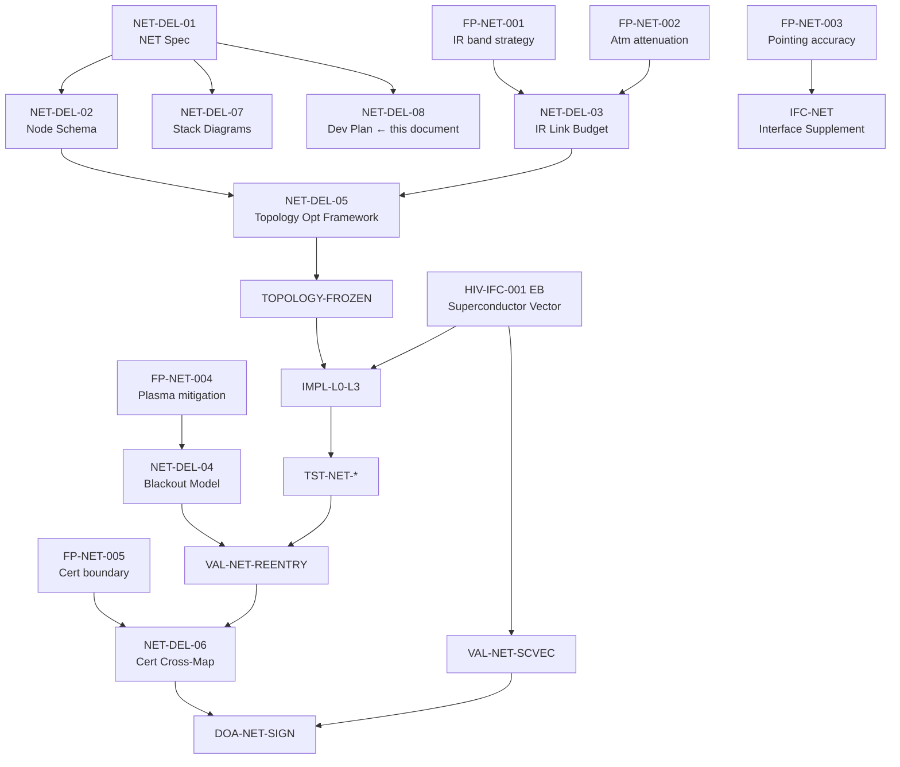

# PLUMA-GAI-NET — Development Plan

**Document ID:** PLUMA-GAI-NET-DEVPLAN-001  
**Version:** 0.1.0  
**Status:** Draft  
**Parent:** PLUMA-GAI-NET-001 ([pluma-gai-net.yaml](pluma-gai-net.yaml))  
**Related:** [`STACK-DIAGRAMS.md`](STACK-DIAGRAMS.md)  
**Last Updated:** 2026-04-02

---

## 1. Purpose

This document defines the phased development roadmap for PLUMA-GAI NET — the
ground–aerospace infrared mesh that extends PLUMA-GAI into a full network
architecture.  It maps deliverables to PLUMA-GAI lifecycle phases, assigns
owners, states open fork points, and tracks dependencies.

---

## 2. Milestone Overview

```
Phase     Milestone                            Target Readiness
──────────────────────────────────────────────────────────────
P010      NET-M01  Requirements Baseline       R-SYS-NET frozen
P020      NET-M02  Safety Assessment           FHA-NET + PSSA-NET complete
P030      NET-M03  Architecture Baseline       Layer stack + interface specs frozen
P030      NET-M04  IR Link Budget              FP-NET-001 / FP-NET-002 resolved
P030      NET-M05  Node Schema & Topology      Ubiquitous map schema certified
P040      NET-M06  Protocol Implementation     L0–L3 implementation packages
P040      NET-M07  Superconductor Vector Impl  HIV-IFC-001 event-boundary mode coded
P050      NET-M08  Verification Campaign       Link budget · latency · blackout tests
P060      NET-M09  Re-entry Blackout Valid.    RSP plasma model + pre-load validated
P070      NET-M10  Network Certification       DOA sign-off on lifecycle-governed NET
```

---

## 3. Phased Deliverables Roadmap

### Phase P010 — Requirements Baseline

| ID | Deliverable | Owner | Status | Dependency |
|----|------------|-------|--------|------------|
| NET-DEL-01 | PLUMA-GAI NET Specification (normative) | Design Authority | draft | — |
| NET-DEL-02 | Net Node Schema | Design Authority | draft | NET-DEL-01 |
| R-SYS-NET | System Requirements Baseline | Systems Engineering | planned | NET-DEL-01 |

**Exit gate P010→P020:** R-SYS-NET frozen; all FP-NET-XXX items identified and
risk-classified; NET architecture agreed by DOA.

---

### Phase P020 — Safety Assessment

| ID | Deliverable | Owner | Status | Dependency |
|----|------------|-------|--------|------------|
| FHA-NET | Functional Hazard Assessment — NET layer | Safety | planned | R-SYS-NET |
| PSSA-NET | Preliminary System Safety Assessment — NET | Safety | planned | FHA-NET |
| DAL-NET | DAL Allocation — NET functions | DOA | planned | PSSA-NET |

**Fork points that must be resolved in P020:**

| Fork Point | Issue | Owner | Resolution Method |
|-----------|-------|-------|------------------|
| FP-NET-005 | Cert boundary: network advisory vs flight-critical loop | DOA | DAL allocation review + PSSA |

**Exit gate P020→P030:** FHA-NET approved; DAL-NET agreed; FP-NET-005 resolved.

---

### Phase P030 — Architecture Baseline

| ID | Deliverable | Owner | Status | Dependency |
|----|------------|-------|--------|------------|
| NET-DEL-03 | IR Link Budget Parametric Model | Analysis | planned | FP-NET-001, FP-NET-002 resolved |
| NET-DEL-04 | Re-entry Blackout Predictive Model | Analysis / Safety | planned | FP-NET-004 resolved |
| NET-DEL-05 | Ground-Space Topology Optimisation Framework | Design Authority | planned | NET-DEL-02, NET-DEL-03 |
| NET-DEL-06 | Certification Cross-Mapping | DOA | planned | DAL-NET |
| NET-DEL-07 | Stack Diagrams & Topological Network Graphics | Design Authority | **draft** | NET-DEL-01 |
| NET-DEL-08 | Development Plan (this document) | Programme | **draft** | NET-DEL-01 |
| IFC-NET | Interface Control Supplement (NET ↔ AMP-GAI-CORE) | Design Authority | planned | NET-DEL-01, AMP-GAI-ICD |
| TOPOLOGY-FROZEN | Ubiquitous map topology frozen (node catalogue) | Design Authority | planned | NET-DEL-05 |

**Fork points that must be resolved in P030:**

| Fork Point | Issue | Owner | Resolution Method |
|-----------|-------|-------|------------------|
| FP-NET-001 | IR wavelength band strategy (MWIR vs LWIR vs NIR) | Design Authority | IR_LINK_BUDGET.yaml analysis |
| FP-NET-002 | Atmospheric attenuation compensation model | Analysis | Parametric model + validation data |
| FP-NET-003 | Optical terminal pointing accuracy limits | Design Authority | Trade study + test plan |
| FP-NET-004 | Plasma interference mitigation for RSP | Safety | Aerothermodynamic coupling study |

**Exit gate P030→P040:** all FP-NET-001–005 resolved; IR link budget approved;
topology frozen; IFC-NET signed by DOA.

---

### Phase P040 — Implementation

| ID | Deliverable | Owner | Status | Dependency |
|----|------------|-------|--------|------------|
| IMPL-L0-L3 | Layer 0–3 implementation packages | SW Lead | planned | P030 frozen |
| IMPL-HIV-IFC-001-EB | HIV-IFC-001 event-boundary (superconductor vector) mode | SW Lead | planned | H.I.V. spec frozen |
| IMPL-BLACKOUT-PRE | Re-entry pre-load autonomy package (AA-093-RSP-REENTRY) | Autonomy | planned | NET-DEL-04 |
| IMPL-TEFF-MONITOR | T_eff monitoring pipeline | Data Gov | planned | IMPL-L0-L3 |

**Superconductor vector channel implementation notes:**

```
HIV-IFC-001 event-boundary mode (INV-HIV-SV):
  - Input: energy_state_hash (sha3-512), data_state_hash (sha3-512)
  - Output: VSED with boundary_mode = true, carrier_state_hash
  - Constraint: MUST NOT carry individual flow fields when boundary_mode = true
  - KPI: T_eff_boundary = verified / total × lim(latency→0) = ∞
```

---

### Phase P050 — Verification

| ID | Deliverable | Owner | Status | Dependency |
|----|------------|-------|--------|------------|
| TST-NET-LATENCY | Latency compliance test per regime | QA | planned | IMPL-L0-L3 |
| TST-NET-IRLINK | IR link budget validation (all bands) | QA | planned | NET-DEL-03 |
| TST-NET-FALLBACK | Degradation state machine test (States 0–3) | QA | planned | IMPL-L0-L3 |
| TST-NET-TEFF | T_eff monotonicity test (INV-HIV-TEFF + INV-HIV-SV) | QA | planned | IMPL-TEFF-MONITOR |
| TST-NET-QKD | QKD overlay functional test | Security | planned | IMPL-L0-L3 |

**Verification objectives per regime:**

| Regime | Latency target | Bandwidth target | IR availability |
|--------|---------------|-----------------|-----------------|
| Subsonic civil | ≤ 150 ms | ≥ 200 Mbps | operational |
| High-altitude cruise | ≤ 200 ms | ≥ 100 Mbps | operational |
| Ascent/boost | ≤ 100 ms | ≥ 50 Mbps | conditional |
| Re-entry plasma | n/a (blackout) | 0 | unavailable → State 2 |
| LEO crosslink | ≤ 300 ms | ≥ 500 Mbps | operational |

---

### Phase P060 — Validation

| ID | Deliverable | Owner | Status | Dependency |
|----|------------|-------|--------|------------|
| VAL-NET-REENTRY | Re-entry blackout model validation (HIL/SIL) | V&V | planned | NET-DEL-04, TST-NET-FALLBACK |
| VAL-NET-TOPO | Topology optimisation validation (ops scenarios) | V&V | planned | NET-DEL-05 |
| VAL-NET-SCVEC | Superconductor vector channel integration validation | V&V | planned | IMPL-HIV-IFC-001-EB |
| VAL-NET-T_EFF | End-to-end T_eff target validation | V&V | planned | IMPL-TEFF-MONITOR |

---

### Phase P070 — Certification

| ID | Deliverable | Owner | Status | Dependency |
|----|------------|-------|--------|------------|
| NET-DEL-06 | Certification Cross-Mapping (NET) | DOA | planned | All P050–P060 evidence |
| DOA-NET-SIGN | DOA sign-off — PLUMA-GAI NET (lifecycle-governed) | DOA | planned | NET-DEL-06 |

---

## 4. Open Fork Points — Resolution Schedule

| ID | Title | Target Phase | Status |
|----|-------|-------------|--------|
| FP-NET-001 | IR wavelength band strategy | P030 | **open** |
| FP-NET-002 | Atmospheric attenuation compensation model | P030 | **open** |
| FP-NET-003 | Optical terminal pointing accuracy limits | P030 | **open** |
| FP-NET-004 | Plasma interference mitigation for RSP | P030 | **open** |
| FP-NET-005 | Certification boundary: advisory vs flight-critical | P020 | **open** |

All five fork points are blocking P030→P040 progression.  They must be resolved
and evidence-bound before the architecture baseline is frozen.

---

## 5. Dependency Graph



---

## 6. Risk Register

| ID | Risk | Probability | Impact | Mitigation |
|----|------|------------|--------|-----------|
| R-NET-01 | IR atmospheric attenuation exceeds model bounds at re-entry | Medium | High | Early coupled aerothermodynamic + IR model validation (P030) |
| R-NET-02 | Optical terminal pointing accuracy insufficient for crosslink | Medium | High | Trade study in P030; TRL assessment before P040 |
| R-NET-03 | Plasma blackout duration underestimated (RSP safety) | Low | Critical | Conservative margin (+100%) in blackout model; AMPEL-autonomous fallback certified independently |
| R-NET-04 | QKD key refresh rate insufficient at LEO crosslink latency | Low | Medium | ETSI GS QKD 014 compliance check in P030 |
| R-NET-05 | T_eff boundary mode (superconductor vector) not achievable without precision timing | Low | Medium | Timing requirement captured in INV-HIV-SV; test in TST-NET-TEFF |

---

## 7. Governance

| Decision | Authority | Phase Gate |
|---------|-----------|-----------|
| Fork point resolution | Design Authority | P030 |
| DAL allocation | DOA | P020 |
| Architecture freeze | Design Authority + DOA | P030→P040 |
| Certification cross-map acceptance | DOA | P070 |
| Topology change (post-freeze) | DOA (change control) | P100 |

---

## 8. References

- PLUMA-GAI NET specification: [`pluma-gai-net.yaml`](pluma-gai-net.yaml)
- Stack diagrams: [`STACK-DIAGRAMS.md`](STACK-DIAGRAMS.md)
- PLUMA-GAI lifecycle phases: [`../README.md`](../README.md) §4
- H.I.V. superconductor vector channel: [`../H.I.V.md`](../H.I.V.md) §4.3
- TranshidreOHs event boundary: [`../TranshidreOHs.md`](../TranshidreOHs.md) §6
- AA-093 autonomy assurance template: [`../AA-093-TEMPLATE.gsn.yaml`](../AA-093-TEMPLATE.gsn.yaml)
- AMP-GAI-ICD: [`../AMP-GAI-ICD-v0.1.0.yaml`](../AMP-GAI-ICD-v0.1.0.yaml)
