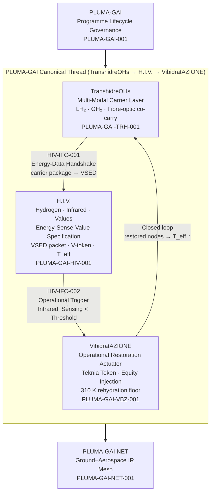
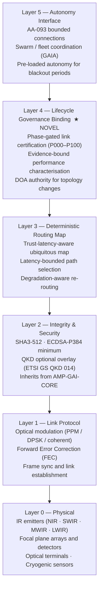
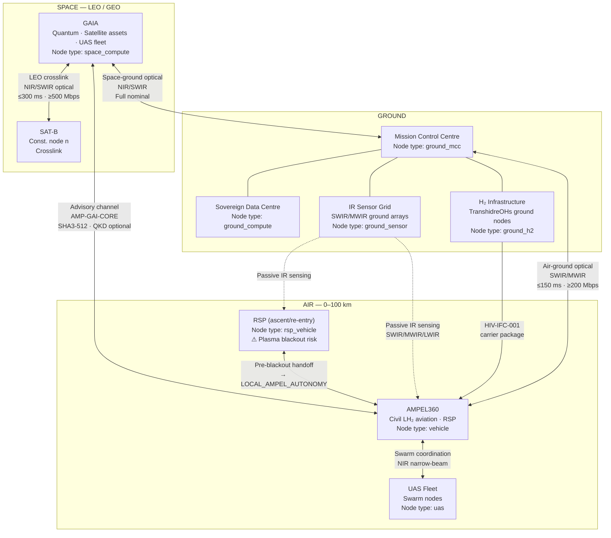
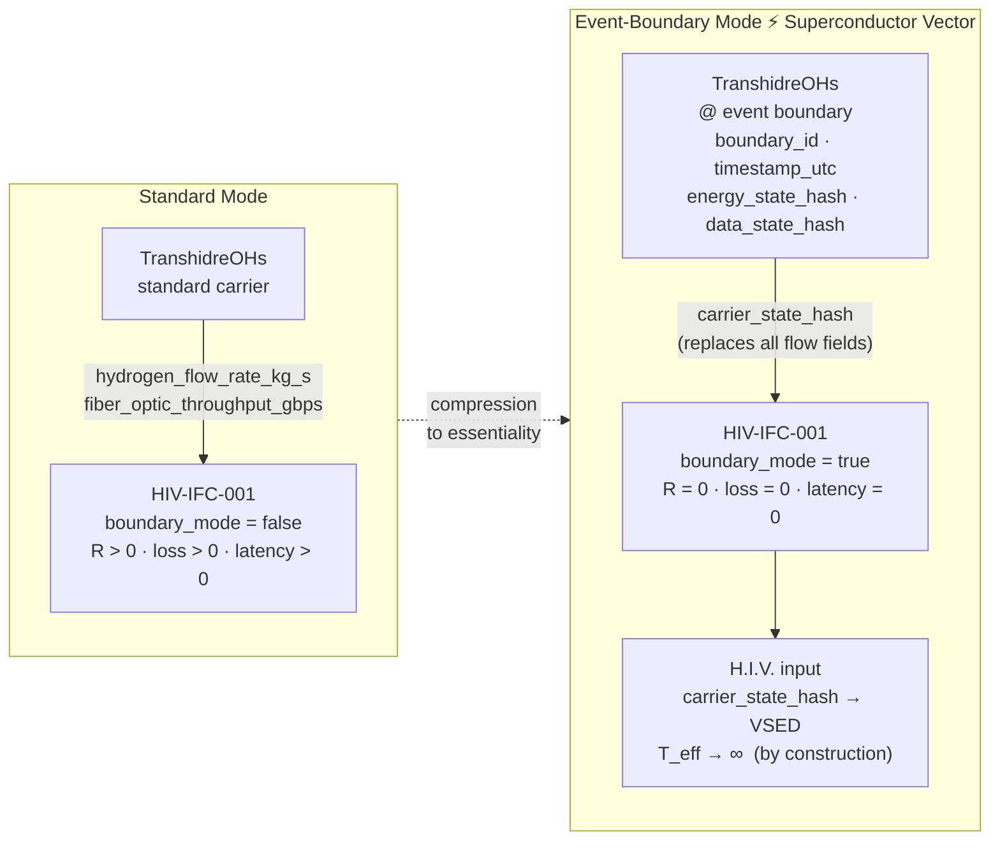
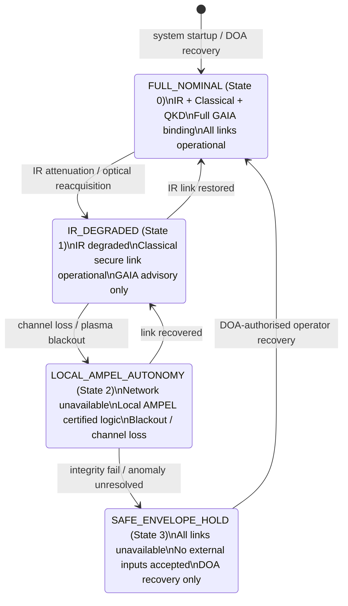
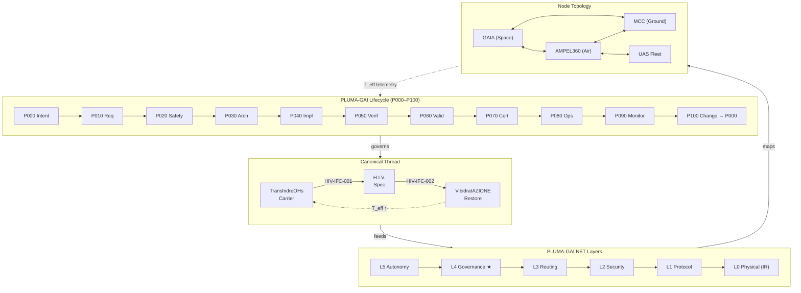

# PLUMA-GAI-NET — Stack Diagrams & Topological Network Graphics

**Document ID:** PLUMA-GAI-NET-DIAG-001  
**Version:** 0.1.0  
**Status:** Draft  
**Parent:** PLUMA-GAI-NET-001 ([pluma-gai-net.yaml](pluma-gai-net.yaml))  
**Related:** [`../H.I.V.md`](../H.I.V.md) · [`../TranshidreOHs.md`](../TranshidreOHs.md) · [`../VibidratAZIONE.md`](../VibidratAZIONE.md)  
**Last Updated:** 2026-04-02

---

## 1. PLUMA-GAI Canonical Stack

The canonical programme stack shows the three-layer PLUMA-GAI thread embedded
within the parent lifecycle architecture and feeding forward to the NET layer.



---

## 2. PLUMA-GAI-NET Layer Stack (L0–L5)

The six-layer NET architecture, with Layer 4 (Lifecycle Governance Binding) as
the novel element distinguishing this from a standard network stack.



### IR Band Allocation (Layer 0)

```
  NIR   0.75–1.4 µm  ──── Short-range comms · acquisition/tracking
  SWIR  1.4–3.0 µm   ──── Ground-air comms · LH₂ leak detect (2.7 µm)
  MWIR  3.0–5.0 µm   ──── Cryo thermal mapping · exhaust imaging
  LWIR  8.0–14.0 µm  ──── RSP TPS supervision · structural hot-spots
```

---

## 3. Topological Network — Ground · Air · Space

The three-tier ubiquitous map node topology with link types and IR bands.



### Ubiquitous Map Node Properties

Every node in the topology is characterised by four mandatory properties:

```
node_id          ── unique identifier (string)
geolocation_4d   ── lat · lon · alt_km · epoch_utc  (updated ≤ 1 s for safety nodes)
performance_envelope
  ├── latency_ms_max
  ├── bandwidth_mbps_min
  ├── jitter_ms_max
  └── trust_score      (0.0 – 1.0)
ir_emission_profile
  ├── band            (NIR / SWIR / MWIR / LWIR)
  └── t_eff_kelvin    ── physical ground truth; cannot be falsified
```

---

## 4. Event Boundary / Superconductor Vector Channel

Illustrates the transition from standard carrier mode to event-boundary
(superconductor vector) mode on HIV-IFC-001.



**T_eff formula collapse at event boundary:**

```
Standard:   T_eff = (verified / total) × (1 / mean_latency_s)
Boundary:   T_eff = (verified / total) × lim(latency → 0) = ∞
```

INV-HIV-SV enforces: when `boundary_mode = true`, channel MUST carry
`carrier_state_hash` and MUST NOT carry individual flow fields.

---

## 5. Degradation State Machine

The four-state deterministic fallback doctrine for PLUMA-GAI NET.



**Pre-entry transition rule (RSP re-entry):**

```
T − 60 s  ──  GAIA uploads bounded autonomy decision package to AMPEL360
T − 30 s  ──  Routing pre-configured to State 2 (LOCAL_AMPEL_AUTONOMY)
T  0 s    ──  Plasma blackout begins (RF + optical blocked)
T + Δ s   ──  Blackout clears; link recovery sequence starts → State 1
```

---

## 6. Full PLUMA-GAI-NET Integration Map

Complete integration picture: programme lifecycle, canonical thread, network
layers, and node topology — one diagram.



---

## 7. References

- PLUMA-GAI-NET specification: [`pluma-gai-net.yaml`](pluma-gai-net.yaml)
- Canonical thread specifications: [`../TranshidreOHs.md`](../TranshidreOHs.md) · [`../H.I.V.md`](../H.I.V.md) · [`../VibidratAZIONE.md`](../VibidratAZIONE.md)
- Net node schema: [`NET_NODE.schema.json`](NET_NODE.schema.json)
- Development plan: [`DEV-PLAN.md`](DEV-PLAN.md)
- PLUMA-GAI programme: [`../README.md`](../README.md)
