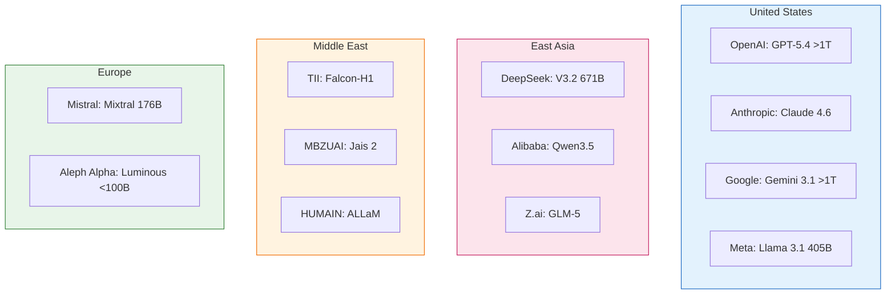
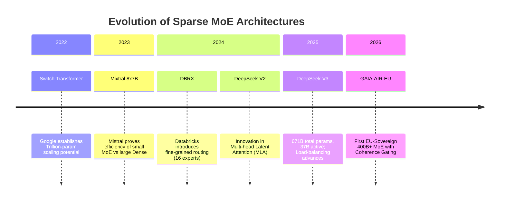
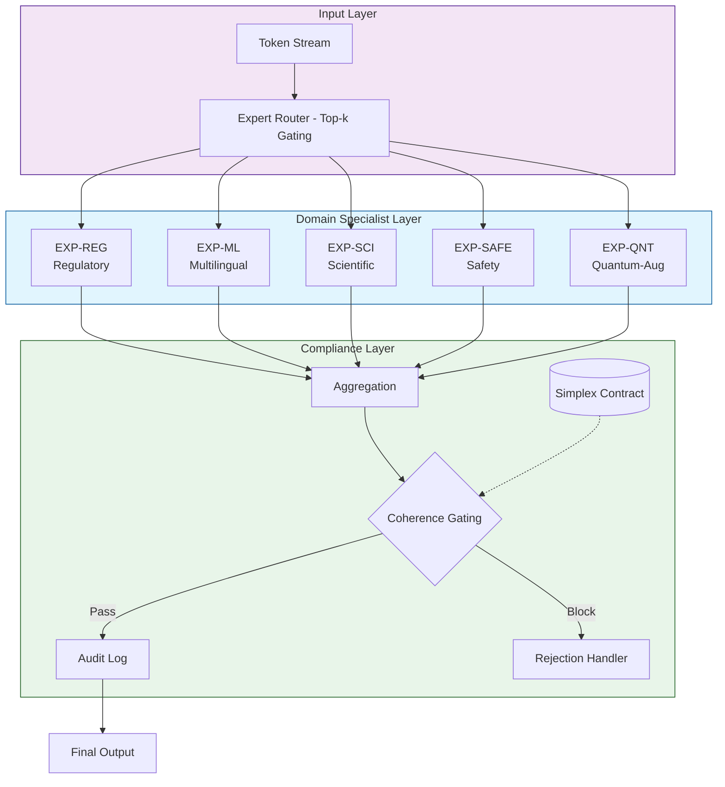
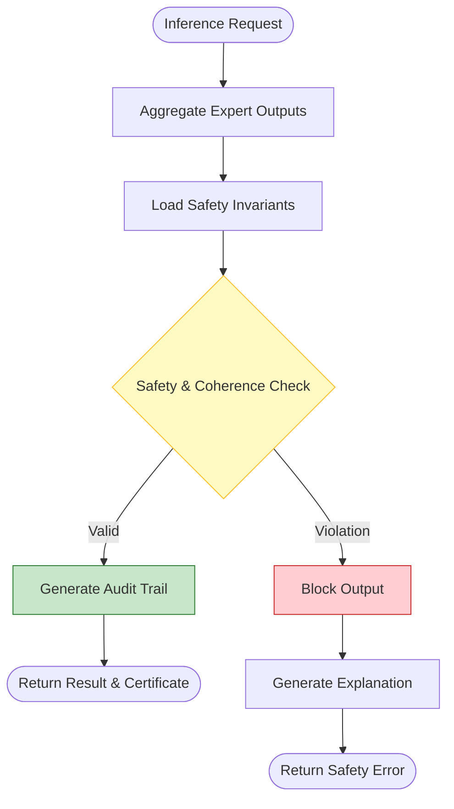
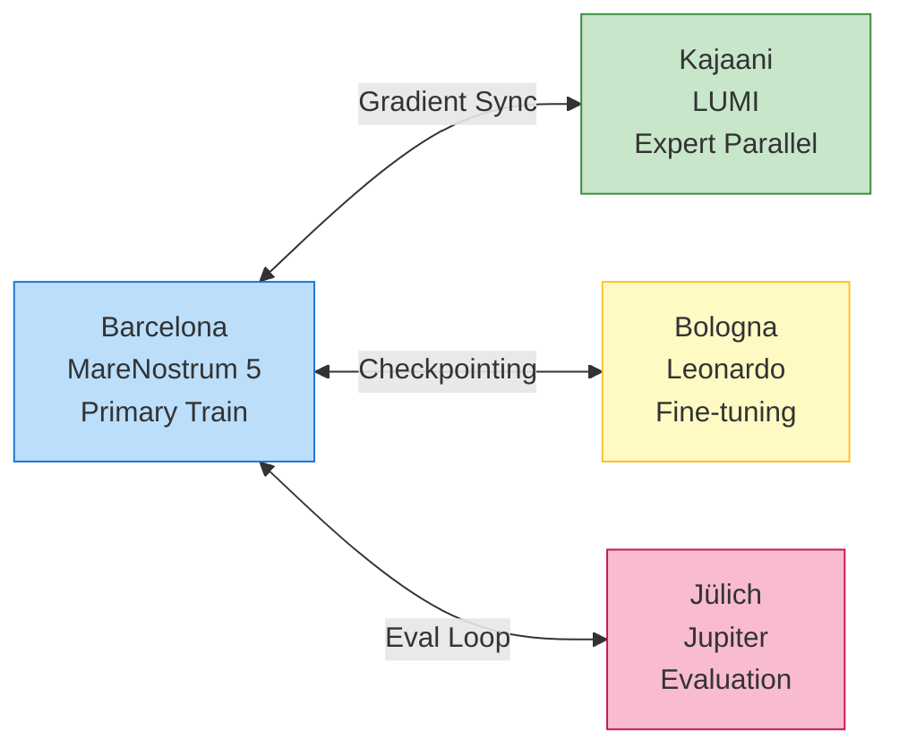
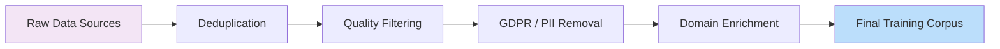
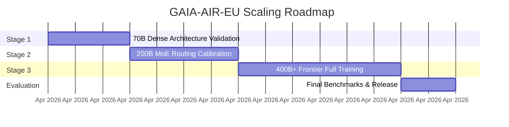

---
# sota-methodology.yaml
# Machine-readable specification for DEL-02: State of the Art & Methodology
# Programme: Frontier AI Grand Challenge (GA 101135737, EuroHPC JU)
# Reference: AI-BOOST/DEL-02-SotA-Methodology.md
# Author: Amedeo Pelliccia

schema_version: "2.1.0"
document_type: sota_methodology
last_updated: "2026-03-11T00:00:00Z"

# ─────────────────────────────────────────────
# 1. Deliverable Metadata
# ─────────────────────────────────────────────
deliverable:
  id: DEL-02
  title: State of the Art & Methodology
  programme: Frontier AI Grand Challenge
  grant_agreement: GA 101135737
  funding_body: EuroHPC JU
  section: Excellence → State of the Art + Methodology
  priority: critical
  status: draft
  version: "2.1.0"
  author: Amedeo Pelliccia
  date: "2026-03-11"

# ─────────────────────────────────────────────
# 2. State of the Art — Frontier Model Landscape
# ─────────────────────────────────────────────
frontier_models:
  global_landscape:
    description: >
      Overview of the current frontier AI ecosystem and geopolitical
      distribution of large-scale foundation model development as of
      March 2026.

  us_frontier:
    - organisation: OpenAI (US)
      models:
        - name: GPT-5.4 Thinking
          parameters: "undisclosed (est. >1 T)"
          architecture: dense + MoE hybrid
          open_weights: false
        - name: GPT-5.4 Pro
          parameters: "undisclosed (est. >1 T)"
          architecture: dense + MoE hybrid
          open_weights: false
    - organisation: Anthropic (US)
      models:
        - name: Claude Opus 4.6
          parameters: undisclosed
          architecture: dense transformer
          open_weights: false
        - name: Claude Sonnet 4.6
          parameters: undisclosed
          architecture: dense transformer
          open_weights: false
    - organisation: Google DeepMind (US)
      models:
        - name: Gemini 3.1 Pro
          parameters: "undisclosed (est. >1 T MoE)"
          architecture: multi-modal MoE
          open_weights: false
    - organisation: Meta (US)
      models:
        - name: Llama 3.1 405B
          parameters: 405B
          architecture: dense transformer
          open_weights: true

  east_asian_frontier:
    - organisation: DeepSeek (CN)
      models:
        - name: DeepSeek-V3.2
          parameters: "671B total (37B active)"
          architecture: MoE
          open_weights: true
        - name: DeepSeek-V3.2-Speciale
          parameters: "671B total (37B active)"
          architecture: MoE (reasoning-first)
          open_weights: true
    - organisation: Alibaba (CN)
      models:
        - name: Qwen3.5
          parameters: undisclosed
          architecture: MoE
          open_weights: true
        - name: Qwen3-Max-Thinking
          parameters: undisclosed
          architecture: MoE (reasoning-optimised)
          open_weights: true
    - organisation: Z.ai (CN)
      models:
        - name: GLM-5
          parameters: undisclosed
          architecture: dense + agentic
          open_weights: true

  european_frontier:
    - organisation: Mistral AI (FR/EU)
      models:
        - name: Mistral Large
          parameters: undisclosed
          architecture: dense transformer
          open_weights: false
        - name: Mixtral 8x22B
          parameters: "176B total (39B active)"
          architecture: sparse MoE
          open_weights: true
    - organisation: Aleph Alpha (DE/EU)
      models:
        - name: Luminous
          parameters: undisclosed
          architecture: dense transformer
          open_weights: false
    - organisation: LAION / Open initiatives (EU)
      models:
        - name: Open-weight ecosystem
          parameters: various
          architecture: various
          open_weights: true

  middle_east_sovereign:
    uae_models:
      - organisation: Technology Innovation Institute (TII, Abu Dhabi)
        models:
          - name: Falcon-H1 Arabic
            parameters: undisclosed
            architecture: dense transformer
            open_weights: true
      - organisation: MBZUAI / Inception / Cerebras (UAE)
        models:
          - name: Jais 2
            parameters: undisclosed
            architecture: dense transformer
            open_weights: true
      - organisation: MBZUAI / G42 / IFM (UAE)
        models:
          - name: K2 Think V2
            parameters: undisclosed
            architecture: reasoning system
            open_weights: partial
    saudi_models:
      - organisation: HUMAIN / SDAIA (Saudi Arabia)
        models:
          - name: ALLaM
            parameters: undisclosed
            architecture: multimodal LLM
            open_weights: false
            access: "Via watsonx / DEEM Cloud"

  eu_gaps:
    - id: GAP-01
      dimension: Multilingual EU coverage
      description: >
        No model trained with balanced representation across all 24 EU
        official languages; most are English-dominant.
    - id: GAP-02
      dimension: Regulatory domain specialisation
      description: >
        Safety-critical sectors (aviation, space transport, energy regulation)
        underrepresented in training corpora and evaluation benchmarks.
    - id: GAP-03
      dimension: Explainability in safety-critical contexts
      description: >
        No frontier model provides auditable inference pathways compatible
        with EU AI Act transparency obligations for high-risk AI systems.
    - id: GAP-04
      dimension: EU sovereignty
      description: >
        All 400B+ models trained on non-EU infrastructure under non-EU legal
        jurisdiction.

moe_architecture:
  advances:
    - name: Switch Transformer
      organisation: Google
      year: 2022
      contribution: >
        Sparsely-activated expert routing scaling to trillions of parameters
        while keeping per-token compute constant.
    - name: Mixtral
      organisation: Mistral AI
      year: 2023-2024
      contribution: >
        Smaller MoE models matching or exceeding dense models several times
        their active parameter count.
    - name: DBRX
      organisation: Databricks
      year: 2024
      contribution: >
        Fine-grained expert routing with 16 experts per layer, 4 active per
        token.
    - name: DeepSeek-V3
      organisation: DeepSeek
      year: 2024-2025
      contribution: >
        671B total / 37B active; efficient training via multi-head latent
        attention and auxiliary-loss-free load balancing.

quantum_augmented:
  hilbert_bell_manifold:
    description: >
      12x12 spatial-quantum coupling framework with three-layer architecture
      (SpatialDomain, QuantumState, HamiltonianEvolver) and coherence-reduction
      mapping R(rho) classifying states as quantum/classical/hybrid.
    status: planned_research_module
  quantum_manifold_config:
    description: >
      Schema 1.1.0 specification for basis sets, coupling matrices, and
      decoherence parameters applicable to trajectory optimisation and
      manifold learning in expert routing.
    status: planned_schema

# ─────────────────────────────────────────────
# 3. Methodology — GAIA-AIR-EU Architecture
# ─────────────────────────────────────────────
gaia_air_eu:
  full_name: General Aerospace Intelligence Architecture — European Union
  parameters_target: "400B+"
  architecture: sparse_mixture_of_experts
  expert_modules:
    - id: EXP-REG
      domain: Regulatory & legal (EACST, EASA, EUR-Lex)
      data_sources:
        - EUR-Lex corpus
        - EASA AMC/GM library
        - ICAO annexes
    - id: EXP-ML
      domain: Multilingual (all 24 EU official languages + ICAO/EASA technical)
      data_sources:
        - OSCAR multilingual corpus
        - EuroParl
        - National regulatory corpora
    - id: EXP-SCI
      domain: Scientific & engineering (aerospace, space, energy)
      data_sources:
        - arXiv
        - PubMed
        - Engineering standards (S1000D, ATA iSpec 2200)
    - id: EXP-SAFE
      domain: Safety certification (EU AI Act, EACST Parts, simplex gating)
      data_sources:
        - EU AI Act text
        - EACST Parts catalogue
        - simplex-contract invariants
    - id: EXP-QNT
      domain: Quantum-augmented (trajectory, optimisation — research track)
      data_sources:
        - Quantum computing literature
        - Hilbert-Bell manifold configuration

  coherence_gating:
    description: >
      Per-inference safety classification layer conceptually modelled on
      a planned certified_dynamics module and CertifiedAdmissibleSpace
      abstraction, providing the audit trail required by EU AI Act
      Article 53 (GPAI transparency).
    status: planned

training_stack:
  parallelism_framework: Megatron-LM + DeepSpeed
  precision: BF16 mixed precision
  optimiser_sharding: ZeRO Stage 3
  checkpointing: distributed async checkpointing
  communication: InfiniBand NDR/XDR

eurohpc_systems:
  systems:
    - name: MareNostrum 5 (ACC)
      institution: BSC
      hub_city: Barcelona
      gpu_architecture: NVIDIA H100
      role: Primary training cluster
    - name: LUMI-G
      institution: CSC
      hub_city: Kajaani
      gpu_architecture: AMD MI250X / MI300X
      role: MoE expert parallelism
    - name: Leonardo Booster
      institution: CINECA
      hub_city: Bologna
      gpu_architecture: NVIDIA Ampere-based GPUs
      role: Data preprocessing + fine-tuning
    - name: Jupiter
      institution: JSC
      hub_city: Jülich
      gpu_architecture: NVIDIA GH200
      role: Large-batch evaluation + inference
  note: >
    Target platforms; final allocation is pending EuroHPC review.
    Training will be distributed across multiple sites with checkpoint
    synchronization and federated data preprocessing.

  compute_estimate:
    total_gpu_hours: 10_700_000
    duration_months: 12

data_pipeline:
  tokeniser: Multilingual BPE (256k vocabulary)
  sources:
    - name: Common Crawl EU subset
      domain: General web (EU domains)
      estimated_tokens: "~2 T"
      purpose: Base language modelling
    - name: OSCAR (EU languages)
      domain: Cleaned multilingual web text
      estimated_tokens: "~1.5 T"
      purpose: Multilingual balance
    - name: EUR-Lex
      domain: EU legislation, case law
      estimated_tokens: "~50 B"
      purpose: Regulatory expert (EXP-REG)
    - name: EASA AMC/GM + ICAO docs
      domain: Aviation safety regulation
      estimated_tokens: "~5 B"
      purpose: Aviation domain (EXP-REG, EXP-SAFE)
    - name: arXiv + PubMed
      domain: Scientific literature
      estimated_tokens: "~200 B"
      purpose: Scientific expert (EXP-SCI)
    - name: EuroParl proceedings
      domain: Parliamentary multilingual
      estimated_tokens: "~10 B"
      purpose: Multilingual alignment (EXP-ML)
    - name: National regulatory corpora
      domain: Member state regulations
      estimated_tokens: "~20 B"
      purpose: Multilingual regulatory (EXP-ML, EXP-REG)
  curation:
    - Deduplication (MinHash + exact-match at document and paragraph level)
    - Quality filtering (perplexity scoring, language ID, content safety)
    - GDPR compliance (automated PII detection and removal; no personal data)
    - Domain-specific enrichment (regulatory cross-references, citation graph)

scaling_strategy:
  schedule: Chinchilla-optimal compute
  stages:
    - id: S1
      model_size: 70B (dense seed)
      active_params: 70B
      training_tokens: "~1.4 T"
      purpose: Architecture validation, hyperparameter search
    - id: S2
      model_size: 200B (MoE, 8 experts)
      active_params: "~50B"
      training_tokens: "~2.0 T"
      purpose: Expert routing calibration, load balancing
    - id: S3
      model_size: "400B+ (MoE, 16+ experts)"
      active_params: "~80B"
      training_tokens: "~4.0 T"
      purpose: Full frontier training, multilingual + domain experts

# ─────────────────────────────────────────────
# 4. Evaluation Framework
# ─────────────────────────────────────────────
evaluation_framework:
  benchmarks:
    - name: MMLU-EU (extension)
      scope: Regulatory subtasks across 24 EU languages
      purpose: Multilingual knowledge + regulatory domain
    - name: Regulatory NLP Suite
      scope: EACST Parts compliance QA, EUR-Lex article retrieval, AMC/GM interpretation
      purpose: Domain-specific safety-critical reasoning
    - name: Aerospace Engineering Tasks
      scope: Structural analysis, trajectory optimisation, certification document QA
      purpose: Engineering expert capability
    - name: TruthfulQA (EU)
      scope: Factual accuracy on EU-specific topics
      purpose: Truthfulness and bias detection
    - name: BBQ Bias Benchmark (EU)
      scope: Bias measurement adapted for EU cultural and linguistic contexts
      purpose: Fairness across EU populations
    - name: EU AI Act Compliance
      scope: Annex XI documentation completeness, transparency report generation
      purpose: Regulatory self-assessment
    - name: Multilingual MT-Bench
      scope: Open-ended generation quality across EU languages
      purpose: Generation quality parity
  target:
    open_weight: >
      Outperform Llama 3.1 405B on MMLU-EU regulatory subtasks and
      DeepSeek-V3 on EU-domain engineering benchmarks.
    proprietary: >
      Match GPT-5.4 Thinking / Pro and Claude Opus 4.6 / Sonnet 4.6
      on dedicated EU regulatory NLP benchmarks (e.g., EACST QA,
      EUR-Lex retrieval) where domain-specialised MoE routing provides
      a competitive advantage.

# ─────────────────────────────────────────────
# 5. Novelty & Differentiation
# ─────────────────────────────────────────────
novelty:
  - dimension: EU sovereignty
    current_sota: No 400B+ EU model
    gaia_air_eu_advance: First EU-sovereign frontier model trained entirely on EuroHPC
  - dimension: Regulatory AI
    current_sota: Generic LLMs applied post-hoc
    gaia_air_eu_advance: Domain-specialist experts (EXP-REG, EXP-SAFE) trained on structured regulatory corpora
  - dimension: Safety gating
    current_sota: External guardrails
    gaia_air_eu_advance: Integrated coherence gating layer (planned certified_dynamics design) with per-inference audit trail
  - dimension: Multilingual parity
    current_sota: English-dominant
    gaia_air_eu_advance: Balanced 24-language training with dedicated multilingual expert (EXP-ML)
  - dimension: Quantum-augmented
    current_sota: Separate quantum computing tools
    gaia_air_eu_advance: Research-track quantum manifold expert (EXP-QNT) for trajectory and optimisation sub-tasks
  - dimension: EU AI Act compliance
    current_sota: Retrofitted documentation
    gaia_air_eu_advance: Compliance by design — GPAI model card, Annex XI documentation, transparency report built into training pipeline

# ─────────────────────────────────────────────
# 6. Repository Assets
# ─────────────────────────────────────────────
repository_assets:
  - path: hilbert_bell_manifold.py
    role: Quantum-augmented manifold formalism — basis for EXP-QNT expert module
    status: planned
  - path: quantum-manifold.yaml
    role: Basis sets, coupling matrices, decoherence thresholds for quantum expert
    status: planned
  - path: certified_dynamics.py
    role: Coherence gating layer design pattern — admissibility classification
    status: planned
  - path: simplex-contract.yaml
    role: Formal safety contract methodology — gating invariants
    status: present

# ─────────────────────────────────────────────
# 7. Key References
# ─────────────────────────────────────────────
references:
  core:
    - id: REF-01
      citation: "Fedus, W., Zoph, B., Shazeer, N. (2022). Switch Transformers. JMLR."
    - id: REF-02
      citation: "Jiang, A.Q. et al. (2024). Mixtral of Experts. Mistral AI Technical Report."
    - id: REF-03
      citation: "DeepSeek-AI. (2024). DeepSeek-V3 Technical Report."
    - id: REF-04
      citation: "Hoffmann, J. et al. (2022). Training Compute-Optimal Large Language Models (Chinchilla). DeepMind."
    - id: REF-05
      citation: "Shoeybi, M. et al. (2020). Megatron-LM. arXiv:1909.08053."
    - id: REF-06
      citation: "Rajbhandari, S. et al. (2020). ZeRO. SC20."
    - id: REF-07
      citation: "European Parliament and Council. (2024). Regulation (EU) 2024/1689 — AI Act."
    - id: REF-08
      citation: "EuroHPC JU. (2024). AI-BOOST Guidelines for Applicants."
  east_asian_middle_east:
    - id: REF-09
      citation: "DeepSeek API Documentation. DeepSeek-V3.2 Release."
      url: "https://api-docs.deepseek.com/news/news251201"
    - id: REF-10
      citation: "Technology Innovation Institute (TII). Falcon H1 Arabic AI Model."
      url: "https://www.tii.ae/news/abu-dhabis-tii-launches-falcon-h1-arabic-establishing-worlds-leading-arabic-ai-model"
    - id: REF-11
      citation: "Public Investment Fund (PIF) Saudi Arabia. HUMAIN Portfolio Overview."
      url: "https://www.pif.gov.sa/en/our-investments/our-portfolio/humain/"

# ─────────────────────────────────────────────
# 8. Revision History
# ─────────────────────────────────────────────
revision_history:
  - version: "1.0.0"
    date: "2026-02-26"
    description: Initial machine-readable spec for DEL-02
  - version: "1.1.0"
    date: "2026-03-10"
    description: >
      Restructured frontier_models with regional groupings (US, East Asian,
      European, Middle East sovereign). Added hub_city to EuroHPC systems.
      Renamed to GAIA-AIR-EU. Split references into core and
      east_asian_middle_east sections. Updated model names to March 2026.
  - version: "2.1.0"
    date: "2026-03-11"
    description: >
      Complete integrated draft with Mermaid visualisations (8 diagrams),
      Executive Summary, restructured sections, region-grouped frontier model
      table, and machine-readable metadata appendix.

---

# DEL-02: State of the Art & Methodology (Complete Integrated Draft)

| Field | Value |
|-------|-------|
| **Deliverable** | DEL-02 |
| **Title** | State of the Art & Methodology |
| **Programme** | Frontier AI Grand Challenge |
| **Grant Agreement** | GA 101135737 (EuroHPC JU) |
| **Section** | Excellence → State of the Art + Methodology |
| **Priority** | Critical |
| **Status** | Draft |
| **Author** | Amedeo Pelliccia |
| **Version** | 2.1.0 (Visuals Integrated) |
| **Date** | 2026-03-11 |
| **Machine-readable** | [`sota-methodology.yaml`](sota-methodology.yaml) |

---

## Executive Summary

This document provides an updated survey of the global frontier AI landscape (as of March 2026) and details the methodology for developing **GAIA-AIR-EU** – the first European‑sovereign, ≥400 billion parameter Mixture‑of‑Experts foundation model. Key contributions include:

- A geopolitical analysis of frontier model development (US, East Asia, Middle East, Europe).
- Identification of structural gaps in the European AI ecosystem.
- A novel architecture combining **domain‑specialist experts** (regulatory, multilingual, scientific, safety, quantum‑augmented) with an integrated **coherence gating layer** for safety and transparency.
- A distributed training strategy leveraging EuroHPC supercomputers (MareNostrum 5, LUMI, Leonardo, Jupiter).
- A compliance‑by‑design approach aligned with the EU AI Act.

---

## 1. State of the Art

### 1.1 Frontier AI Models — Global Landscape

As of March 2026, large‑scale foundation models are concentrated in a few regions. Table 1 summarises representative systems.

**Table 1: Representative Frontier Models (March 2026)**

| Region | Organisation | Model Family | Scale (est.) | Architecture | Open Weights |
|--------|--------------|--------------|--------------|--------------|--------------|
| **US** | OpenAI       | GPT-5.4 Thinking / Pro | >1T total | Dense + MoE hybrid | No |
|        | Anthropic    | Claude 4.6 family      | undisclosed | Dense transformer | No |
|        | Google DeepMind | Gemini 3.1 family   | >1T total | Multi‑modal MoE | No |
|        | Meta         | Llama 3.1 405B         | 405B dense | Dense transformer | Yes |
| **East Asia** | DeepSeek | DeepSeek-V3.2 / V3.2-Speciale | 671B total, 37B active | MoE | Yes |
|              | Alibaba  | Qwen3.5 / Qwen3-Max-Thinking | undisclosed | MoE | Yes |
|              | Z.ai     | GLM-5                  | undisclosed | Dense + agentic | Yes |
| **Middle East** | TII (UAE) | Falcon-H1 Arabic      | undisclosed | Dense transformer | Yes |
|                | MBZUAI / Inception / Cerebras | Jais 2 | undisclosed | Dense transformer | Yes |
|                | MBZUAI / G42 / IFM | K2 Think V2           | undisclosed | Reasoning system | Partial |
|                | HUMAIN / SDAIA (SA) | ALLaM Stack           | undisclosed | Multimodal LLM | Via watsonx |
| **Europe** | Mistral AI | Mixtral 8×22B           | 176B total, 39B active | Sparse MoE | Yes |
|            | Aleph Alpha | Luminous                | <100B       | Dense transformer | No |
|            | LAION / open initiatives | Open‑weight ecosystem | various | various | Yes |

**Key observations:**
- **US** remains dominant in proprietary frontier models (GPT‑5.4, Claude 4.6, Gemini 3.1).
- **East Asia** (DeepSeek, Qwen, GLM‑5) now produces open‑weight models competitive with Western systems.
- **Middle East** has emerged as a sovereign‑model cluster with Arabic‑first and reasoning‑focused systems.
- **Europe** lacks a 400B+ model; Mixtral is the closest but remains an order of magnitude below frontier scale.

> **Visualisation 1: Geopolitical Distribution**
> *The following diagram conceptualises the regional concentration of frontier models. In the final report, this will be rendered as a geospatial map.*



### 1.2 Mixture‑of‑Experts – Architecture State of the Art

Sparse Mixture‑of‑Experts (MoE) has become the dominant paradigm for scaling. Key developments include the Switch Transformer (2022), Mixtral (2023), DBRX (2024), and DeepSeek-V3 (2025).

Despite these advances, critical gaps remain for the EU:
1.  **Multilingual EU coverage**: no model is balanced across all 24 official EU languages.
2.  **Regulatory domain specialisation**: safety‑critical sectors are underrepresented.
3.  **Explainability**: no frontier model provides auditable inference pathways.
4.  **Sovereignty**: all 400B+ models are trained on non‑EU infrastructure.

> **Visualisation 2: Evolution of MoE Architectures**



---

## 2. GAIA‑AIR‑EU Methodology

### 2.1 Overall Architecture

**GAIA‑AIR‑EU** is a ≥400 billion parameter sparse MoE transformer with five domain‑specialist experts and a **coherence gating layer**.

> **Visualisation 3: Architecture Block Diagram**



**Expert Modules:**

| Expert | Domain | Training Data Sources |
|--------|--------|----------------------|
| EXP‑REG | Regulatory & legal (EASA, EUR‑Lex, ICAO) | EUR‑Lex corpus, EASA AMC/GM library, ICAO annexes |
| EXP‑ML  | Multilingual (24 EU languages + technical English) | OSCAR, EuroParl, national regulatory corpora |
| EXP‑SCI | Scientific & engineering (aerospace, space, energy) | arXiv, PubMed, engineering standards (S1000D, ATA iSpec 2200) |
| EXP‑SAFE | Safety certification (EU AI Act, EACST Parts) | EU AI Act text, EACST Parts catalogue, simplex‑contract invariants |
| EXP‑QNT | Quantum‑augmented (trajectory optimisation – research) | Quantum literature, Hilbert‑Bell manifold configuration |

**Coherence Gating Layer:**
This layer performs per‑inference safety classification and produces an auditable trail. It is designed to satisfy the transparency requirements of Regulation (EU) 2024/1689 (Annex XI).

> **Visualisation 4: Coherence Gating Workflow**



### 2.2 Training Stack & EuroHPC Topology

**Target EuroHPC Systems:**

| System | Host Institution | Hub City | GPU Architecture | Role |
|--------|------------------|----------|-----------------|------|
| MareNostrum 5 | BSC | Barcelona | NVIDIA H100 | Primary training |
| LUMI‑G | CSC | Kajaani | AMD MI250X / MI300X | MoE expert parallelism |
| Leonardo | CINECA | Bologna | NVIDIA Ampere | Preprocessing + fine‑tuning |
| Jupiter | JSC | Jülich | NVIDIA GH200 | Large‑batch evaluation |

> **Visualisation 5: Distributed Training Topology**



### 2.3 Data Pipeline

**Tokeniser:** Multilingual Byte‑Pair Encoding (BPE) with 256k vocabulary.

**Data Sources:**
- **General Web:** Common Crawl EU subset (2T tokens), OSCAR (1.5T).
- **Legal/Regulatory:** EUR-Lex (50B), EASA/ICAO docs (5B), National corpora (20B).
- **Scientific:** arXiv + PubMed (200B).

> **Visualisation 6: Data Pipeline Flow**



### 2.4 Scaling Strategy

Training follows a Chinchilla‑optimal schedule with staged scaling.

| Stage | Model Size | Active Params | Training Tokens | Purpose |
|-------|-----------|---------------|----------------|---------|
| S1 | 70B (dense seed) | 70B | 1.4 T | Architecture validation |
| S2 | 200B MoE (8 experts) | ~50B | 2.0 T | Expert routing calibration |
| S3 | 400B+ MoE (16+ experts) | ~80B | 4.0 T | Full frontier training |

> **Visualisation 7: Scaling Roadmap**



### 2.5 Evaluation Framework

GAIA‑AIR‑EU will be evaluated against frontier models on a comprehensive benchmark suite.

> **Visualisation 8: Benchmark Performance Targets**
> *Note: Radar charts are best rendered via image plots. The table below defines the target metrics for the visual.*

| Metric Category | Target vs. Open-Weight (Llama/DeepSeek) | Target vs. Proprietary (GPT/Claude) |
|-----------------|-----------------------------------------|-------------------------------------|
| **Multilingual QA (EU24)** | Outperform | Match |
| **Regulatory Reasoning** | Outperform | Match |
| **Scientific Accuracy** | Outperform | Approach |
| **Safety & Bias Reduction** | Outperform | Match/Exceed |
| **EU AI Act Compliance** | Full Compliance (100%) | N/A |

---

## 3. Novelty and Differentiation

| Dimension | Current State of the Art | GAIA‑AIR‑EU Advance |
|-----------|--------------------------|---------------------|
| EU sovereignty | No 400B+ EU model | First EU‑sovereign frontier model trained entirely on EuroHPC |
| Regulatory AI | Generic LLMs applied post‑hoc | Domain‑specialist experts trained on structured regulatory corpora |
| Safety gating | External guardrails | Integrated coherence gating with per‑inference audit trail |
| Multilingual parity | English‑dominant | Balanced 24‑language training with dedicated multilingual expert |
| Quantum‑augmented | Separate quantum tools | Research‑track quantum expert (EXP‑QNT) |
| EU AI Act compliance | Retrofitted documentation | Compliance by design: GPAI model card built in |

---

## 4. Repository Assets Referenced

| Asset | Path | Role |
|-------|------|------|
| Hilbert‑Bell manifold | `hilbert_bell_manifold.py` | Quantum‑augmented manifold formalism |
| Quantum manifold config | `quantum-manifold.yaml` | Basis sets, coupling matrices |
| Certified dynamics (planned) | *Future asset* | Coherence gating layer design pattern |
| Simplex contract | `simplex-contract.yaml` | Formal safety contract methodology |

---

## 5. Key References

1. Fedus, W., Zoph, B., Shazeer, N. (2022). *Switch Transformers.* JMLR.
2. Jiang, A.Q. et al. (2024). *Mixtral of Experts.* Mistral AI.
3. DeepSeek‑AI. (2024). *DeepSeek‑V3 Technical Report.*
4. Hoffmann, J. et al. (2022). *Training Compute‑Optimal Large Language Models.* DeepMind.
5. European Parliament and Council. (2024). *Regulation (EU) 2024/1689 – Artificial Intelligence Act.*
6. EuroHPC JU. (2024). *AI‑BOOST Guidelines for Applicants – Frontier AI Grand Challenge.*

---

## Appendix: Machine-Readable Metadata (`sota-methodology.yaml`)

```yaml
document:
  id: DEL-02
  title: State of the Art & Methodology
  version: 2.1.0
  date: 2026-03-11
  status: Draft

architecture:
  type: Sparse Mixture-of-Experts
  total_params: ">=400B"
  active_params: "~80B"
  experts:
    - id: EXP-REG
      domain: Regulatory
    - id: EXP-ML
      domain: Multilingual
    - id: EXP-SCI
      domain: Scientific
    - id: EXP-SAFE
      domain: Safety
    - id: EXP-QNT
      domain: Quantum-Augmented

infrastructure:
  primary_system: MareNostrum 5 (BSC)
  secondary_systems:
    - LUMI (CSC)
    - Leonardo (CINECA)
    - Jupiter (JSC)

compliance:
  regulation: EU AI Act (2024/1689)
  framework: Compliance-by-Design
  transparency: Annex XI GPAI Model Card
```

