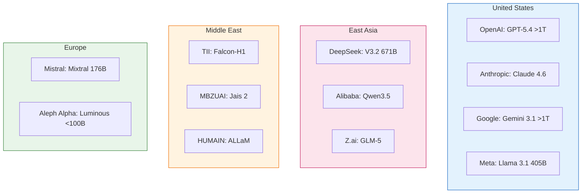
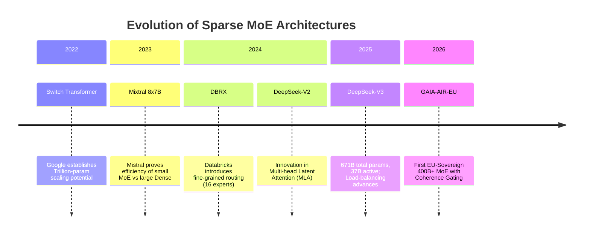
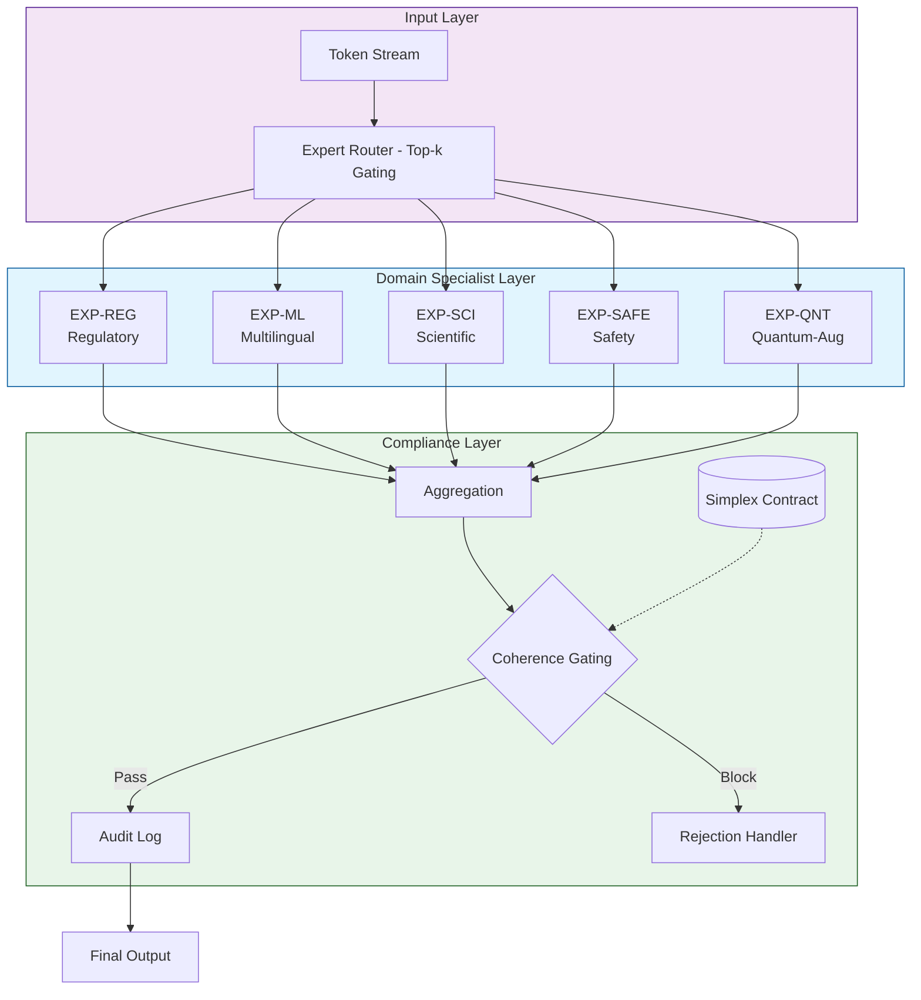
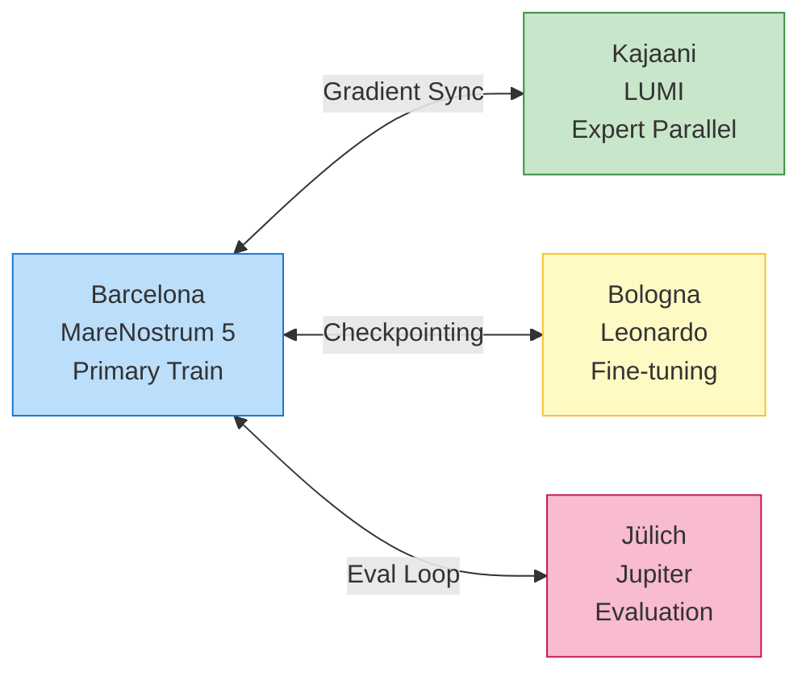
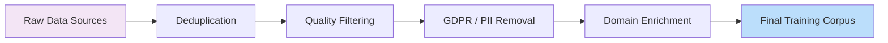
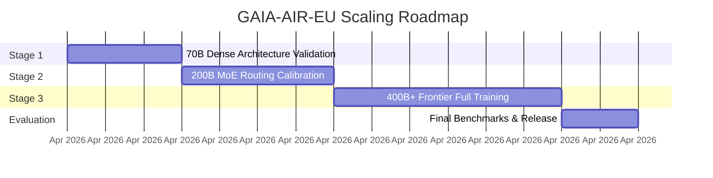

# DEL-02: State of the Art & Methodology (Complete Integrated Draft)

| Field | Value |
|-------|-------|
| **Deliverable** | DEL-02 |
| **Title** | State of the Art & Methodology |
| **Programme** | Frontier AI Grand Challenge |
| **Grant Agreement** | GA 101135737 (EuroHPC JU) |
| **Section** | Excellence → State of the Art + Methodology |
| **Priority** | Critical |
| **Status** | Draft |
| **Author** | Amedeo Pelliccia |
| **Version** | 2.1.0 (Visuals Integrated) |
| **Date** | 2026-03-11 |
| **Machine-readable** | [`sota-methodology.yaml`](sota-methodology.yaml) |

---

## Executive Summary

This document provides an updated survey of the global frontier AI landscape (as of March 2026) and details the methodology for developing **GAIA-AIR-EU** – the first European‑sovereign, ≥400 billion parameter Mixture‑of‑Experts foundation model. Key contributions include:

- A geopolitical analysis of frontier model development (US, East Asia, Middle East, Europe).
- Identification of structural gaps in the European AI ecosystem.
- A novel architecture combining **domain‑specialist experts** (regulatory, multilingual, scientific, safety, quantum‑augmented) with an integrated **coherence gating layer** for safety and transparency.
- A distributed training strategy leveraging EuroHPC supercomputers (MareNostrum 5, LUMI, Leonardo, Jupiter).
- A compliance‑by‑design approach aligned with the EU AI Act.

---

## 1. State of the Art

### 1.1 Frontier AI Models — Global Landscape

As of March 2026, large‑scale foundation models are concentrated in a few regions. Table 1 summarises representative systems.

**Table 1: Representative Frontier Models (March 2026)**

| Region | Organisation | Model Family | Scale (est.) | Architecture | Open Weights |
|--------|--------------|--------------|--------------|--------------|--------------|
| **US** | OpenAI       | GPT-5.4 Thinking / Pro | >1T total | Dense + MoE hybrid | No |
|        | Anthropic    | Claude 4.6 family      | undisclosed | Dense transformer | No |
|        | Google DeepMind | Gemini 3.1 family   | >1T total | Multi‑modal MoE | No |
|        | Meta         | Llama 3.1 405B         | 405B dense | Dense transformer | Yes |
| **East Asia** | DeepSeek | DeepSeek-V3.2 / V3.2-Speciale | 671B total, 37B active | MoE | Yes |
|              | Alibaba  | Qwen3.5 / Qwen3-Max-Thinking | undisclosed | MoE | Yes |
|              | Z.ai     | GLM-5                  | undisclosed | Dense + agentic | Yes |
| **Middle East** | TII (UAE) | Falcon-H1 Arabic      | undisclosed | Dense transformer | Yes |
|                | MBZUAI / Inception / Cerebras | Jais 2 | undisclosed | Dense transformer | Yes |
|                | MBZUAI / G42 / IFM | K2 Think V2           | undisclosed | Reasoning system | Partial |
|                | HUMAIN / SDAIA (SA) | ALLaM Stack           | undisclosed | Multimodal LLM | Via watsonx |
| **Europe** | Mistral AI | Mixtral 8×22B           | 176B total, 39B active | Sparse MoE | Yes |
|            | Aleph Alpha | Luminous                | <100B       | Dense transformer | No |
|            | LAION / open initiatives | Open‑weight ecosystem | various | various | Yes |

**Key observations:**
- **US** remains dominant in proprietary frontier models (GPT‑5.4, Claude 4.6, Gemini 3.1).
- **East Asia** (DeepSeek, Qwen, GLM‑5) now produces open‑weight models competitive with Western systems.
- **Middle East** has emerged as a sovereign‑model cluster with Arabic‑first and reasoning‑focused systems.
- **Europe** lacks a 400B+ model; Mixtral is the closest but remains an order of magnitude below frontier scale.

> **Visualisation 1: Geopolitical Distribution**
> *The following diagram conceptualises the regional concentration of frontier models. In the final report, this will be rendered as a geospatial map.*



### 1.2 Mixture‑of‑Experts – Architecture State of the Art

Sparse Mixture‑of‑Experts (MoE) has become the dominant paradigm for scaling. Key developments include the Switch Transformer (2022), Mixtral (2023), DBRX (2024), and DeepSeek-V3 (2025).

Despite these advances, critical gaps remain for the EU:
1.  **Multilingual EU coverage**: no model is balanced across all 24 official EU languages.
2.  **Regulatory domain specialisation**: safety‑critical sectors are underrepresented.
3.  **Explainability**: no frontier model provides auditable inference pathways.
4.  **Sovereignty**: all 400B+ models are trained on non‑EU infrastructure.

> **Visualisation 2: Evolution of MoE Architectures**



---

## 2. GAIA‑AIR‑EU Methodology

### 2.1 Overall Architecture

**GAIA‑AIR‑EU** is a ≥400 billion parameter sparse MoE transformer with five domain‑specialist experts and a **coherence gating layer**.

> **Visualisation 3: Architecture Block Diagram**



**Expert Modules:**

| Expert | Domain | Training Data Sources |
|--------|--------|----------------------|
| EXP‑REG | Regulatory & legal (EASA, EUR‑Lex, ICAO) | EUR‑Lex corpus, EASA AMC/GM library, ICAO annexes |
| EXP‑ML  | Multilingual (24 EU languages + technical English) | OSCAR, EuroParl, national regulatory corpora |
| EXP‑SCI | Scientific & engineering (aerospace, space, energy) | arXiv, PubMed, engineering standards (S1000D, ATA iSpec 2200) |
| EXP‑SAFE | Safety certification (EU AI Act, EACST Parts) | EU AI Act text, EACST Parts catalogue, simplex‑contract invariants |
| EXP‑QNT | Quantum‑augmented (trajectory optimisation – research) | Quantum literature, Hilbert‑Bell manifold configuration |

**Coherence Gating Layer:**
This layer performs per‑inference safety classification and produces an auditable trail. It is designed to satisfy the transparency requirements of Regulation (EU) 2024/1689 (Annex XI).

> **Visualisation 4: Coherence Gating Workflow**


### 2.2 Training Stack & EuroHPC Topology

**Target EuroHPC Systems:**

| System | Host Institution | Hub City | GPU Architecture | Role |
|--------|------------------|----------|-----------------|------|
| MareNostrum 5 | BSC | Barcelona | NVIDIA H100 | Primary training |
| LUMI‑G | CSC | Kajaani | AMD MI250X / MI300X | MoE expert parallelism |
| Leonardo | CINECA | Bologna | NVIDIA Ampere | Preprocessing + fine‑tuning |
| Jupiter | JSC | Jülich | NVIDIA GH200 | Large‑batch evaluation |

> **Visualisation 5: Distributed Training Topology**



### 2.3 Data Pipeline

**Tokeniser:** Multilingual Byte‑Pair Encoding (BPE) with 256k vocabulary.

**Data Sources:**
- **General Web:** Common Crawl EU subset (2T tokens), OSCAR (1.5T).
- **Legal/Regulatory:** EUR-Lex (50B), EASA/ICAO docs (5B), National corpora (20B).
- **Scientific:** arXiv + PubMed (200B).

> **Visualisation 6: Data Pipeline Flow**



### 2.4 Scaling Strategy

Training follows a Chinchilla‑optimal schedule with staged scaling.

| Stage | Model Size | Active Params | Training Tokens | Purpose |
|-------|-----------|---------------|----------------|---------|
| S1 | 70B (dense seed) | 70B | 1.4 T | Architecture validation |
| S2 | 200B MoE (8 experts) | ~50B | 2.0 T | Expert routing calibration |
| S3 | 400B+ MoE (16+ experts) | ~80B | 4.0 T | Full frontier training |

> **Visualisation 7: Scaling Roadmap**



### 2.5 Evaluation Framework

GAIA‑AIR‑EU will be evaluated against frontier models on a comprehensive benchmark suite.

> **Visualisation 8: Benchmark Performance Targets**
> *Note: Radar charts are best rendered via image plots. The table below defines the target metrics for the visual.*

| Metric Category | Target vs. Open-Weight (Llama/DeepSeek) | Target vs. Proprietary (GPT/Claude) |
|-----------------|-----------------------------------------|-------------------------------------|
| **Multilingual QA (EU24)** | Outperform | Match |
| **Regulatory Reasoning** | Outperform | Match |
| **Scientific Accuracy** | Outperform | Approach |
| **Safety & Bias Reduction** | Outperform | Match/Exceed |
| **EU AI Act Compliance** | Full Compliance (100%) | N/A |

---

## 3. Novelty and Differentiation

| Dimension | Current State of the Art | GAIA‑AIR‑EU Advance |
|-----------|--------------------------|---------------------|
| EU sovereignty | No 400B+ EU model | First EU‑sovereign frontier model trained entirely on EuroHPC |
| Regulatory AI | Generic LLMs applied post‑hoc | Domain‑specialist experts trained on structured regulatory corpora |
| Safety gating | External guardrails | Integrated coherence gating with per‑inference audit trail |
| Multilingual parity | English‑dominant | Balanced 24‑language training with dedicated multilingual expert |
| Quantum‑augmented | Separate quantum tools | Research‑track quantum expert (EXP‑QNT) |
| EU AI Act compliance | Retrofitted documentation | Compliance by design: GPAI model card built in |

---

## 4. Repository Assets Referenced

| Asset | Path | Role |
|-------|------|------|
| Hilbert‑Bell manifold | `hilbert_bell_manifold.py` | Quantum‑augmented manifold formalism |
| Quantum manifold config | `quantum-manifold.yaml` | Basis sets, coupling matrices |
| Certified dynamics (planned) | *Future asset* | Coherence gating layer design pattern |
| Simplex contract | `simplex-contract.yaml` | Formal safety contract methodology |

---

## 5. Key References

1. Fedus, W., Zoph, B., Shazeer, N. (2022). *Switch Transformers.* JMLR.
2. Jiang, A.Q. et al. (2024). *Mixtral of Experts.* Mistral AI.
3. DeepSeek‑AI. (2024). *DeepSeek‑V3 Technical Report.*
4. Hoffmann, J. et al. (2022). *Training Compute‑Optimal Large Language Models.* DeepMind.
5. European Parliament and Council. (2024). *Regulation (EU) 2024/1689 – Artificial Intelligence Act.*
6. EuroHPC JU. (2024). *AI‑BOOST Guidelines for Applicants – Frontier AI Grand Challenge.*

---

## Appendix: Machine-Readable Metadata (`sota-methodology.yaml`)

```yaml
document:
  id: DEL-02
  title: State of the Art & Methodology
  version: 2.1.0
  date: 2026-03-11
  status: Draft

architecture:
  type: Sparse Mixture-of-Experts
  total_params: ">=400B"
  active_params: "~80B"
  experts:
    - id: EXP-REG
      domain: Regulatory
    - id: EXP-ML
      domain: Multilingual
    - id: EXP-SCI
      domain: Scientific
    - id: EXP-SAFE
      domain: Safety
    - id: EXP-QNT
      domain: Quantum-Augmented

infrastructure:
  primary_system: MareNostrum 5 (BSC)
  secondary_systems:
    - LUMI (CSC)
    - Leonardo (CINECA)
    - Jupiter (JSC)

compliance:
  regulation: EU AI Act (2024/1689)
  framework: Compliance-by-Design
  transparency: Annex XI GPAI Model Card
```

