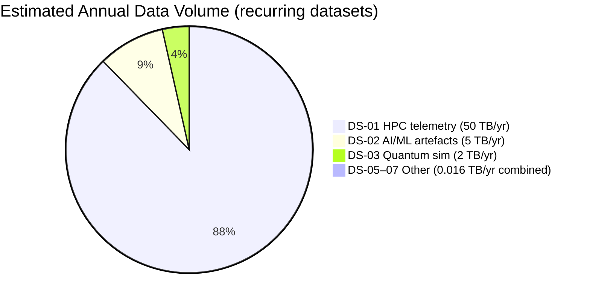
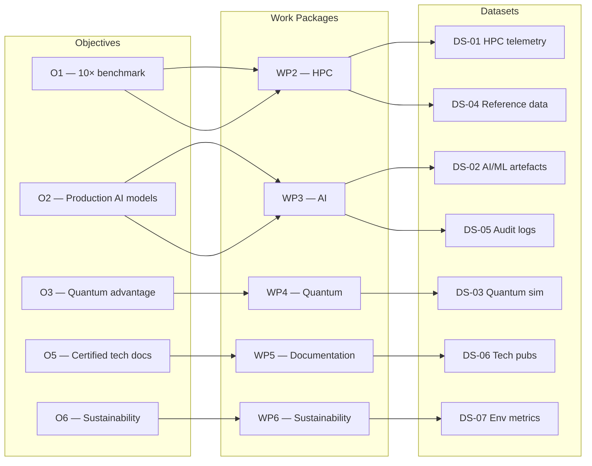
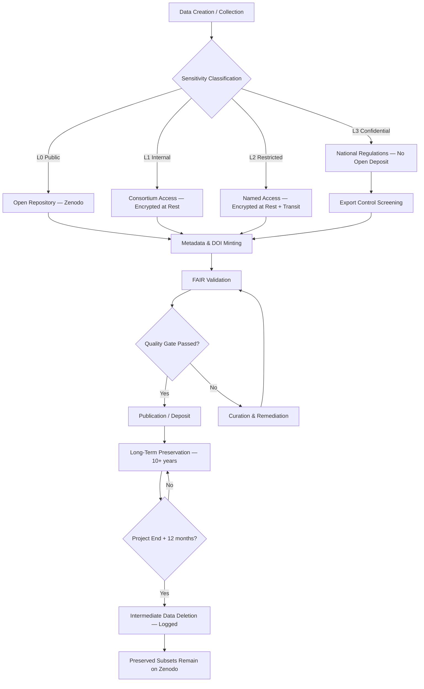
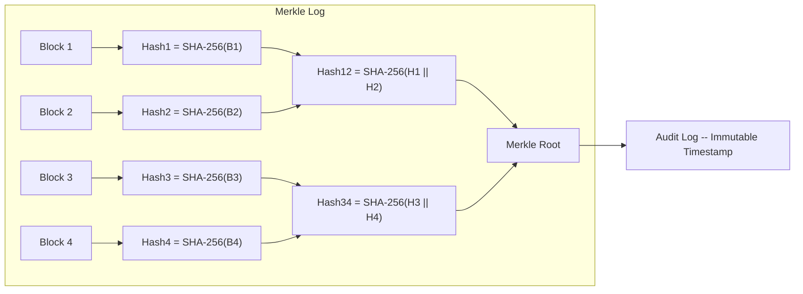
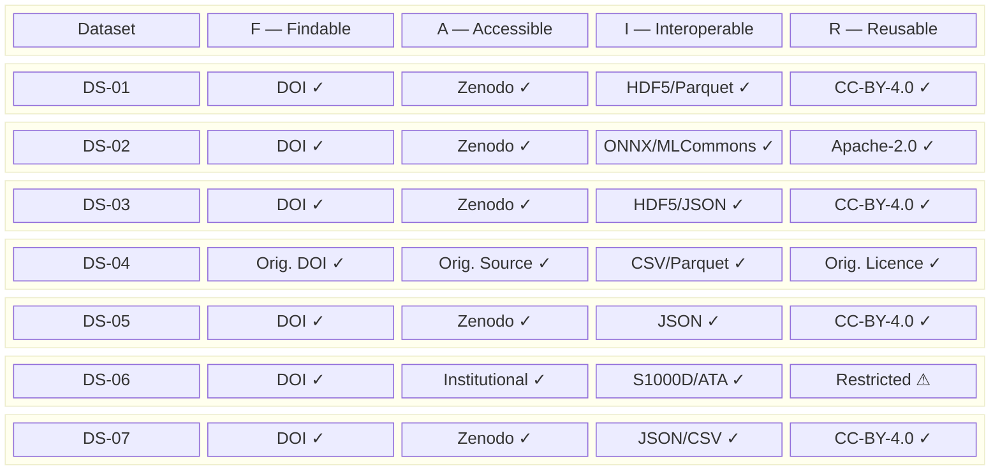
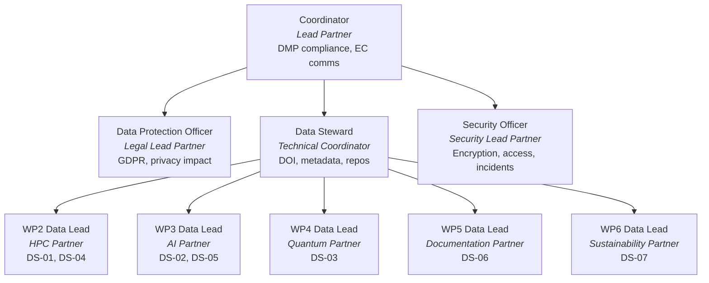
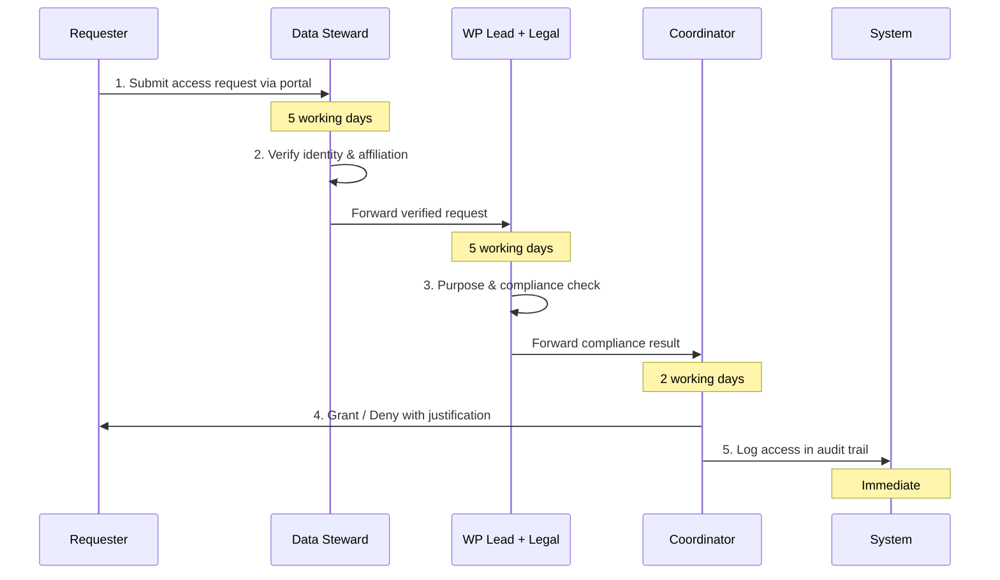
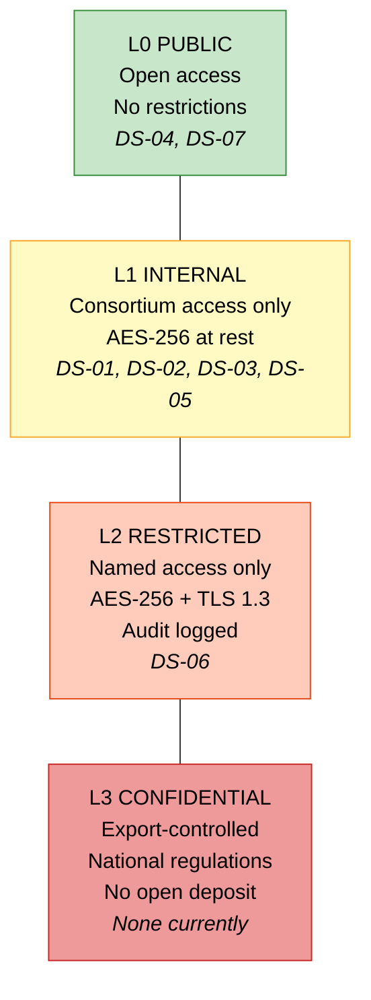
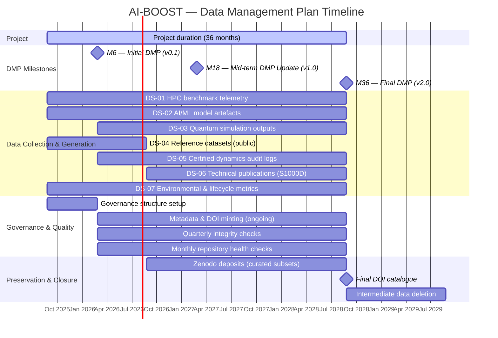

---
# ─────────────────────────────────────────────
# DEL-03: Data Management Plan (Machine-Readable Header)
# ─────────────────────────────────────────────
# This YAML header serves as the machine-readable layer of the deliverable.
# It can be extracted by CI pipelines for automated validation using the $schema reference.
$schema: "https://ai-boost.eu/schemas/deliverable-schema-v1.0.json"

deliverable:
  id: DEL-03
  title: Data Management Plan
  section: "Excellence → Data"
  programme:
    name: AI-BOOST
    grant_agreement: "GA 101135737"
    funding_body: EuroHPC JU
    call_identifier: "HPC-2023-01"
  status: draft
  authors:
    - name: Amedeo Pelliccia
      role: Coordinator
      partner: "Lead Partner Institution"
  due_milestones:
    - milestone: M6
      scope: initial
      due_date: "2026-02-25"
    - milestone: M18
      scope: mid_term_update
      due_date: "2027-02-25"
    - milestone: M36
      scope: final
      due_date: "2028-08-25"

# ─────────────────────────────────────────────
# 1. Governance & Roles
# ─────────────────────────────────────────────
governance:
  data_protection_officer:
    partner: "Legal Lead Partner"
    contact: "dpo@partner.eu"
  data_steward:
    partner: "Technical Coordinator"
    contact: "steward@ai-boost.eu"
    responsibilities: [DOI minting, metadata quality, repository management]
  security_officer:
    partner: "Security Lead Partner"
    contact: "security@partner.eu"
    responsibilities: [Encryption, access control, incident response]
  wp_data_leads:
    - wp: WP2
      lead: "HPC Partner"
      datasets: [DS-01, DS-04]
    - wp: WP3
      lead: "AI Partner"
      datasets: [DS-02, DS-05]
    - wp: WP4
      lead: "Quantum Partner"
      datasets: [DS-03]
    - wp: WP5
      lead: "Documentation Partner"
      datasets: [DS-06]
    - wp: WP6
      lead: "Sustainability Partner"
      datasets: [DS-07]

# ─────────────────────────────────────────────
# 2. Datasets
# ─────────────────────────────────────────────
datasets:
  - id: DS-01
    title: HPC benchmark telemetry
    origin: generated
    source: EuroHPC runs
    formats: [HDF5, Parquet]
    estimated_volume: "50 TB/year"
    sensitivity: internal
    wp_mapping: WP2
    objective_mapping: "O1 — Achieve 10x benchmark improvement"
    fair:
      findable:
        persistent_id: DOI (Zenodo)
        metadata_schema: DataCite 4.5
      accessible:
        repository: Zenodo
        protocol: HTTPS
        usage_note: "Datasets >50GB split across multiple records"
      interoperable:
        standards: [HDF5, Parquet]
      reusable:
        licence: CC-BY-4.0
        provenance: hash_chained_audit_log
    integrity:
      algorithm: SHA-256
      chaining: merkle_log

  - id: DS-02
    title: AI/ML model artefacts
    origin: generated
    source: training pipelines
    formats: [ONNX, SafeTensors, YAML]
    estimated_volume: "5 TB/year"
    sensitivity: internal
    wp_mapping: WP3
    objective_mapping: "O2 — Deploy production-ready AI models"
    fair:
      findable:
        persistent_id: DOI (Zenodo)
        metadata_schema: DataCite 4.5
      accessible:
        repository: Zenodo
        protocol: HTTPS
      interoperable:
        standards: [ONNX, MLCommons, Hugging Face model-card]
      reusable:
        licence: Apache-2.0
        provenance: hash_chained_audit_log
    integrity:
      algorithm: SHA-256
      chaining: merkle_log

  - id: DS-03
    title: Quantum simulation outputs
    origin: generated
    source: hybrid quantum-classical runs
    formats: [HDF5, JSON]
    estimated_volume: "2 TB/year"
    sensitivity: internal
    wp_mapping: WP4
    objective_mapping: "O3 — Demonstrate quantum advantage"
    fair:
      findable:
        persistent_id: DOI (Zenodo)
        metadata_schema: DataCite 4.5
      accessible:
        repository: Zenodo
        protocol: HTTPS
      interoperable:
        standards: [HDF5, JSON]
        vocabulary: quantum-manifold.yaml
      reusable:
        licence: CC-BY-4.0
        provenance: hash_chained_audit_log
    integrity:
      algorithm: SHA-256
      chaining: merkle_log

  - id: DS-04
    title: Reference datasets (public)
    origin: collected
    source: open benchmarks
    formats: [CSV, Parquet]
    estimated_volume: "500 GB"
    sensitivity: public
    wp_mapping: WP2
    objective_mapping: "O1 — Benchmarking baseline"
    fair:
      findable:
        persistent_id: original DOI
        metadata_schema: DataCite 4.5
      accessible:
        repository: original source
        protocol: HTTPS
      interoperable:
        standards: [CSV, Parquet]
      reusable:
        licence: original licence
        provenance: source_reference
    integrity:
      algorithm: SHA-256
      chaining: simple_hash

  - id: DS-05
    title: Certified dynamics audit logs
    origin: generated
    source: admissibility engine
    formats: [JSON]
    estimated_volume: "10 GB/year"
    sensitivity: internal
    wp_mapping: WP3
    objective_mapping: "O2 — Model admissibility"
    fair:
      findable:
        persistent_id: DOI (Zenodo)
        metadata_schema: DataCite 4.5
      accessible:
        repository: Zenodo
        protocol: HTTPS
      interoperable:
        standards: [JSON]
        vocabulary: simplex-contract.yaml
      reusable:
        licence: CC-BY-4.0
        provenance: hash_chained_audit_log
    integrity:
      algorithm: SHA-256
      chaining: merkle_log

  - id: DS-06
    title: Technical publications (S1000D modules)
    origin: generated
    source: documentation pipeline
    formats: [XML, PDF]
    estimated_volume: "1 GB/year"
    sensitivity: restricted
    wp_mapping: WP5
    objective_mapping: "O5 — Certified technical documentation"
    fair:
      findable:
        persistent_id: DOI (institutional)
        metadata_schema: DataCite 4.5
      accessible:
        repository: institutional
        protocol: HTTPS
        access_control: named_access
      interoperable:
        standards: [S1000D Issue 5.0, ATA iSpec 2200]
      reusable:
        licence: restricted
        provenance: hash_chained_audit_log
    integrity:
      algorithm: SHA-256
      chaining: merkle_log

  - id: DS-07
    title: Environmental and lifecycle metrics
    origin: generated
    source: sustainability monitors
    formats: [JSON, CSV]
    estimated_volume: "5 GB/year"
    sensitivity: public
    wp_mapping: WP6
    objective_mapping: "O6 — Sustainability & Impact"
    fair:
      findable:
        persistent_id: DOI (Zenodo)
        metadata_schema: DataCite 4.5
      accessible:
        repository: Zenodo
        protocol: HTTPS
      interoperable:
        standards: [JSON, CSV]
      reusable:
        licence: CC-BY-4.0
        provenance: hash_chained_audit_log
    integrity:
      algorithm: SHA-256
      chaining: simple_hash

# ─────────────────────────────────────────────
# 3. Security Classification
# ─────────────────────────────────────────────
security:
  classification_levels:
    - level: L0
      label: public
      controls: open access, no restrictions
    - level: L1
      label: internal
      controls: consortium access, encrypted at rest (AES-256)
    - level: L2
      label: restricted
      controls: named access, encrypted at rest and in transit (AES-256 + TLS 1.3), audit logged
    - level: L3
      label: confidential
      controls: dual-use / export-controlled, national regulations, not deposited openly
  encryption:
    at_rest: AES-256
    in_transit: TLS 1.3
  backup_strategy: "3-2-1 (3 copies, 2 media, 1 off-site)"
  incident_response:
    window: "24 hours"
    severity_levels:
      - level: A
        description: "L3 data breach / major integrity loss"
        action: "Notify EC Project Officer within 24 hours"
      - level: B
        description: "L2 data exposure / minor integrity issue"
        action: "Internal review within 72 hours"
      - level: C
        description: "L1 policy violation"
        action: "Logged and addressed in monthly consortium meeting"
    register: "incident-register.yaml"
  access_procedure:
    steps:
      - step: 1
        action: "Access request submitted via project portal"
        responsibility: "Requester"
      - step: 2
        action: "Identity & affiliation verified"
        timeline: "5 working days"
        responsibility: "Data Steward"
      - step: 3
        action: "Purpose & compliance check"
        timeline: "5 working days"
        responsibility: "WP Lead + Legal"
      - step: 4
        action: "Access granted/denied with justification"
        timeline: "2 working days"
        responsibility: "Coordinator"
      - step: 5
        action: "Access logged in audit trail"
        timeline: "Immediate"
        responsibility: "System"
  export_control:
    screening_required: true
    regulation: "Dual-Use Regulation (EU) 2021/821"
    checklist: "export-control-checklist.yaml"
    non_eu_partners: "Additional approval required for L1+ access"

# ─────────────────────────────────────────────
# 4. Ethics and Legal
# ─────────────────────────────────────────────
ethics:
  personal_data: false
  gdpr_reference: "Regulation (EU) 2016/679"
  export_control_reference: "Dual-Use Regulation (EU) 2021/821"
  ip_governance: "contributions-registry.yaml"
  open_access_obligation: "Horizon Europe Article 17"
  ethical_review:
    required: false
    note: "No human subjects involved; no dual-use research of concern beyond standard export control"

# ─────────────────────────────────────────────
# 5. Preservation
# ─────────────────────────────────────────────
preservation:
  default_repository: Zenodo
  minimum_retention_years: 10
  zenodo_retention_years: 20
  format_policy: "open standards only (HDF5, Parquet, JSON, XML, CSV, ONNX)"
  intermediate_data_deletion: "within 12 months of project end"
  integrity_checks:
    - type: "Checksum verification"
      frequency: "On every transfer"
      responsible: "Data Steward"
      tool: "sha256sum / automated pipeline"
    - type: "Format validation"
      frequency: "On ingestion"
      responsible: "WP Lead"
      tool: "Schema validators"
    - type: "Metadata completeness"
      frequency: "Quarterly"
      responsible: "Coordinator"
      tool: "DataCite validator"
    - type: "Repository availability"
      frequency: "Monthly"
      responsible: "Coordinator"
      tool: "Automated health checks"

# ─────────────────────────────────────────────
# 6. Resources & Costs
# ─────────────────────────────────────────────
resources:
  storage:
    - source: "EuroHPC allocated"
      responsible: "Coordinator"
      cost: "Covered by HPC allocation"
      usage: "Raw data, intermediate results"
    - source: "Zenodo"
      responsible: "Coordinator"
      cost: "Free (CERN infrastructure)"
      usage: "Published datasets, curated subsets"
      limitation: "50 GB per dataset limit; large datasets split or linked"
    - source: "Institutional repos"
      responsible: "Partners"
      cost: "In-kind"
      usage: "Restricted data (DS-06), long-term preservation"
  curation:
    - activity: "Data curation & metadata"
      responsible: "WP lead per dataset"
      cost: "Staff effort (in-kind)"
  contingency:
    note: "Large datasets (DS-01, DS-02, DS-03) will be deposited as sampled/curated subsets with full data available on request (L1 access)."

# ─────────────────────────────────────────────
# 7. Gantt Milestones (machine-readable)
# ─────────────────────────────────────────────
gantt:
  project_start: "2025-08-25"
  project_end: "2028-08-25"
  milestones:
    - id: M6
      date: "2026-02-25"
      label: "Initial DMP (v0.1)"
      activities: [Governance setup, Dataset mapping, FAIR policies, Security classification]
    - id: M12
      date: "2026-08-25"
      label: "First deposits"
      activities: [Zenodo deposits start, DS-04 collection complete, DS-06 production starts]
    - id: M18
      date: "2027-02-25"
      label: "Mid-term DMP Update (v1.0)"
      activities: [Volume assessment, New datasets catalogued, Access statistics review]
    - id: M24
      date: "2027-08-25"
      label: "Integrity audit"
      activities: [Integrity audit, Export control review, Contingency assessment]
    - id: M30
      date: "2028-02-25"
      label: "Pre-final curation"
      activities: [Data curation, Preservation readiness check]
    - id: M36
      date: "2028-08-25"
      label: "Final DMP (v2.0)"
      activities: [Final DOI catalogue, Preservation confirmation, Lessons learned]
    - id: M36_plus_12
      date: "2029-08-25"
      label: "Post-project data deletion"
      activities: [Intermediate data deletion complete]

# ─────────────────────────────────────────────
# 8. Revision History
# ─────────────────────────────────────────────
revision_history:
  - version: "0.1"
    date: "2026-02-25"
    milestone: M6
    description: "Initial Data Management Plan"
    changes: ["Initial draft", "Dataset mapping added", "Governance structure defined"]
  - version: "1.0"
    date: "2027-02-25"
    milestone: M18
    description: "Mid-term update"
    changes: ["Actual volumes", "New datasets", "Access statistics"]
  - version: "2.0"
    date: "2028-08-25"
    milestone: M36
    description: "Final DMP"
    changes: ["Preservation confirmation", "DOI catalogue", "Lessons learned"]
---

# DEL-03 — Data Management Plan

**Deliverable ID:** DEL-03
**Title:** Data Management Plan
**Section:** Excellence → Data
**Programme:** AI-BOOST — Frontier AI Grand Challenge
**Grant Agreement:** GA 101135737
**Funding Body:** EuroHPC JU
**Call Identifier:** HPC-2023-01
**Author:** Amedeo Pelliccia (Coordinator)
**Status:** Draft (v0.1)
**Due Date:** M6 (2026-02-25)

---

## Table of Contents
1. [Executive Summary](#1-executive-summary)
2. [Data Summary](#2-data-summary)
3. [FAIR Data Principles](#3-fair-data-principles)
4. [Data Governance](#4-data-governance)
5. [Data Security](#5-data-security)
6. [Ethics and Legal Compliance](#6-ethics-and-legal-compliance)
7. [Preservation and Long-Term Access](#7-preservation-and-long-term-access)
8. [Resource Allocation](#8-resource-allocation)
9. [Milestone Gantt Chart](#9-milestone-gantt-chart)
10. [Revision History](#10-revision-history)
11. [Glossary](#11-glossary)

---

## 1. Executive Summary

This Data Management Plan (DMP) outlines the comprehensive strategy for managing data generated and collected during the AI-BOOST project. It ensures full compliance with Horizon Europe and EuroHPC JU requirements, adhering strictly to the **FAIR principles** (Findable, Accessible, Interoperable, Reusable) while enforcing robust security standards.

The plan covers the entire data lifecycle—from creation and processing to sharing, preservation, and deletion. It is designed as a **living document**, scheduled for iterative updates at **M18 (Mid-term)** and **M36 (Final)** to reflect the project's technical evolution.

### 1.1 Key Objectives
- **Compliance:** Adhere to GDPR and **Dual-Use Regulation (EU) 2021/821**.
- **Security:** Protect sensitive data using a four-tier classification system (L0–L3).
- **Preservation:** Ensure long-term availability of research outputs (minimum 10 years).
- **Governance:** Define clear roles and responsibilities for data stewardship across the consortium.

---

## 2. Data Summary

### 2.1 Overview of Datasets
The project will generate and collect seven primary dataset categories. Estimated volumes are based on projected HPC usage and training pipelines.

| ID | Dataset Title | Origin | Format | Est. Volume | Sensitivity | Integrity Protocol |
|:---|:---|:---|:---|:---|:---|:---|
| **DS-01** | HPC benchmark telemetry | Generated | HDF5, Parquet | 50 TB/year | Internal | Merkle Log (SHA-256) |
| **DS-02** | AI/ML model artefacts | Generated | ONNX, SafeTensors | 5 TB/year | Internal | Merkle Log (SHA-256) |
| **DS-03** | Quantum simulation outputs | Generated | HDF5, JSON | 2 TB/year | Internal | Merkle Log (SHA-256) |
| **DS-04** | Reference datasets (public) | Collected | CSV, Parquet | 500 GB | Public | Simple Hash (SHA-256) |
| **DS-05** | Certified dynamics audit logs | Generated | JSON | 10 GB/year | Internal | Merkle Log (SHA-256) |
| **DS-06** | Technical publications (S1000D) | Generated | XML, PDF | 1 GB/year | Restricted | Merkle Log (SHA-256) |
| **DS-07** | Environmental & lifecycle metrics | Generated | JSON, CSV | 5 GB/year | Public | Simple Hash (SHA-256) |

### 2.2 Re-use of Existing Data
- **Public Benchmarks (DS-04):** Re-used under original open licences. No personal data is contained.
- **Pre-trained Models:** Used under respective licences; weights are not redistributed unless explicitly permitted.
- **Personal Data:** The project **does not** collect, process, or store personal data.

### 2.3 Dataset Volume Distribution

The following chart shows the relative estimated annual storage footprint across all datasets, illustrating that HPC benchmark telemetry (DS-01) dominates volume planning.

> **Volume breakdown:** DS-01 accounts for ~87% of annual recurring storage. DS-05 (0.01 TB/yr), DS-06 (0.001 TB/yr), and DS-07 (0.005 TB/yr) are grouped for readability. DS-04 (500 GB total) is excluded from this chart as it is a **one-time collection**, not an annual volume.

### 2.4 Dataset–WP–Objective Traceability

Each dataset is traceable to a specific Work Package and project objective. The following diagram shows this mapping.

### 2.5 Data Lifecycle Flowchart

The complete data lifecycle — from generation through preservation and eventual deletion — follows this process:

### 2.6 Data Integrity Architecture

To ensure immutable provenance, most generated datasets (DS-01–DS-03, DS-05–DS-06) utilize a **Merkle Log** structure; DS-07, while also generated, instead uses a simpler `simple_hash`-based integrity mechanism. This chains individual data blocks via SHA-256 hashes, allowing any modification or corruption to be detectable instantly, ensuring audit-ready integrity.

---

## 3. FAIR Data Principles

The following matrix provides a visual summary of FAIR compliance status across all datasets:

> **Legend:** ✓ [Compliant] = Fully FAIR-compliant | ⚠ [Conditional] = Restricted licence applies due to sensitivity level

### 3.1 Findable
- **Persistent Identifiers:** Every published dataset receives a **DOI** via Zenodo or an institutional repository.
- **Metadata:** Machine-readable metadata follows the **DataCite 4.5** schema.
- **Catalogue:** A central data catalogue links dataset IDs (DS-XX) to DOIs, versions, and access URLs.

### 3.2 Accessible
- **Repositories:** Primary repository is **Zenodo** (CERN-hosted). Restricted data (DS-06) uses institutional repositories with access control.
- **Protocols:** Standard HTTPS protocols are used. No proprietary access mechanisms are employed.
- **Large Data Handling:** Datasets exceeding **50 GB** (e.g., DS-01) will be deposited as curated subsets. Full datasets are split across multiple Zenodo records to comply with the platform's upload limits, ensuring all data remains accessible via standard protocols.

### 3.3 Interoperable
- **Formats:** Open, non-proprietary formats are mandated (HDF5, Parquet, ONNX, JSON, XML, CSV).
- **Vocabularies:**
  - AI/ML: **MLCommons** schema, **Hugging Face** model-card conventions.
  - Technical Docs: **ASD S1000D Issue 5.0**, **ATA iSpec 2200**.
  - Quantum: Project-specific `quantum-manifold.yaml` schema.

### 3.4 Reusable
- **Licences:**
  - Data: **CC BY 4.0** (default).
  - Code/Models: **Apache 2.0**.
  - Restricted: Specific licence terms applied (DS-06).
- **Provenance:** Recorded via **Merkle logs** with immutable timestamps.
- **Quality:** Ensured through the project's evidence-gated admissibility framework.

---

## 4. Data Governance

### 4.1 Governance Structure

The following diagram shows the data governance hierarchy and reporting lines across the consortium.

### 4.2 Roles and Responsibilities
Clear accountability is established for data management activities.

| Role | Partner | Responsibilities | Contact |
|:---|:---|:---|:---|
| **Data Protection Officer (DPO)** | Legal Lead Partner | GDPR compliance, privacy impact assessments | `dpo@partner.eu` |
| **Data Steward** | Technical Coordinator | DOI minting, metadata quality, repository management | `steward@ai-boost.eu` |
| **Security Officer** | Security Lead Partner | Encryption, access control, incident response | `security@partner.eu` |
| **WP Data Leads** | Each WP Lead | Dataset creation, quality assurance, documentation | WP-specific |
| **Coordinator** | Lead Partner | Overall DMP compliance, EC communication | `coordinator@ai-boost.eu` |

### 4.3 Data Access Procedure
For **Internal (L1)** and **Restricted (L2)** datasets, the following access procedure applies:

**Step-by-step:**

1. **Request:** Access request submitted via project portal (*Requester*).
2. **Verification:** Identity & affiliation verified within 5 working days (*Data Steward*).
3. **Compliance:** Purpose & compliance check within 5 working days (*WP Lead + Legal*).
4. **Decision:** Access granted/denied with justification within 2 working days (*Coordinator*).
5. **Logging:** Access logged in audit trail immediately (*System*).

---

## 5. Data Security

### 5.1 Classification Levels
All datasets are classified upon creation to ensure appropriate handling. The following diagram illustrates the tiered security model with escalating controls:

> **Note:** Levels are labelled L0–L3 in ascending order of restriction. Each node includes the level number and label for accessibility.

### 5.2 Dataset–Security Mapping

| Dataset | Classification | Encryption at Rest | Encryption in Transit | Audit Logged | Export Screening |
|:---|:---|:---|:---|:---|:---|
| **DS-01** | L1 Internal | AES-256 | — | — | — |
| **DS-02** | L1 Internal | AES-256 | — | — | — |
| **DS-03** | L1 Internal | AES-256 | — | — | — |
| **DS-04** | L0 Public | — | — | — | — |
| **DS-05** | L1 Internal | AES-256 | — | — | — |
| **DS-06** | L2 Restricted | AES-256 | TLS 1.3 | ✓ | ✓ |
| **DS-07** | L0 Public | — | — | — | — |

| Level | Label | Controls |
|:---|:---|:---|
| **L0** | Public | Open access, no restrictions. |
| **L1** | Internal | Consortium access only. Encrypted at rest (AES-256). |
| **L2** | Restricted | Named access only. Encrypted at rest & in transit (AES-256 + TLS 1.3). Audit logged. |
| **L3** | Confidential | Dual-use / export-controlled. Handled per national regulations. Not deposited openly. |

### 5.3 Technical Measures
- **Encryption:** AES-256 at rest; TLS 1.3 in transit.
- **Backup:** **3-2-1 Strategy** (3 copies, 2 media types, 1 off-site) for all L1+ datasets.
- **Integrity:** SHA-256 Merkle logs ensure data has not been tampered with.

### 5.4 Incident Response
Data breaches or integrity failures are managed according to severity.

| Severity | Description | Action | Timeline |
|:---|:---|:---|:---|
| **A** | L3 data breach / major integrity loss | Notify EC Project Officer | Within 24 hours |
| **B** | L2 data exposure / minor integrity issue | Internal review | Within 72 hours |
| **C** | L1 policy violation | Logged & addressed | Monthly consortium meeting |

### 5.5 Export Control
- **Regulation:** **Dual-Use Regulation (EU) 2021/821**.
- **Screening:** All L2/L3 datasets undergo export control screening before publication.
- **Non-EU Partners:** Additional approval required for L1+ data access by partners outside the EU.

---

## 6. Ethics and Legal Compliance

### 6.1 Personal Data (GDPR)
- **Status:** **No personal data** is processed.
- **Contingency:** If PII is inadvertently found, data will be quarantined, anonymised, or deleted immediately per Regulation (EU) 2016/679.

### 6.2 Intellectual Property (IP)
- **Background IP:** Documented in the Consortium Agreement.
- **Foreground IP:** Governed by the Grant Agreement and `contributions-registry.yaml`.
- **Open Access:** Horizon Europe Article 17 obligations met via Zenodo deposits (CC BY 4.0).

---

## 7. Preservation and Long-Term Access

### 7.1 Repository Strategy
- **Primary:** **Zenodo** (Guaranteed 20-year retention).
- **Secondary:** Institutional repositories (for restricted data or partner-specific requirements).
- **Large Data:** Datasets >50 GB (e.g., DS-01) will be deposited as **curated subsets** with full data available on request (L1 access).

### 7.2 Retention Periods
- **Minimum:** 10 years after project end.
- **Zenodo:** 20 years (CERN infrastructure).
- **Intermediate Data:** Deleted within 12 months of project end (logged deletion).

### 7.3 Integrity Checks
| Check Type | Frequency | Responsible | Tool |
|:---|:---|:---|:---|
| Checksum verification | On every transfer | Data Steward | Automated pipeline |
| Format validation | On ingestion | WP Lead | Schema validators |
| Metadata completeness | Quarterly | Coordinator | DataCite validator |
| Repository availability | Monthly | Coordinator | Automated health checks |

---

## 8. Resource Allocation

### 8.1 Storage and Costs
| Source | Responsible | Cost | Usage |
|:---|:---|:---|:---|
| **EuroHPC Allocation** | Coordinator | Covered by Grant | Raw data, intermediate results |
| **Zenodo** | Coordinator | Free (CERN) | Published datasets, curated subsets |
| **Institutional Repos** | Partners | In-kind | Restricted data (DS-06), long-term preservation |

### 8.2 Contingency
- **Large Volumes:** DS-01, DS-02, and DS-03 exceed typical free repository limits. Strategy: Deposit representative samples publicly; retain full datasets on EuroHPC storage with L1 access protocols.
- **Curation:** Staff effort for data curation and metadata is accounted for in WP budgets (in-kind).

---

## 9. Milestone Gantt Chart

The following chart visualises the full project timeline, DMP milestones, data lifecycle activities, and work-package data workflows.

### 9.1 Milestone Summary

| Milestone | Date | DMP Version | Key Activities |
|:---|:---|:---|:---|
| **M6** | 2026-02-25 | v0.1 (Initial) | Governance setup, dataset mapping, FAIR policies defined, security classification applied |
| **M12** | 2026-08-25 | — | First Zenodo deposits, DS-04 collection complete, DS-06 production starts |
| **M18** | 2027-02-25 | v1.0 (Mid-term) | Actual volumes assessed, new datasets catalogued, access statistics reviewed |
| **M24** | 2027-08-25 | — | Integrity audit, export control review, contingency plan assessment |
| **M30** | 2028-02-25 | — | Pre-final data curation, preservation readiness check |
| **M36** | 2028-08-25 | v2.0 (Final) | Final DOI catalogue, preservation confirmation, lessons learned |
| **M36+12** | 2029-08-25 | — | Intermediate data deletion complete |

---

## 10. Revision History

This DMP is a living document. Updates are tracked in the YAML header and below.

| Version | Date | Milestone | Description | Key Changes |
|:---|:---|:---|:---|:---|
| **0.1** | 2026-02-25 | M6 | Initial DMP | Initial draft, dataset mapping, governance defined |
| **1.0** | 2027-02-25 | M18 | Mid-term Update | Actual volumes, new datasets, access statistics |
| **2.0** | 2028-08-25 | M36 | Final DMP | Preservation confirmation, DOI catalogue, lessons learned |

---

## 11. Glossary

| Term | Definition |
|:---|:---|
| **DMP** | Data Management Plan. A document describing how data will be collected, processed, and shared. |
| **DOI** | Digital Object Identifier. A persistent identifier used to uniquely identify objects. |
| **FAIR** | Findable, Accessible, Interoperable, Reusable. Principles to enhance reusability. |
| **Merkle Log** | A tree structure in which every leaf node is labelled with the hash of a data block, providing secure verification of large data structures. |
| **S1000D** | An international specification for technical publications. |
| **Zenodo** | An open-access repository for research artifacts. |

---

## 12. Approval

**Prepared by:** Amedeo Pelliccia
**Date:** 2026-02-25
**Reviewed by:** Consortium Board
**Next Review:** M18 (2027-02-25)

---
*This document is optimized for machine-readable processing via the embedded YAML header.*
