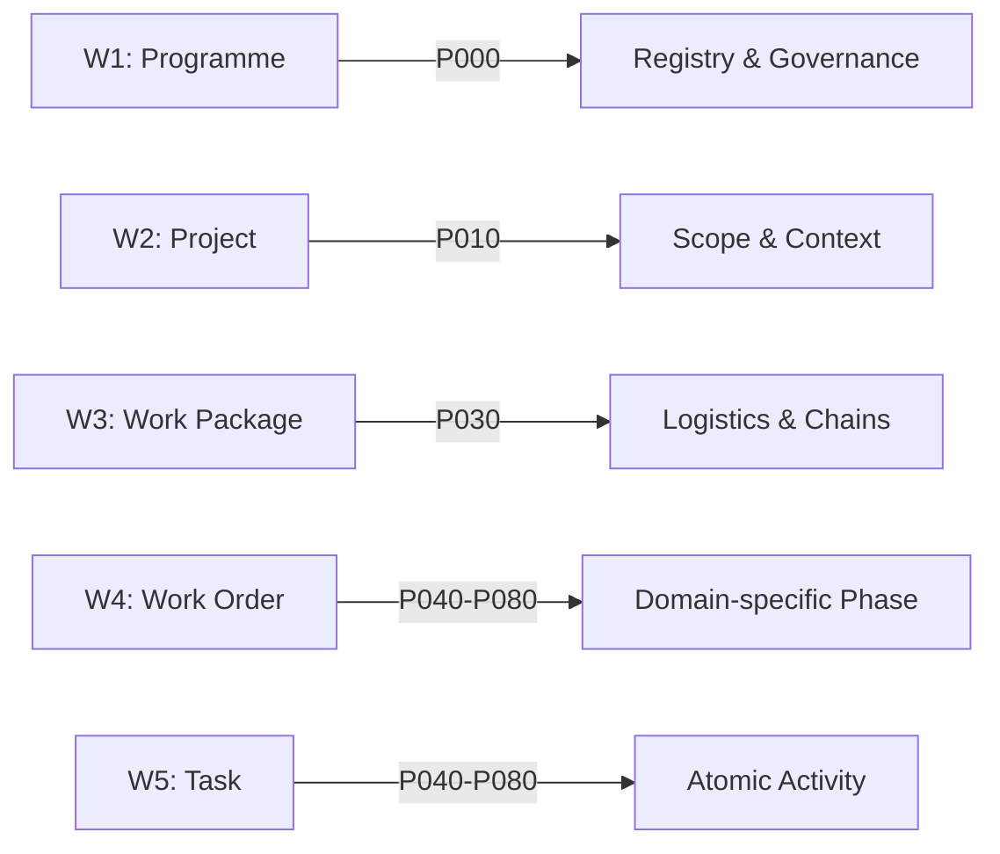
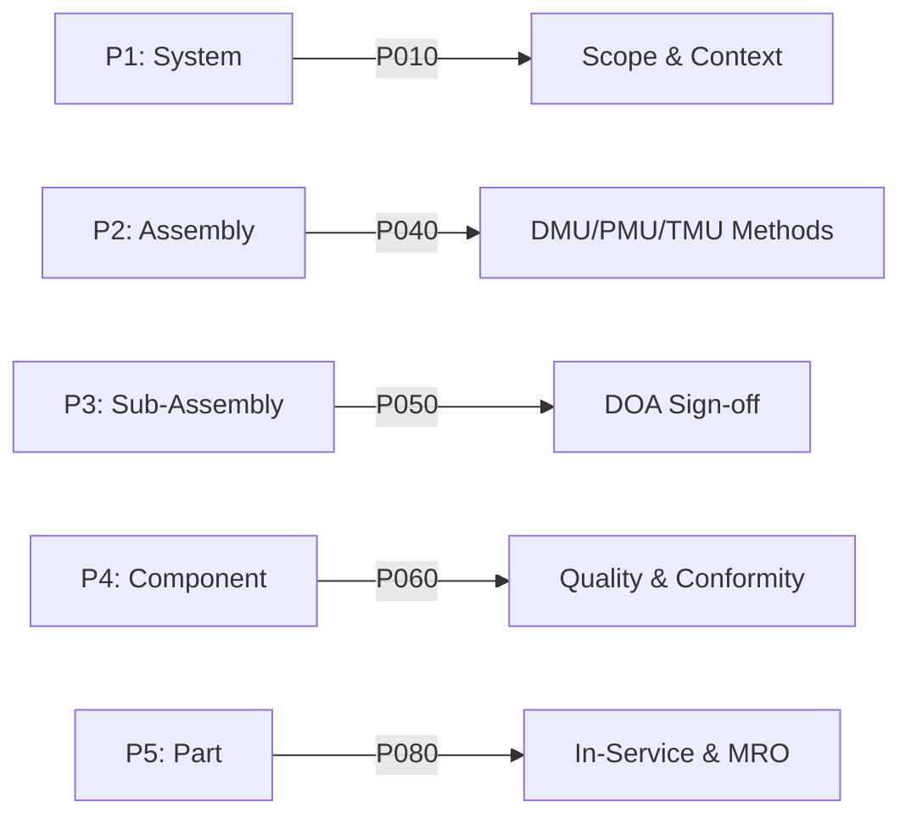
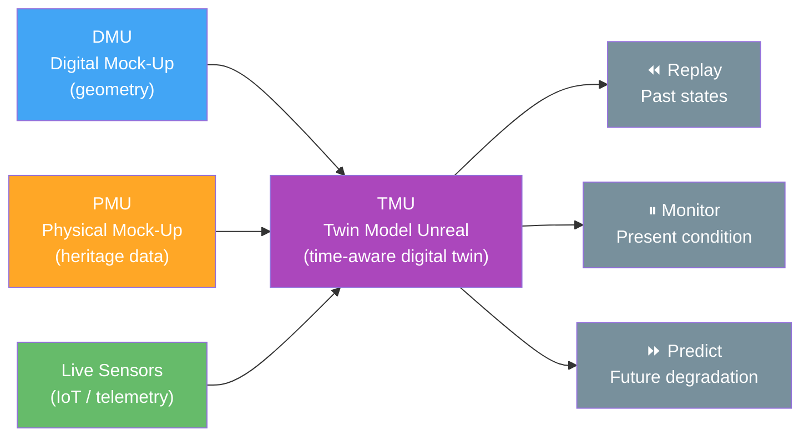
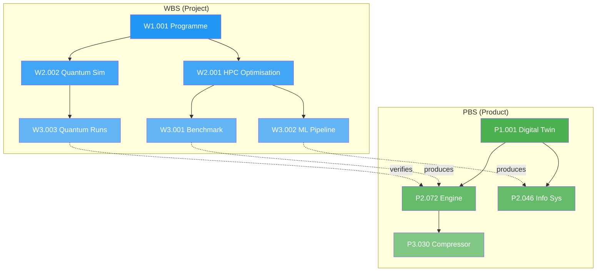

# IPSN — Initial Problem Statement Numbering

**Unified Work Breakdown Structure (WBS) & Product Breakdown Structure (PBS) Formula**

| Metadata | Value |
|----------|-------|
| **Document ID** | ESSA-STD-IPSN-001 |
| **Version** | v0.1-draft |
| **Status** | Draft |
| **Parent** | ESSA-DOC-AMPEL360-001 ([AMPEL360.md](AMPEL360.md)) |
| **Companion** | [`ipsn.yaml`](ipsn.yaml) |
| **Related** | [`CCTLS.md`](CCTLS.md) · [`AMPEL360.md`](AMPEL360.md) · [`H-PIPELINE.md`](H-PIPELINE.md) |
| **Last Updated** | 2026-03-11 |

---

## 1. Purpose and Scope

Aerospace programmes require two decomposition hierarchies operating in parallel:

| Hierarchy | Governs | Typical Question |
|-----------|---------|------------------|
| **WBS** (Work Breakdown Structure) | *Project* — who does what, when, at what cost | "Which work order delivers this task?" |
| **PBS** (Product Breakdown Structure) | *Product* — what is built, assembled, maintained | "Which part number is installed here?" |

Without a formal bridge between the two, work orders reference part numbers inconsistently, cost rolls-up mismatch product trees, and traceability audits fail at the seam.

**IPSN** provides:

1. A **unified identifier formula** that encodes both WBS and PBS coordinates in a single token.
2. A **five-level hierarchy** for each dimension (WBS and PBS), with level definitions anchored to CCTLS phases and AMPEL360 lifecycle governance.
3. A **unified vocabulary** — a controlled term set ensuring that WBS activities and PBS items use the same language when referring to the same object.
4. **Cross-reference rules** so that every WBS node can be linked to the PBS items it produces, and every PBS item can be traced to the WBS activity that created it.

### 1.1 Constitutional Constraint (inherited)

> Evolutionary Change ⊆ Valid(H_Envelope)

All IPSN identifiers are subject to the AMPEL360 lifecycle invariant. A WBS/PBS node cannot be activated if it violates the active safety envelope.

---

## 2. The IPSN Unified Identifier Formula

### 2.1 Canonical Form

```
IPSN = {PRG}-{W|P}{LVL}.{SEQ}[-{PHASE}][-{VER}]
```

| Field | Width | Description | Example |
|-------|-------|-------------|---------|
| `PRG` | 2–8 chars | Programme code (upper-case, alphanumeric) | `AIBOOST`, `GA360` |
| `W` or `P` | 1 char | Domain: **W** = WBS (project), **P** = PBS (product) | `W`, `P` |
| `LVL` | 1 digit | Hierarchy level (1–5) | `3` |
| `SEQ` | 3 digits | Sequential number within parent at that level | `007` |
| `PHASE` | P + 3 digits | CCTLS phase (optional, for lifecycle binding) | `P040` |
| `VER` | semver | Version (optional, for configuration control) | `1.0.0` |

### 2.2 WBS Identifier

```
WBS_ID = {PRG}-W{LVL}.{SEQ}
```

**Example:** `AIBOOST-W3.007` → AI-BOOST programme, WBS level 3, sequence 007

### 2.3 PBS Identifier

```
PBS_ID = {PRG}-P{LVL}.{SEQ}
```

**Example:** `AIBOOST-P3.042` → AI-BOOST programme, PBS level 3, part sequence 042

### 2.4 Unified Cross-Reference (IPSN Full Form)

When a WBS activity directly produces or governs a PBS item, the unified form links both:

```
IPSN_FULL = {WBS_ID}:{PBS_ID}:{PHASE}
```

**Example:** `AIBOOST-W3.007:AIBOOST-P3.042:P040`

Meaning: Work order W3.007 produces component P3.042, governed under CCTLS phase P040 (Numerical & Simulation Methods).

### 2.5 Formal Definition

Let **W** be the set of all WBS nodes and **P** the set of all PBS nodes for a programme. Define:

```
IPSN: W × P → Phase

∀ w ∈ W, ∃ p ∈ P : produces(w, p)    (completeness)
∀ p ∈ P, ∃ w ∈ W : produces(w, p)    (traceability)
∀ (w, p) ∈ IPSN : phase(w) = phase(p) (coherence)
```

**Completeness:** Every work order produces at least one product item.
**Traceability:** Every product item is traceable to at least one work order.
**Coherence:** Linked WBS/PBS pairs share the same CCTLS phase.

---

## 3. WBS Hierarchy (Project Dimension)

The WBS decomposes the project into manageable units of work.

| Level | Name | Definition | CCTLS Mapping | Typical CCTLS Atoms |
|-------|------|------------|---------------|---------------------|
| **W1** | Programme | Top-level programme or contract | P000 (Registry) | `REG_ENTRY` |
| **W2** | Project / Phase | Major project phase or sub-programme | P010 (Scope) | `SCOPE_NODE` |
| **W3** | Work Package (WP) | Deliverable-oriented work grouping | P030 (Logistics) | `CHAIN_NODE`, `PROCESS` |
| **W4** | Work Order (WO) | Discrete unit of authorised work | P040–P080 (domain) | `METHOD`, `MRO_JOB`, `TEST_CAMPAIGN` |
| **W5** | Task / Activity | Atomic schedulable action | P040–P080 (domain) | `SIM_RUN`, `STEP`, `CHECK` |

### 3.1 WBS Numbering Examples

```
AIBOOST-W1.001              Programme: AI-BOOST
├── AIBOOST-W2.001          Project: HPC Optimisation
│   ├── AIBOOST-W3.001      WP: Benchmark Suite Development
│   │   ├── AIBOOST-W4.001  WO: Design benchmark harness
│   │   │   ├── AIBOOST-W5.001  Task: Write HDF5 schema
│   │   │   └── AIBOOST-W5.002  Task: Validate Parquet output
│   │   └── AIBOOST-W4.002  WO: Execute EuroHPC runs
│   └── AIBOOST-W3.002      WP: ML Pipeline Integration
├── AIBOOST-W2.002          Project: Quantum Simulation
│   └── AIBOOST-W3.003      WP: Hybrid Quantum-Classical Runs
└── AIBOOST-W2.003          Project: Certification & Documentation
    └── AIBOOST-W3.004      WP: S1000D Module Generation
```

### 3.2 WBS–CCTLS Phase Mapping



---

## 4. PBS Hierarchy (Product Dimension)

The PBS decomposes the product into identifiable, configurable items.

| Level | Name | Definition | ATA/S1000D Mapping | Typical CCTLS Atoms |
|-------|------|------------|--------------------|---------------------|
| **P1** | System / Product | Top-level product or system | Aircraft type / System ID | `SCOPE_NODE` |
| **P2** | Assembly | Major functional assembly | ATA Chapter (e.g., 72 = Engine) | `PRODUCT_ITEM` |
| **P3** | Sub-Assembly | Decomposed functional group | ATA Section (e.g., 72-30 = Compressor) | `PRODUCT_ITEM` |
| **P4** | Component / Module | Replaceable unit (LRU/SRU) | ATA Subject (e.g., 72-30-01) | `FIG`, `ITEM` |
| **P5** | Part | Lowest tracked item (piece part) | Part number / PN | `ITEM`, `CALLOUT` |

### 4.1 PBS Numbering Examples

```
AIBOOST-P1.001                System: GAIA-AIR Digital Twin
├── AIBOOST-P2.072            Assembly: Engine (ATA 72)
│   ├── AIBOOST-P3.030        Sub-Assembly: Compressor Section
│   │   ├── AIBOOST-P4.001    Component: Stage-1 Compressor Blade
│   │   │   └── AIBOOST-P5.001  Part: Blade root insert
│   │   └── AIBOOST-P4.002    Component: Compressor Disk
│   └── AIBOOST-P3.050        Sub-Assembly: Turbine Section
├── AIBOOST-P2.027            Assembly: Flight Controls (ATA 27)
└── AIBOOST-P2.046            Assembly: Information Systems (ATA 46)
```

### 4.2 PBS–CCTLS Phase Mapping



---

## 5. Mock-Up Taxonomy (DMU / PMU / TMU)

Product representation in aerospace engineering operates across three distinct tiers, each with a different relationship to **time**. IPSN identifiers at PBS levels P2–P4 carry an implicit mock-up tier that governs how the item's data is created, stored, and consumed.

### 5.1 Three-Tier Overview

| Tier | Full Name | Time Dimension | Data Content |
|------|-----------|----------------|--------------|
| **DMU** | Digital Mock-Up | ❌ Static snapshot | CAD geometry — the shape of the part |
| **PMU** | Physical Mock-Up | ⏪ Past only | Heritage test database — wind tunnel, bird strike, fatigue test results |
| **TMU** | Twin Model Unreal (Engine) Understanding | ⏪⏸⏩ Past + Present + Future | Time-aware living digital twin model |

- **DMU** captures the *geometry* of a product item — a static, time-independent 3D representation.
- **PMU** captures the *empirical truth* — the historical record of physical test campaigns. This is irreplaceable certification evidence used for regression baselines.
- **TMU** fuses DMU geometry and PMU heritage data into a **time-aware digital twin** built on a game-engine-grade real-time platform. TMU models can replay past states, monitor present state via live sensor feeds, and predict future states (degradation, remaining useful life).

### 5.2 Time-Awareness Formalism

The critical differentiator is that **TMU models are time-aware**:

```
DMU:  geometry(part)            → shape              # static, no time dimension
PMU:  test(part, campaign)      → result             # historical, past only
TMU:  state(part, t)            → condition(t)       # function of time t
```

TMU enables three temporal operations:

| Operation | Time Direction | Source |
|-----------|---------------|--------|
| **Replay** | ⏪ Past | PMU heritage data + flight recorder data |
| **Monitor** | ⏸ Present | Live sensor feeds, IoT telemetry |
| **Predict** | ⏩ Future | Degradation models, remaining useful life (RUL) |

### 5.3 Data Flow

DMU provides the shape. PMU provides the empirical truth. TMU fuses both into a living, temporal model.



### 5.4 IPSN Integration

Each PBS item (P2–P5) can carry a mock-up tier attribute in its IPSN token:

| PBS Level | Typical DMU Artefact | Typical PMU Artefact | Typical TMU Artefact |
|-----------|---------------------|---------------------|---------------------|
| **P2** (Assembly) | 3D CAD model | Wind tunnel campaign data | Fleet-level digital twin |
| **P3** (Sub-Assembly) | Section geometry | Fatigue test results | Sub-system condition model |
| **P4** (Component) | Part CAD file | Bird strike / impact tests | Component RUL predictor |
| **P5** (Part) | 2D drawing | Material coupon test data | Sensor-tracked part state |

---

## 6. Unified Vocabulary

A controlled term set bridging WBS and PBS domains. Each term has a single canonical definition used in both contexts.

| Term | WBS Context | PBS Context | CCTLS Token Type |
|------|-------------|-------------|------------------|
| **Programme** | Top-level funded initiative | — | `REG_ENTRY` |
| **System** | — | Top-level product | `SCOPE_NODE` |
| **Work Package** | Deliverable-oriented grouping | — | `CHAIN_NODE` |
| **Assembly** | — | Major functional grouping | `PRODUCT_ITEM` |
| **Work Order** | Authorised unit of work | — | `METHOD` / `MRO_JOB` |
| **Component** | — | Replaceable unit (LRU/SRU) | `FIG` / `ITEM` |
| **Task** | Atomic schedulable activity | — | `STEP` / `CHECK` |
| **Part** | — | Lowest tracked item | `ITEM` / `CALLOUT` |
| **Deliverable** | Output of a Work Package | Output product/document | `CE_DECL` / `TEST_REPORT` |
| **Configuration Item** | Baseline-controlled WBS element | Baseline-controlled PBS element | Token (any, with `version`) |
| **Effectivity** | WBS scope (which tails/MSNs) | PBS scope (which tails/MSNs) | `effectivity` binding |
| **Phase** | Lifecycle gate governing the work | Lifecycle gate governing the product | `phase` (P000–P120) |

### 6.1 Cross-Domain Link Types

When linking WBS and PBS nodes, use the following CCTLS relation types:

| Relation | Direction | Meaning |
|----------|-----------|---------|
| `produces` | WBS → PBS | Work order W produces product item P |
| `consumes` | WBS → PBS | Work order W requires product item P as input |
| `verifies` | WBS → PBS | Work order W verifies product item P |
| `governs` | WBS → WBS | Work package governs sub-work-orders |
| `decomposes` | PBS → PBS | Assembly decomposes into sub-assemblies |
| `derives_from` | PBS → PBS | Component derives from parent design |

---

## 7. Cross-Reference Matrix

### 7.1 WBS × PBS Traceability

Every programme must maintain a cross-reference matrix ensuring completeness and traceability:

```
┌─────────────┬────────────┬────────────┬────────────┐
│             │ P2.072     │ P2.027     │ P2.046     │
│             │ Engine     │ Flt Ctrl   │ Info Sys   │
├─────────────┼────────────┼────────────┼────────────┤
│ W3.001      │  produces  │            │            │
│ Benchmark   │            │            │            │
├─────────────┼────────────┼────────────┼────────────┤
│ W3.002      │            │            │  produces  │
│ ML Pipeline │            │            │            │
├─────────────┼────────────┼────────────┼────────────┤
│ W3.003      │  verifies  │  verifies  │            │
│ Quantum Sim │            │            │            │
├─────────────┼────────────┼────────────┼────────────┤
│ W3.004      │  produces  │  produces  │  produces  │
│ S1000D Docs │            │            │            │
└─────────────┴────────────┴────────────┴────────────┘
```

### 7.2 Mermaid Visualisation



---

## 8. Token Integration

Every IPSN node is tokenisable under the CCTLS token model. The token carries both WBS and PBS coordinates.

### 8.1 Extended Token Schema

```yaml
token:
  token_id: "TOK-IPSN-001"
  token_type: "IPSN_NODE"
  phase: "P040"

  ipsn:
    wbs_id: "AIBOOST-W4.001"
    pbs_id: "AIBOOST-P3.030"
    relation: "produces"
    programme: "AIBOOST"

  title: "Design compressor benchmark harness"
  version: "1.0.0"
  status: "CONFIRMED"
  checksum: "sha3-512:..."

  bindings:
    domain: "AVIATION"
    operation_context: "DESIGN"
    effectivity: ["MSN-001", "MSN-002"]

  links:
    - rel: "produces"
      target_token_id: "TOK-PBS-P3.030"
    - rel: "derives_from"
      target_token_id: "TOK-WBS-W3.001"
```

### 8.2 CCTLS State Machine Compliance

IPSN tokens follow the same state machine as all CCTLS tokens:

```
DRAFT → CONFIRMED → ACTIVATED → PUBLISHED → OBSOLETE
```

- **DRAFT:** WBS/PBS node defined, not yet authorised.
- **CONFIRMED:** Schema validated, mandatory links present, cross-reference verified.
- **ACTIVATED:** Work authorised (WBS) or product released (PBS).
- **PUBLISHED:** Deliverable or product available to downstream consumers.
- **OBSOLETE:** Superseded by a newer version.

---

## 9. Validation Rules

### 9.1 Structural Rules

| Rule ID | Rule | Enforcement |
|---------|------|-------------|
| IPSN-R-001 | Every W-node at level N must have a parent at level N−1 | CONFIRM gate |
| IPSN-R-002 | Every P-node at level N must have a parent at level N−1 | CONFIRM gate |
| IPSN-R-003 | Every W4/W5 node must link to at least one P-node via `produces` or `verifies` | CONFIRM gate |
| IPSN-R-004 | Every P4/P5 node must be linked from at least one W-node | CONFIRM gate |
| IPSN-R-005 | Cross-referenced WBS and PBS nodes must share the same CCTLS phase or an adjacent phase | CONFIRM gate |
| IPSN-R-006 | Programme code (`PRG`) must be consistent across all WBS and PBS nodes | INTERPRET gate |
| IPSN-R-007 | Sequence numbers must be unique within their parent scope | INTERPRET gate |

### 9.2 Lifecycle Rules

| Rule ID | Rule | Enforcement |
|---------|------|-------------|
| IPSN-R-010 | A PBS node cannot be ACTIVATED unless its producing WBS node is ACTIVATED | ACTIVATE gate |
| IPSN-R-011 | A WBS node cannot be PUBLISHED unless all its linked PBS nodes are PUBLISHED | PUBLISH gate |
| IPSN-R-012 | OBSOLETE propagates: obsoleting a W3 node obsoletes all child W4/W5 nodes | State machine |

---

## 10. Glossary

| Term | Definition |
|------|------------|
| **IPSN** | Initial Problem Statement Numbering — the unified WBS/PBS identifier formula defined in this document |
| **WBS** | Work Breakdown Structure — hierarchical decomposition of project work into manageable elements |
| **PBS** | Product Breakdown Structure — hierarchical decomposition of a product into assemblies, components, and parts |
| **LRU** | Line Replaceable Unit — a component replaceable at the operational (line) level |
| **SRU** | Shop Replaceable Unit — a component replaceable only in a shop/depot environment |
| **ATA** | Air Transport Association — chapter numbering system for aircraft systems (e.g., ATA 72 = Engine) |
| **S1000D** | International specification for technical publications using XML data modules |
| **DMU** | Digital Mock-Up — static 3D digital representation of product geometry (no time dimension) |
| **PMU** | Physical Mock-Up — the heritage database of physical test campaigns (wind tunnel, bird strike, structural fatigue). Irreplaceable empirical evidence for certification and regression baselines |
| **TMU** | Twin Model Unreal (Engine) Understanding — a time-aware digital twin layer built on a game-engine-grade real-time platform. Fuses DMU geometry + PMU heritage data into a living temporal model that can replay past states, monitor present condition, and predict future degradation |
| **DOA** | Design Organisation Approval — authority to approve designs (Part-21 Subpart J) |

---

## 11. Revision History

| Version | Date | Description |
|---------|------|-------------|
| 0.1 | 2026-03-11 | Initial IPSN specification |

---

*This document is a normative standard within the ESSA governance framework. Machine-readable companion: [`ipsn.yaml`](ipsn.yaml).*
