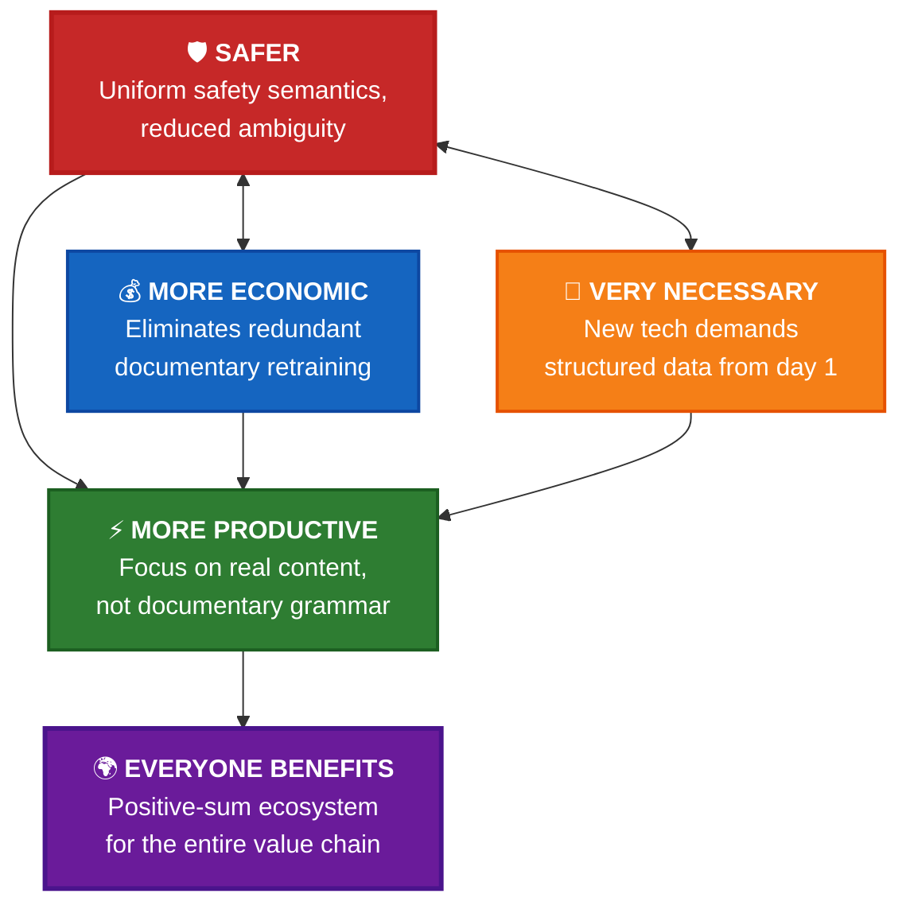
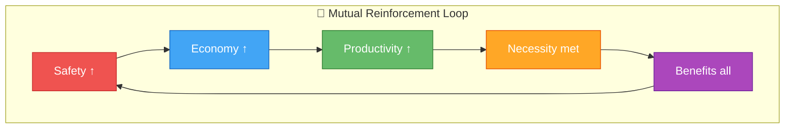
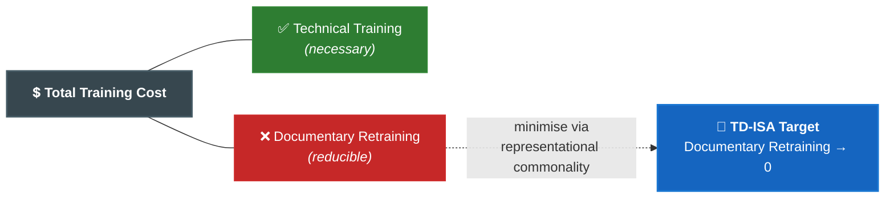
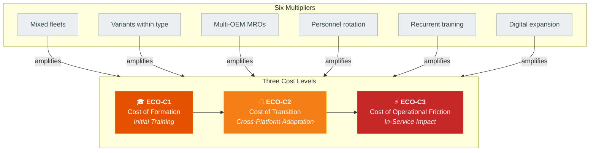
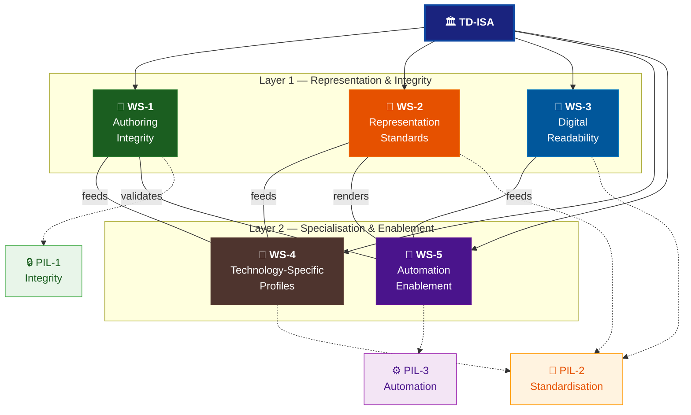
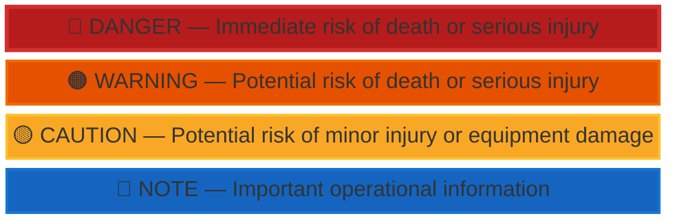
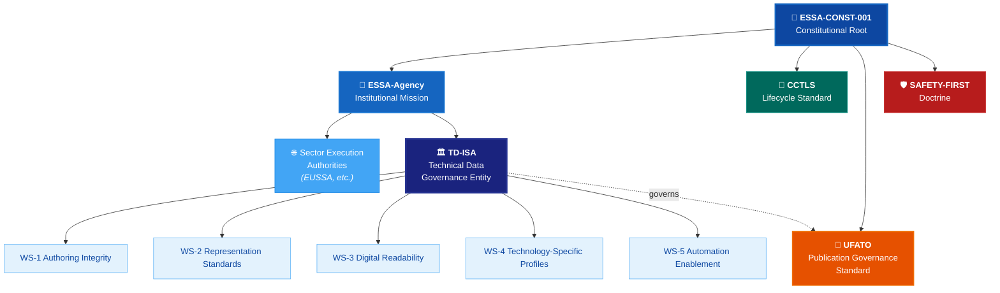

---
##############################################################################
# ESSA — TD-ISA: Technical Data Integrity, Standardization, and Automation
# Machine-readable companion specification
# Reference: ESSA-DOC-TDISA-001 v0.1-draft
# Author: Amedeo Pelliccia
##############################################################################

document_id: ESSA-DOC-TDISA-001
document_type: entity_proposal
title: "TD-ISA — Technical Data Integrity, Standardization, and Automation"
version: "0.5.0-draft"
schema_version: "1.0.0"
status: draft
parent: ESSA-CONST-001
last_updated: "2026-04-14T00:00:00Z"

mission_statement: >
  TD-ISA advances technical data integrity, standardisation, and automation
  to improve safety, interoperability, efficiency, and operational reliability
  across digital engineering and technical publication ecosystems.

strategic_objective: >
  Define a universal representation framework while preserving
  technology-specific flexibility in content structure.
  Universal form. Adaptive technical organisation.

closing_statement: >
  Technical data should not remain fragmented where common understanding is
  essential. By aligning integrity, representation, and automation-readiness,
  TD-ISA would help transform technical publications from isolated
  documentation products into a shared operational language for safer and
  more efficient industrial execution.

##############################################################################
# 1  Three Pillars
##############################################################################

pillars:

  - id: PIL-1
    name: "Technical Data Integrity"
    description: >
      Ensuring consistency, traceability, accuracy, and governance of
      technical information across its lifecycle.
    concerns:
      - consistency
      - traceability
      - accuracy
      - governance

  - id: PIL-2
    name: "Standardisation"
    description: >
      Promoting shared authoring rules, visual conventions, safety semantics,
      and digital presentation principles.
    concerns:
      - authoring_rules
      - visual_conventions
      - safety_semantics
      - presentation_principles
    primary_standard: ESSA-STD-UFATO-001

  - id: PIL-3
    name: "Automation"
    description: >
      Enabling technical content to be more easily validated, reused,
      processed, and integrated into automated and semi-automated
      operational environments.
    concerns:
      - machine_readability
      - validation_logic
      - content_reuse
      - workflow_integration

##############################################################################
# 2  Value Proposition: The Quintuple Win
##############################################################################

value_proposition:

  summary: "Safer. More economic. More productive. Very necessary. Everyone benefits."
  summary_es: "Más seguro. Más económico. Más trabajo. Muy necesario. Y todes felices."

  dimensions:

    - id: VP-1
      name: "Safer"
      description: >
        Uniform safety semantics, consistent visual cues, and reduced
        interpretation ambiguity lower the probability of human error.
      beneficiaries:
        - technicians
        - flight_crews
        - passengers
        - regulators

    - id: VP-2
      name: "More Economic"
      description: >
        Eliminates redundant documentary retraining; reduces format conversions,
        rework, and adaptation overhead.
      beneficiaries:
        - operators
        - mro_organisations
        - training_organisations
        - oems

    - id: VP-3
      name: "More Productive"
      description: >
        Training time concentrates on real technical content — technology,
        risks, execution — instead of documentary grammar.
      beneficiaries:
        - technicians
        - authors
        - instructors
        - subject_matter_experts

    - id: VP-4
      name: "Very Necessary"
      description: >
        Emerging technologies (hydrogen, high-voltage, AI-assisted) demand
        structured technical data from inception. Retrofitting standardisation
        later is orders of magnitude more expensive and more dangerous.
      beneficiaries:
        - industry
        - regulators
        - future_programmes

    - id: VP-5
      name: "Everyone Benefits"
      description: >
        A shared representation language creates a positive-sum ecosystem:
        OEMs author once, operators read consistently, MROs transfer
        competences, regulators audit uniformly.
      beneficiaries:
        - entire_aviation_value_chain

  reinforcement_principle: >
    These five dimensions are not trade-offs. They reinforce each other.
    Standardised representation does not reduce technical depth. It amplifies
    the value of every training hour, every maintenance action, and every
    safety check — by removing the noise of documentary fragmentation.

##############################################################################
# 2a Economic Argument
##############################################################################

economic_argument:

  thesis: >
    The industry is not only paying to train for the aircraft.
    It is also paying to train for the documentary differences around the aircraft.

  conclusion: >
    Standardised technical representation would not eliminate technical training.
    It would eliminate unnecessary retraining on how different organisations
    choose to represent the same maintenance intent.

  formula:
    total_training_cost: "Technical Training (necessary) + Documentary Retraining (reducible)"
    td_isa_target: "Minimise Documentary Retraining → 0 by maximising representational commonality."

  cost_levels:

    - id: ECO-C1
      name: "Cost of Formation (Initial Training)"
      description: >
        Training hours consumed not only by the technical system but also by
        documentary logic, coding systems, colour schemes, symbology,
        navigation philosophy, procedural voice, and variant-specific
        documentary differences.
      drivers:
        - documentary_logic
        - coding_conventions
        - colour_and_symbology
        - navigation_philosophy
        - procedural_voice
        - variant_documentary_differences

    - id: ECO-C2
      name: "Cost of Transition (Cross-Platform Adaptation)"
      description: >
        Each transition between aircraft model, variant, OEM, operator,
        MRO organisation, or documentary platform introduces an adaptation
        curve that consumes time and reduces initial efficiency even when
        the underlying technical competence already exists.
      transition_boundaries:
        - aircraft_model_or_variant
        - oem_or_constructor
        - operator_or_mro
        - documentary_platform_or_legacy_system

    - id: ECO-C3
      name: "Cost of Operational Friction (In-Service Impact)"
      description: >
        Mental translation between different documentary frameworks during
        operations produces longer reading times, more refresher actions,
        higher dependence on specific prior experience, increased probability
        of doubt or misinterpretation, and reduced ability to reuse
        competences across fleets.
      friction_effects:
        - longer_reading_interpretation_time
        - more_frequent_refresher_actions
        - higher_dependence_on_specific_experience
        - increased_doubt_or_misinterpretation
        - reduced_competence_reuse_across_fleets

  multipliers:
    - id: MUL-01
      factor: "Mixed fleets"
      effect: "Each fleet type may carry a different documentary philosophy."

    - id: MUL-02
      factor: "Variants within type"
      effect: "Sub-variant documentary differences compound the problem."

    - id: MUL-03
      factor: "Multi-OEM MROs"
      effect: "MRO organisations serving multiple constructors pay the cost for each."

    - id: MUL-04
      factor: "Personnel rotation"
      effect: "Every technician transition restarts the adaptation curve."

    - id: MUL-05
      factor: "Recurrent training"
      effect: "Documentary differences must be refreshed alongside technical content."

    - id: MUL-06
      factor: "Digital expansion"
      effect: "New IETP platforms introduce additional interaction-logic differences."

##############################################################################
# 3  Workstreams
##############################################################################

workstreams:

  - id: WS-1
    name: "Authoring Integrity"
    pillar: PIL-1
    description: >
      Controlled terminology, procedural clarity, semantic consistency,
      and traceable content governance.
    deliverables:
      - name: "Controlled vocabulary register"
        description: "Master BREX dictionary with domain extensions."
        ufato_binding: [UF-CT-01, UF-CT-02, UF-CT-03, UF-CT-04]

      - name: "Authoring style guide"
        description: "Sentence length, voice, mood, conditional nesting rules."
        ufato_binding: [UF-AR-01, UF-AR-02, UF-AR-03, UF-AR-04, UF-AR-05, UF-AR-06]

      - name: "Content governance model"
        description: "Change authority, review cycles, baseline rules."
        integration: "CCTLS gate sequence"

      - name: "Traceability matrix template"
        description: "Requirement → content → evidence chain."
        integration: "H-Pipeline H_REQ / H_EVIDENCE"

    maturity:
      level: M1
      status: "UFATO Layer 1 authoring rules defined."

  - id: WS-2
    name: "Representation Standards"
    pillar: PIL-2
    description: >
      Harmonised rules for visual hierarchy, colour coding, line conventions,
      illustration semantics, and safety cue presentation.
    deliverables:
      - name: "Safety severity scheme"
        description: "Invariant DANGER/WARNING/CAUTION/NOTE rendering."
        ufato_binding: "UFATO §4.3"

      - name: "Visual hierarchy specification"
        description: "Heading mapping, step numbering, table captioning."
        ufato_binding: [UF-VH-01, UF-VH-02, UF-VH-03, UF-VH-04, UF-VH-05, UF-VH-06]

      - name: "Illustration standard"
        description: "Line weights, callout conventions, greyscale legibility."
        ufato_binding: [UF-IC-01, UF-IC-02, UF-IC-03, UF-IC-04]

      - name: "Colour scheme annex"
        description: "Day-mode and night-mode palettes with WCAG AA compliance."
        ufato_binding: [UF-VH-05, UF-VH-06]

    maturity:
      level: M1
      status: "UFATO Layer 1 visual/safety semantics defined."

  - id: WS-3
    name: "Digital Readability and Interaction"
    pillar: PIL-2
    description: >
      Standards for display behaviour on tablets, laptops, and
      maintenance-oriented digital interfaces.
    deliverables:
      - name: "IETP interaction specification"
        description: "Breadcrumbs, hyperlinks, effectivity filtering, undo."
        ufato_binding: [UF-IL-01, UF-IL-02, UF-IL-03, UF-IL-04, UF-IL-05]

      - name: "Responsive display guidelines"
        description: "Minimum text sizes, contrast ratios, touch targets."
        ufato_binding: [UF-VH-04, UF-VH-05, UF-IC-04]

      - name: "Offline-mode specification"
        description: "Baseline preservation, sync logic, conflict resolution."
        ufato_binding: [UF-IL-05]

      - name: "Accessibility conformance profile"
        description: "WCAG 2.1 AA mapping for maintenance environments."
        ufato_binding: [UF-VH-04, UF-VH-05]

    maturity:
      level: M1
      status: "UFATO Layer 1 interaction logic defined."

  - id: WS-4
    name: "Technology-Specific Profiles"
    pillar: PIL-2
    description: >
      Adaptable chaptering and content structuring models for conventional
      aircraft, hydrogen systems, fuel cells, high-voltage architectures,
      AI-assisted systems, and future aerospace configurations.
    deliverables:
      - name: "Chapter Scheme registry"
        description: "Technology-domain chapter decompositions registered in AGGIX."
        ufato_binding: [AS-GOV-01, AS-GOV-02, AS-GOV-03, AS-GOV-04, AS-GOV-05]

      - name: "Hydrogen (LH₂) profile"
        description: "Chapters 28H/28V/28R, 73H/73C/73E."
        ufato_binding: "UFATO §5.2.2"

      - name: "High-voltage profile"
        description: "Chapters 24E/24B/24G."
        ufato_binding: "UFATO §5.2.3"

      - name: "AI-assisted systems profile"
        description: "Chapters 45A/45X/45M."
        ufato_binding: "UFATO §5.2.4"

      - name: "Domain Glossary Extension (DGE) template"
        description: "Structured term registration for new technology domains."
        ufato_binding: "UFATO §5.3"

    maturity:
      level: M1
      status: "UFATO Layer 2 reference Chapter Schemes defined."

  - id: WS-5
    name: "Automation Enablement"
    pillar: PIL-3
    description: >
      Machine-readable patterns, validation logic, structured semantics,
      and interoperability rules that support digital workflows and
      automation.
    deliverables:
      - name: "BREX validation rule set"
        description: "Schematron/XSD rules for automated authoring checks."
        integration: "S1000D BREX + UFATO Layer 1"

      - name: "Publication build pipeline specification"
        description: "CI/CD-compatible IETP build with automated link-checking."
        integration: "CCTLS PUBLISH gate"

      - name: "Structured metadata schema"
        description: "YAML/JSON sidecar schemas for data modules."
        integration: "AGGIX PUB/CFG resource types"

      - name: "Interoperability API specification"
        description: "REST/GraphQL interfaces for cross-system content exchange."
        integration: "AGGIX URI resolution"

      - name: "Machine-learning data extraction patterns"
        description: "Structured patterns for training data extraction from tech pubs."
        integration: "ESSA AI governance"

    maturity:
      level: M0
      status: "Scope defined; deliverables pending."

##############################################################################
# 4  Maturity Model
##############################################################################

maturity_model:
  levels:
    - level: M0
      label: "Proposed"
      criteria: "Workstream scope and deliverables defined."

    - level: M1
      label: "In Development"
      criteria: "Deliverables in INTERPRET or CONFIRM state."

    - level: M2
      label: "Published"
      criteria: "Deliverables in ACTIVATE or PUBLISH state."

    - level: M3
      label: "Adopted"
      criteria: "Deliverables in operational use by at least one external organisation."

    - level: M4
      label: "Institutionalised"
      criteria: "Deliverables incorporated into formal industry standards."

##############################################################################
# 5  Institutional Positioning Options
##############################################################################

institutional_positioning:
  forms:
    - form: institute
      description: "Permanent research and standards body."
      governance: "Board-directed, funded R&D agenda."

    - form: council
      description: "Advisory body with industry representation."
      governance: "Rotating chair, consensus-based recommendations."

    - form: foundation
      description: "Non-profit entity with open-access mandate."
      governance: "Membership-funded, public deliverables."

    - form: standards_initiative
      description: "Focused working group within an existing body."
      governance: "Time-bound charter, deliverable-driven."

    - form: cross_industry_working_body
      description: "Multi-stakeholder coordination mechanism."
      governance: "Federated participation, shared governance."

  recommended_initial_form: standards_initiative
  institutionalisation_pathway: "Council or Foundation once workstream deliverables reach M3."

##############################################################################
# 6  Benefits
##############################################################################

benefits:
  - id: BEN-01
    benefit: "Save time"
    impact_area: "Authoring, translation, cross-fleet maintenance."

  - id: BEN-02
    benefit: "Reduce costs"
    impact_area: "Fewer format conversions, less rework, smaller training burden."

  - id: BEN-03
    benefit: "Reduce interpretation errors"
    impact_area: "Uniform safety cues, controlled vocabulary, consistent layout."

  - id: BEN-04
    benefit: "Improve training transferability"
    impact_area: "Technicians trained on one system can read another."

  - id: BEN-05
    benefit: "Improve content reuse"
    impact_area: "Modular data modules shareable across programmes."

  - id: BEN-06
    benefit: "Reduce aircraft-on-ground exposure"
    impact_area: "Faster access to correct, unambiguous maintenance data."

  - id: BEN-07
    benefit: "Strengthen safety and security"
    impact_area: "Invariant safety semantics, traceable content governance."

  - id: BEN-08
    benefit: "Improve interoperability"
    impact_area: "OEMs, suppliers, operators, and MROs share a common data language."

  - id: BEN-09
    benefit: "Enable automation"
    impact_area: "Machine-readable, validated, structured data for digital workflows."

##############################################################################
# 7  Integration
##############################################################################

integration:
  essa:
    - artefact: "ESSA-Agency Constitution"
      binding: "TD-ISA operates under ESSA-Agency institutional authority."

    - artefact: "CCTLS gate sequence"
      binding: "Workstream deliverables follow INTERPRET → CONFIRM → ACTIVATE → PUBLISH."

    - artefact: "H-Pipeline (H_ENVELOPE)"
      binding: "WS-1 traceability extends H-token chains into publication content."

    - artefact: "AGGIX registry"
      binding: "WS-4 Chapter Schemes and WS-5 metadata schemas registered as CFG/PUB resources."

    - artefact: "UFATO (ESSA-STD-UFATO-001)"
      binding: "TD-ISA's primary technical standard — governs Layer 1 + Layer 2 rules."

    - artefact: "SPEC-PELS-014 lifecycle"
      binding: "Publication artefact states align with PELS engineering/product states."

    - artefact: "Safety-First Doctrine"
      binding: "WS-2 safety semantics are derived from SAFETY-FIRST invariants."

  external_standards:
    - standard: "S1000D Steering Committee"
      relationship: "WS-1/WS-2 rules align with and extend S1000D BREX and presentation specs."

    - standard: "ATA e-Business Group"
      relationship: "WS-4 conventional-aircraft profile maps to ATA iSpec 2200."

    - standard: "SAE International (ARP4754A, ARP4761)"
      relationship: "WS-1 traceability compatible with system development and safety assessment."

    - standard: "EASA / FAA"
      relationship: "WS-4 technology-specific profiles support certification data packages."

    - standard: "ISO TC20/SC1 (Aerospace terminology)"
      relationship: "WS-1 controlled vocabulary harmonised with ISO aerospace terminology."

    - standard: "W3C (WCAG)"
      relationship: "WS-3 accessibility rules conform to WCAG 2.1 AA."

    - standard: "DO-178C / DO-330 (RTCA)"
      relationship: "WS-4 AI-assisted systems profile references software/tool qualification."

##############################################################################
# 8  Revision History
##############################################################################

revision_history:
  - version: "0.1.0"
    date: "2026-04-14"
    change: "Initial entity proposal."

  - version: "0.2.0-draft"
    date: "2026-04-14"
    change: "Added economic_argument section: documentary retraining cost model with three cost levels, six multipliers, and formula."

  - version: "0.3.0-draft"
    date: "2026-04-14"
    change: "Added value_proposition section: Quadruple Win (economic, safer, more productive, everyone benefits)."

  - version: "0.4.0-draft"
    date: "2026-04-14"
    change: "Upgraded to Quintuple Win: added VP-4 'Very Necessary' dimension; reordered safety-first; added Spanish summary."

  - version: "0.5.0-draft"
    date: "2026-04-14"
    change: "Enhanced graphic elements: replaced ASCII art with Mermaid diagrams; added new diagrams for pillars, cost model, maturity progression, and integration map."
---

# ESSA — TD-ISA: Technical Data Integrity, Standardization, and Automation

**A Proposed Entity for Common Technical Data Governance**

| Metadata | Value |
|----------|-------|
| **Document ID** | ESSA-DOC-TDISA-001 |
| **Version** | v0.5-draft |
| **Status** |  Entity Proposal |
| **Parent** | ESSA-CONST-001 ([ESSA-AGENCY-CONSTITUTION.md](ESSA-AGENCY-CONSTITUTION.md)) |
| **Companion** | [`td-isa.yaml`](td-isa.yaml) |
| **Related** | [`UFATO.md`](UFATO.md) · [`SAFETY-FIRST.md`](SAFETY-FIRST.md) · [`CCTLS.md`](CCTLS.md) · [`IPSN.md`](IPSN.md) |
| **Last Updated** | 2026-04-14 |

---

## 0. Preamble

Across aviation and other high-consequence industries, technical information is
often produced through different authoring traditions, visual conventions,
coding logics, and procedural philosophies. Even when the operational intent is
the same, the representation of that intent may vary significantly between
organisations, platforms, and legacy systems.

This fragmentation creates unnecessary complexity for:

- maintenance technicians who must interpret tasks across different documentary systems,
- authors and illustrators who must re-express similar technical intent in multiple formats,
- operators and MRO organisations seeking interoperability,
- digital toolchains that depend on consistent structure and semantics,
- future automation systems that require stable, machine-readable, and trustworthy data.

TD-ISA is proposed as a dedicated entity focused on establishing a common
framework for the integrity, standardisation, and automation-readiness of
technical data.

---

## 1. Mission Statement

> **TD-ISA advances technical data integrity, standardisation, and automation
> to improve safety, interoperability, efficiency, and operational reliability
> across digital engineering and technical publication ecosystems.**

---

## 2. Core Mission: Three Pillars

TD-ISA is organised around three interdependent pillars:

```mermaid
graph TB
    TDISA["🏛️ <b>TD-ISA</b><br/>Technical Data Governance"]
    
    PIL1["🔒 <b>PIL-1</b><br/>Technical Data Integrity"]
    PIL2["📐 <b>PIL-2</b><br/>Standardisation"]
    PIL3["⚙️ <b>PIL-3</b><br/>Automation"]

    TDISA --> PIL1
    TDISA --> PIL2
    TDISA --> PIL3

    PIL1 --- C1A["Consistency"]
    PIL1 --- C1B["Traceability"]
    PIL1 --- C1C["Accuracy"]
    PIL1 --- C1D["Governance"]

    PIL2 --- C2A["Authoring Rules"]
    PIL2 --- C2B["Visual Conventions"]
    PIL2 --- C2C["Safety Semantics"]
    PIL2 --- C2D["Presentation Principles"]

    PIL3 --- C3A["Machine Readability"]
    PIL3 --- C3B["Validation Logic"]
    PIL3 --- C3C["Content Reuse"]
    PIL3 --- C3D["Workflow Integration"]

    style TDISA fill:#1a237e,stroke:#0d47a1,color:#ffffff,stroke-width:3px
    style PIL1 fill:#1b5e20,stroke:#2e7d32,color:#ffffff,stroke-width:2px
    style PIL2 fill:#e65100,stroke:#ef6c00,color:#ffffff,stroke-width:2px
    style PIL3 fill:#4a148c,stroke:#6a1b9a,color:#ffffff,stroke-width:2px

    style C1A fill:#e8f5e9,stroke:#4caf50,color:#1b5e20
    style C1B fill:#e8f5e9,stroke:#4caf50,color:#1b5e20
    style C1C fill:#e8f5e9,stroke:#4caf50,color:#1b5e20
    style C1D fill:#e8f5e9,stroke:#4caf50,color:#1b5e20

    style C2A fill:#fff3e0,stroke:#ff9800,color:#e65100
    style C2B fill:#fff3e0,stroke:#ff9800,color:#e65100
    style C2C fill:#fff3e0,stroke:#ff9800,color:#e65100
    style C2D fill:#fff3e0,stroke:#ff9800,color:#e65100

    style C3A fill:#f3e5f5,stroke:#9c27b0,color:#4a148c
    style C3B fill:#f3e5f5,stroke:#9c27b0,color:#4a148c
    style C3C fill:#f3e5f5,stroke:#9c27b0,color:#4a148c
    style C3D fill:#f3e5f5,stroke:#9c27b0,color:#4a148c
```

### 2.1 Technical Data Integrity

Ensuring consistency, traceability, accuracy, and governance of technical
information across its lifecycle.

| Concern | What TD-ISA Addresses |
|---------|----------------------|
| Consistency | Same operational intent produces semantically equivalent content regardless of authoring origin |
| Traceability | Every technical datum links to its source requirement, safety objective, or engineering authority |
| Accuracy | Content validation against structured rules, not narrative review alone |
| Governance | Version control, change authority, baseline management, and audit readiness |

### 2.2 Standardisation

Promoting shared authoring rules, visual conventions, safety semantics, and
digital presentation principles.

| Concern | What TD-ISA Addresses |
|---------|----------------------|
| Authoring rules | Sentence structure, controlled vocabulary, procedural clarity |
| Visual conventions | Colour coding, line weights, callout styles, safety cue rendering |
| Safety semantics | Invariant severity hierarchy (DANGER / WARNING / CAUTION / NOTE) |
| Presentation | Digital display behaviour, accessibility, interaction logic |

TD-ISA references and governs the **UFATO** standard
(ESSA-STD-UFATO-001) as its core representation framework:
universal form for presentation; adaptive technical organisation for content
structure.

### 2.3 Automation

Enabling technical content to be more easily validated, reused, processed,
and integrated into automated and semi-automated operational environments.

| Concern | What TD-ISA Addresses |
|---------|----------------------|
| Machine readability | Structured semantic markup, typed metadata, machine-parseable rules |
| Validation logic | Automated BREX / Schematron / schema checks at authoring and build time |
| Content reuse | Modular data modules with stable identifiers and applicability filtering |
| Workflow integration | API-ready publication artefacts, CI/CD-compatible build pipelines |

---

## 3. Strategic Objective

The objective is **not** to rigidly standardise every technical chapter or
every engineering architecture.

The objective is to define a **universal representation framework** while
preserving **technology-specific flexibility** in content structure.

> **Universal form. Adaptive technical organisation.**

This is the strategic equilibrium:

- Strong standardisation where **cognitive consistency and safety** matter most.
- Controlled flexibility where **engineering reality** demands it.

---

## 4. Why It Matters

A stronger common framework would:

| Benefit | Impact Area |
|---------|-------------|
| Save time | Authoring, translation, cross-fleet maintenance |
| Reduce costs | Fewer format conversions, less rework, smaller training burden |
| Reduce interpretation errors | Uniform safety cues, controlled vocabulary, consistent layout |
| Improve training transferability | Technicians trained on one system can read another |
| Improve content reuse | Modular data modules shareable across programmes |
| Reduce aircraft-on-ground exposure | Faster access to correct, unambiguous maintenance data |
| Strengthen safety and security | Invariant safety semantics, traceable content governance |
| Improve interoperability | OEMs, suppliers, operators, and MROs share a common data language |
| Enable automation | Machine-readable, validated, structured data for digital workflows |

---

## 5. Value Proposition: The Quintuple Win

TD-ISA's impact can be summarised in five reinforcing dimensions:

> **Más seguro. Más económico. Más trabajo. Muy necesario. Y todes felices.**
>
> *Safer. More economic. More productive. Very necessary. And everyone benefits.*

| Dimension | What Changes | Who Benefits |
|-----------|-------------|--------------|
| **Safer** | Uniform safety semantics, consistent visual cues, and reduced interpretation ambiguity lower the probability of human error | Technicians, flight crews, passengers, regulators |
| **More Economic** | Eliminates redundant documentary retraining; reduces format conversions, rework, and adaptation overhead | Operators, MROs, training organisations, OEMs |
| **More Productive** | Training time concentrates on real technical content — technology, risks, execution — instead of documentary grammar | Technicians, authors, instructors, SMEs |
| **Very Necessary** | Emerging technologies (hydrogen, high-voltage, AI-assisted) demand structured technical data from inception — retrofitting standardisation later is orders of magnitude more expensive and more dangerous | Industry, regulators, future programmes |
| **Everyone Benefits** | A shared representation language creates a positive-sum ecosystem: OEMs author once, operators read consistently, MROs transfer competences, regulators audit uniformly | The entire aviation value chain |

### 5.1 Why It Is a Quintuple Win

Traditional standardisation arguments focus narrowly on cost reduction.
TD-ISA goes further:

- **Safety improvement** through cognitive consistency comes first,
- **economic savings** are real and multiplicative (see §6),
- **productivity gains** refocus human effort on technical substance,
- **necessity** is structural — new technology domains cannot afford
  fragmented documentation from their first day of operation,
  and
- **ecosystem-wide satisfaction** follows because every stakeholder —
  from the line technician to the regulator — benefits from a common
  documentary language.

These five dimensions are not trade-offs. They reinforce each other:

📊 Quintuple Win — reinforcement logic (click to expand)

> **Standardised representation does not reduce technical depth.
> It amplifies the value of every training hour, every maintenance action,
> and every safety check — by removing the noise of documentary
> fragmentation.**

---

## 6. Economic Argument: The Documentary Retraining Problem

The strongest economic justification for TD-ISA lies in a distinction that is
rarely made explicit:

> **The industry is not only paying to train for the aircraft.
> It is also paying to train for the documentary differences around the aircraft.**

Today, training a maintenance technician, author, or SME involves not only
the technical system itself, but also the specific way each manufacturer,
variant, or platform **represents** that system in its publications. This
creates cost at three levels.

### 6.1 Cost of Formation (Initial Training)

Training hours are consumed not only by the technical system, but also by:

- documentary logic and navigation philosophy,
- coding systems and numbering conventions,
- colour schemes and visual symbology,
- procedural voice and structure,
- variant-specific documentary differences.

Every organisation that publishes differently adds formation overhead that has
**nothing to do with the aircraft itself**.

### 6.2 Cost of Transition (Cross-Platform Adaptation)

Each transition between:

- aircraft model or variant,
- OEM or constructor,
- operator or MRO organisation,
- documentary platform or legacy system,

introduces an **adaptation curve** that consumes time and reduces initial
efficiency — even when the underlying technical competence already exists.

### 6.3 Cost of Operational Friction (In-Service Impact)

When technicians, instructors, authors, or SMEs must mentally translate
between different documentary frameworks during operations, the result is:

- longer reading and interpretation times,
- more frequent need for refresher actions,
- higher dependence on specific prior experience,
- increased probability of doubt or misinterpretation,
- reduced ability to reuse competences across fleets.

### 6.4 The Core Insight

If the **representation** were significantly more standardised, training
could concentrate on what genuinely matters:

- the technology,
- the architecture of the system,
- the real operational risks,
- the safe execution of the task.

And **not** on relearning, each time, a new documentary grammar.

> **Standardised technical representation would not eliminate technical
> training. It would eliminate unnecessary retraining on how different
> organisations choose to represent the same maintenance intent.**

### 6.5 Scale of Impact

This cost is not marginal. It is **multiplicative** across:

| Multiplier | Effect |
|------------|--------|
| Mixed fleets | Each fleet type may carry a different documentary philosophy |
| Variants within type | Sub-variant documentary differences compound the problem |
| Multi-OEM MROs | MRO organisations serving multiple constructors pay the cost for each |
| Personnel rotation | Every technician transition restarts the adaptation curve |
| Recurrent training | Documentary differences must be refreshed alongside technical content |
| Digital expansion | New IETP platforms introduce additional interaction-logic differences |

A common representation framework would **dramatically reduce training
overhead, accelerate cross-platform readiness, and improve operational
efficiency** across the entire aviation ecosystem.

### 6.6 Formula

📐 Cost amplification model (click to expand)

The savings potential is proportional to the number of **documentary
boundaries** a workforce must cross. For large operators, multi-type MROs,
and global supply chains, this represents a **structural cost reduction
opportunity**.

---

## 7. Workstreams

TD-ISA operates through five main workstreams:

### 7.1 WS-1 — Authoring Integrity

Controlled terminology, procedural clarity, semantic consistency, and
traceable content governance.

| Deliverable | Description | UFATO Binding |
|-------------|-------------|---------------|
| Controlled vocabulary register | Master BREX dictionary with domain extensions | UF-CT-01 through UF-CT-04 |
| Authoring style guide | Sentence length, voice, mood, conditional nesting rules | UF-AR-01 through UF-AR-06 |
| Content governance model | Change authority, review cycles, baseline rules | CCTLS gate sequence |
| Traceability matrix template | Requirement → content → evidence chain | H-Pipeline H_REQ / H_EVIDENCE |

### 7.2 WS-2 — Representation Standards

Harmonised rules for visual hierarchy, colour coding, line conventions,
illustration semantics, and safety cue presentation.

| Deliverable | Description | UFATO Binding |
|-------------|-------------|---------------|
| Safety severity scheme | Invariant DANGER / WARNING / CAUTION / NOTE rendering | UFATO §4.3 |
| Visual hierarchy specification | Heading mapping, step numbering, table captioning | UF-VH-01 through UF-VH-06 |
| Illustration standard | Line weights, callout conventions, greyscale legibility | UF-IC-01 through UF-IC-04 |
| Colour scheme annex | Day-mode and night-mode palettes with WCAG AA compliance | UF-VH-05, UF-VH-06 |

🎨 Safety severity hierarchy (click to expand)

### 7.3 WS-3 — Digital Readability and Interaction

Standards for display behaviour on tablets, laptops, and maintenance-oriented
digital interfaces.

| Deliverable | Description | UFATO Binding |
|-------------|-------------|---------------|
| IETP interaction specification | Breadcrumbs, hyperlinks, effectivity filtering, undo | UF-IL-01 through UF-IL-05 |
| Responsive display guidelines | Minimum text sizes, contrast ratios, touch targets | UF-VH-04, UF-VH-05, UF-IC-04 |
| Offline-mode specification | Baseline preservation, sync logic, conflict resolution | UF-IL-05 |
| Accessibility conformance profile | WCAG 2.1 AA mapping for maintenance environments | UF-VH-04, UF-VH-05 |

### 7.4 WS-4 — Technology-Specific Profiles

Adaptable chaptering and content structuring models for conventional aircraft,
hydrogen systems, fuel cells, high-voltage architectures, AI-assisted systems,
and future aerospace configurations.

| Deliverable | Description | UFATO Binding |
|-------------|-------------|---------------|
| Chapter Scheme registry | Technology-domain chapter decompositions registered in AGGIX | AS-GOV-01 through AS-GOV-05 |
| Hydrogen (LH₂) profile | Chapters 28H/28V/28R, 73H/73C/73E | UFATO §5.2.2 |
| High-voltage profile | Chapters 24E/24B/24G | UFATO §5.2.3 |
| AI-assisted systems profile | Chapters 45A/45X/45M | UFATO §5.2.4 |
| Domain Glossary Extension (DGE) template | Structured term registration for new technology domains | UFATO §5.3 |

### 7.5 WS-5 — Automation Enablement

Machine-readable patterns, validation logic, structured semantics, and
interoperability rules that support digital workflows and automation.

| Deliverable | Description | Integration |
|-------------|-------------|-------------|
| BREX validation rule set | Schematron / XSD rules for automated authoring checks | S1000D BREX + UFATO Layer 1 |
| Publication build pipeline specification | CI/CD-compatible IETP build with automated link-checking | CCTLS PUBLISH gate |
| Structured metadata schema | YAML/JSON sidecar schemas for data modules | AGGIX PUB / CFG resource types |
| Interoperability API specification | REST/GraphQL interfaces for cross-system content exchange | AGGIX URI resolution |
| Machine-learning data extraction patterns | Structured patterns for training data extraction from tech pubs | ESSA AI governance |

---

## 8. Placement in the ESSA Stack

TD-ISA operates as a **cross-cutting entity** within ESSA governance:

**Key relationship:** UFATO (ESSA-STD-UFATO-001) is the **primary technical
standard** that TD-ISA governs and advances. TD-ISA provides the
institutional authority, workstream structure, and cross-industry coordination
that UFATO's rules require for effective adoption.

---

## 9. Institutional Positioning

TD-ISA may be framed as one of the following, depending on its intended
level of authority, governance, and participation:

| Form | Description | Governance Model |
|------|-------------|------------------|
| **Institute** | Permanent research and standards body | Board-directed, funded R&D agenda |
| **Council** | Advisory body with industry representation | Rotating chair, consensus-based recommendations |
| **Foundation** | Non-profit entity with open-access mandate | Membership-funded, public deliverables |
| **Standards Initiative** | Focused working group within an existing body | Time-bound charter, deliverable-driven |
| **Cross-Industry Working Body** | Multi-stakeholder coordination mechanism | Federated participation, shared governance |

The recommended initial framing is a **Standards Initiative** under ESSA
governance, with a pathway to institutionalisation as a **Council** or
**Foundation** once workstream deliverables reach maturity.

---

## 10. Integration Points

```mermaid
graph TB
    TDISA["🏛️ <b>TD-ISA</b>"]

    subgraph ESSA_INT ["ESSA Governance Artefacts"]
        CONST["📜 ESSA-Agency<br/>Constitution"]
        CCTLS_I["🔄 CCTLS<br/>Gate Sequence"]
        HPIPE["🔗 H-Pipeline<br/>H_ENVELOPE"]
        AGGIX_I["📦 AGGIX<br/>Registry"]
        UFATO_I["📄 UFATO<br/>ESSA-STD-UFATO-001"]
        PELS["📋 SPEC-PELS-014<br/>Lifecycle"]
        SAFE["🛡️ Safety-First<br/>Doctrine"]
    end

    subgraph EXT ["External Standards"]
        S1000D["S1000D Steering<br/>Committee"]
        ATA["ATA e-Business<br/>Group"]
        SAE["SAE International<br/>ARP4754A / ARP4761"]
        EASA["EASA / FAA"]
        ISO["ISO TC20/SC1"]
        W3C["W3C WCAG"]
        RTCA["DO-178C / DO-330<br/>RTCA"]
    end

    TDISA --- CONST
    TDISA --- CCTLS_I
    TDISA --- HPIPE
    TDISA --- AGGIX_I
    TDISA ---|governs| UFATO_I
    TDISA --- PELS
    TDISA --- SAFE

    TDISA -.- S1000D
    TDISA -.- ATA
    TDISA -.- SAE
    TDISA -.- EASA
    TDISA -.- ISO
    TDISA -.- W3C
    TDISA -.- RTCA

    style TDISA fill:#1a237e,stroke:#283593,color:#ffffff,stroke-width:3px
    style CONST fill:#e3f2fd,stroke:#64b5f6,color:#0d47a1
    style CCTLS_I fill:#e3f2fd,stroke:#64b5f6,color:#0d47a1
    style HPIPE fill:#e3f2fd,stroke:#64b5f6,color:#0d47a1
    style AGGIX_I fill:#e3f2fd,stroke:#64b5f6,color:#0d47a1
    style UFATO_I fill:#fff3e0,stroke:#ff9800,color:#e65100,stroke-width:2px
    style PELS fill:#e3f2fd,stroke:#64b5f6,color:#0d47a1
    style SAFE fill:#ffebee,stroke:#ef5350,color:#b71c1c
    style S1000D fill:#f5f5f5,stroke:#9e9e9e,color:#424242
    style ATA fill:#f5f5f5,stroke:#9e9e9e,color:#424242
    style SAE fill:#f5f5f5,stroke:#9e9e9e,color:#424242
    style EASA fill:#f5f5f5,stroke:#9e9e9e,color:#424242
    style ISO fill:#f5f5f5,stroke:#9e9e9e,color:#424242
    style W3C fill:#f5f5f5,stroke:#9e9e9e,color:#424242
    style RTCA fill:#f5f5f5,stroke:#9e9e9e,color:#424242
```

### 10.1 With ESSA Governance

| ESSA Artefact | TD-ISA Binding |
|---------------|----------------|
| ESSA-Agency Constitution | TD-ISA operates under ESSA-Agency institutional authority |
| CCTLS gate sequence | TD-ISA workstream deliverables follow INTERPRET → CONFIRM → ACTIVATE → PUBLISH |
| H-Pipeline (H_ENVELOPE) | WS-1 traceability extends H-token chains into publication content |
| AGGIX registry | WS-4 Chapter Schemes and WS-5 metadata schemas registered as CFG/PUB resources |
| UFATO (ESSA-STD-UFATO-001) | TD-ISA's primary technical standard — governs Layer 1 + Layer 2 rules |
| SPEC-PELS-014 lifecycle | Publication artefact states align with PELS engineering/product states |
| Safety-First Doctrine | WS-2 safety semantics are derived from SAFETY-FIRST invariants |

### 10.2 With External Standards and Bodies

| Standard / Body | Relationship |
|-----------------|-------------|
| S1000D Steering Committee | WS-1/WS-2 rules align with and extend S1000D BREX and presentation specs |
| ATA e-Business Group | WS-4 conventional-aircraft profile maps to ATA iSpec 2200 |
| SAE International (ARP4754A, ARP4761) | WS-1 traceability compatible with system development and safety assessment processes |
| EASA / FAA | WS-4 technology-specific profiles support certification data packages |
| ISO TC20/SC1 (Aerospace terminology) | WS-1 controlled vocabulary harmonised with ISO aerospace terminology |
| W3C (WCAG) | WS-3 accessibility rules conform to WCAG 2.1 AA |
| DO-178C / DO-330 (RTCA) | WS-4 AI-assisted systems profile references software/tool qualification |

---

## 11. Conformance and Governance

### 11.1 Workstream Maturity Levels

Each workstream progresses through defined maturity levels:

| Level | Label | Criteria |
|-------|-------|----------|
| **M0** | Proposed | Workstream scope and deliverables defined |
| **M1** | In Development | Deliverables in INTERPRET or CONFIRM state |
| **M2** | Published | Deliverables in ACTIVATE or PUBLISH state |
| **M3** | Adopted | Deliverables in operational use by at least one external organisation |
| **M4** | Institutionalised | Deliverables incorporated into formal industry standards |

### 11.2 Current Maturity Assessment

```mermaid
gantt
    title TD-ISA Workstream Maturity Status
    dateFormat X
    axisFormat %s

    section WS-1 Authoring Integrity
    M1 — In Development :active, ws1, 0, 2

    section WS-2 Representation Standards
    M1 — In Development :active, ws2, 0, 2

    section WS-3 Digital Readability
    M1 — In Development :active, ws3, 0, 2

    section WS-4 Technology-Specific Profiles
    M1 — In Development :active, ws4, 0, 2

    section WS-5 Automation Enablement
    M0 — Proposed :ws5, 0, 1
```

| Workstream | Level | Status |
|------------|-------|--------|
| WS-1 Authoring Integrity | M1 | UFATO Layer 1 authoring rules defined |
| WS-2 Representation Standards | M1 | UFATO Layer 1 visual/safety semantics defined |
| WS-3 Digital Readability | M1 | UFATO Layer 1 interaction logic defined |
| WS-4 Technology-Specific Profiles | M1 | UFATO Layer 2 reference Chapter Schemes defined |
| WS-5 Automation Enablement | M0 | Scope defined; deliverables pending |

---

## 12. What TD-ISA Is Not

1. **Not a replacement for S1000D, ATA iSpec 2200, or any existing standard.**
   TD-ISA coordinates and extends; it does not supplant.
2. **Not a software product.** TD-ISA defines standards, rules, and governance
   frameworks. Implementation is the responsibility of CSDB, IETP, and
   toolchain providers.
3. **Not a regulatory authority.** TD-ISA proposes and governs standards;
   certification authority remains with EASA, FAA, and equivalent bodies.
4. **Not limited to aviation.** While aviation is the primary domain, TD-ISA's
   principles apply to any high-consequence industry where technical data
   integrity, standardisation, and automation are critical.

---

## 13. Closing Statement

Technical data should not remain fragmented where common understanding is
essential.

By aligning integrity, representation, and automation-readiness, TD-ISA would
help transform technical publications from isolated documentation products
into a **shared operational language** for safer and more efficient industrial
execution.

---

## 14. Revision History

| Version | Date | Change |
|---------|------|--------|
| v0.1-draft | 2026-04-14 | Initial entity proposal. |
| v0.2-draft | 2026-04-14 | Added §6 Economic Argument: The Documentary Retraining Problem. |
| v0.3-draft | 2026-04-14 | Added §5 Value Proposition: The Quadruple Win. |
| v0.4-draft | 2026-04-14 | Upgraded to Quintuple Win: added 5th dimension "Very Necessary"; reordered safety-first; added Spanish summary. |
| v0.5-draft | 2026-04-14 | Enhanced graphic elements: replaced ASCII art with Mermaid diagrams; added new diagrams for three pillars, cost model, maturity progression, and integration map; added SVG status badge. |
