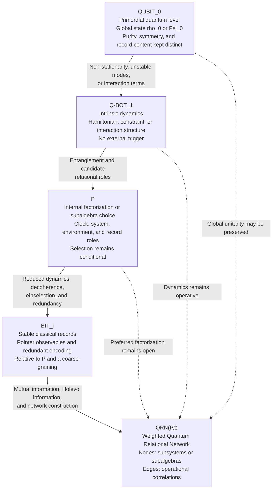

# Primordial Qubit Framework

## A disciplined framework connecting quantum information, decoherence, and primordial cosmology

**Subtitle:** Internal differentiation, stable classical records, and relational-network emergence in a closed universe  
**Version:** v0.6.2 — Major revision / working paper  
**Acronym:** PQF  
**Author:** Amedeo Pelliccia (Amedeo Pelliccia De Martino)

> [!NOTE]
> Mathematical expressions use GitHub-supported MathJax syntax: `$...$` inline and fenced `math` blocks for display equations. Mermaid labels intentionally use plain text because Mermaid does not process MathJax inside nodes.

---

## Preface

The Primordial Qubit Framework begins from a restricted claim: **classically distinguishable information requires physically recordable differences**.

A primordial state may be pure, highly symmetric, and initially poor in stable classical records. These properties are related only under additional assumptions. They are not synonyms:

- **Purity** concerns the density operator.
- **Symmetry** concerns invariance under a specified group action.
- **Superposition** concerns the coherent representation of a state in a chosen basis.
- **Von Neumann entropy** measures mixedness, not the number of classical structures present.
- **Operationally accessible classical information** depends on observables, subsystem structure, decoherence, and stable records.

The framework assumes, as a working hypothesis, that the primordial universe can be represented at an appropriate effective level by a globally quantum state that is low in the relevant coarse-grained entropy, highly symmetric under the relevant symmetries, and initially poor in stable differentiated records.

The label **QUBIT₀** does **not** necessarily denote a literal two-level system in ℂ². It denotes the primordial quantum level prior to the stabilization of classical bits.

The intrinsic dynamics, labelled **Q-BOT₁**, is not activated by an external agent. It belongs to the model from the outset. Differentiation requires either non-stationarity relative to the relevant dynamics, unstable modes, interaction terms, or amplification mechanisms capable of generating entanglement and records.

In a universe with no external environment, some degrees of freedom may play, relative to others, the roles of system, environment, clock, and memory. Decoherence then concerns reduced states defined with respect to an internal factorization or subalgebra choice. The global state may remain pure and evolve unitarily.

This removes the need for an external observer. It does **not** by itself determine a preferred factorization, solve the measurement problem, or explain why an observer experiences one outcome.

The central statement is:

> **The classical bit is not assumed as an origin. It is a stable record emerging from a quantum state, intrinsic dynamics, and an internal partition capable of producing accessible and redundant differences.**

---



---

## Epistemic status

| Register | Meaning |
|---|---|
| **R1 — Established** | Standard result in quantum mechanics, QFT, decoherence theory, or information theory |
| **R2 — Conditional** | Valid under explicit assumptions such as a factorization, Hamiltonian, coarse-graining, or semiclassical regime |
| **R3 — Framework conjecture** | Original proposal requiring derivation, simulation, or testing |
| **R4 — Controlled metaphor** | Expository language that is never used as a proof step |

Expressions such as “the universe observes itself,” “execution,” “residual,” and “potential” are permitted only as controlled metaphors and must be accompanied by an operational statement.

The indices `₀`, `₁`, and `ᵢ` indicate **conceptual dependency levels**, not necessarily temporal instants.

---

## Abstract

The **Primordial Qubit Framework** provides a conceptual and operational structure for describing the emergence of stable classical records from a globally quantum state in a closed universe.

Its canonical dependency chain is:

```math
(\rho_0,H)\longrightarrow\mathcal P\longrightarrow\{\mathrm{BIT}_i\}\longrightarrow\mathrm{QRN}(\mathcal P,t)
```

Here:

- $\rho_0$ or $\Psi_0$ denotes the primordial global quantum state;
- $H$ denotes intrinsic dynamics or a constraint structure;
- $\mathcal P$ denotes a tensor-product structure or a family of subalgebras;
- $\mathrm{BIT}_i$ denotes stable classical records;
- $\mathrm{QRN}(\mathcal P,t)$ denotes a weighted relational network constructed from operational correlations.

The framework strictly separates purity, symmetry, superposition, mixedness, and accessible classical information. It does not identify global von Neumann entropy with coarse-grained thermodynamic entropy. It does not derive the cosmological arrow of time from Landauer’s principle.

Its specific contribution consists of:

1. a disciplined separation between state, dynamics, partition, record, and relational network;
2. an internal relational-closure criterion;
3. an operational differentiation-capacity functional $\mathcal D$;
4. a quantitative definition of the Quantum Relational Network;
5. a candidate relational-complexity measure;
6. a four-qubit toy model illustrating reduced decoherence and redundant record formation.

The framework does not claim to solve the measurement problem, derive a unique preferred factorization, explain the low-entropy boundary condition, or provide a theory of quantum gravity.

---

# 1. Motivation

## 1.1 From abstract bits to physical records

A classical bit cannot be treated as a primitive physical object without specifying how its value becomes stable and accessible.

In a quantum description, classicality requires at least:

1. intrinsic dynamics;
2. a subsystem or observable structure;
3. suppression of operational interference;
4. stability of selected observables;
5. physical recording, preferably redundant, in additional degrees of freedom.

The symbol **BITᵢ** therefore denotes a physical record satisfying distinguishability, stability, and accessibility conditions. It does not merely denote the abstract value `0` or `1`.

## 1.2 Closed-universe decoherence

Decoherence does not require an environment external to the universe. It requires a relational split such as:

```math
\mathcal H\simeq\mathcal H_S\otimes\mathcal H_E
```

and an interaction that entangles $S$ and $E$.

The global state may evolve unitarily:

```math
\rho_{SE}(t)=U(t)\rho_{SE}(0)U^{\dagger}(t)
```

while the reduced state:

```math
\rho_S(t)=\operatorname{Tr}_E\!\left[\rho_{SE}(t)\right]
```

loses observable coherence in a dynamically selected basis.

This **reformulates** the environmental requirement: the environment is internal to the total system. It does not by itself derive the preferred split or select one ontological outcome.

## 1.3 Relational time

In Page–Wootters-type constructions, a globally constrained state may yield conditional evolution when one subsystem acts as a clock.

The framework uses this only as a conditional tool:

- a clock degree of freedom must already be identified;
- its correlations with the remaining system must support an adequate ordering parameter;
- the construction does not select the clock uniquely;
- relational time does not automatically solve the preferred-factorization problem.

---

# 2. Original contribution and non-claims

## 2.1 Original contribution

The framework does not claim originality for decoherence, Page–Wootters relational time, quantum Darwinism, Landauer’s principle, quantum mereology, or crossed-product constructions.

Its proposed contribution is architectural and operational.

### C1 — Separation of levels

The framework distinguishes:

```math
\text{state}\neq\text{dynamics}\neq\text{factorization}\neq\text{record}\neq\text{relational network}
```

This prevents recurring conflations between:

- a quantum state and classical information;
- decoherence and collapse;
- correlation and causation;
- global purity and local thermality;
- a relational graph and a causal network.

### C2 — Internal relational closure

A closed quantum cosmology is relationally complete only if it specifies how the following roles arise internally:

```math
\text{clock}\;|\;\text{system}\;|\;\text{environment}\;|\;\text{record}
```

This is a consistency criterion, not a derivation of a unique partition.

### C3 — Operational differentiation capacity

The framework introduces a partition-dependent functional $\mathcal D$ that estimates how effectively a state–dynamics pair produces stable and redundantly accessible classical records.

### C4 — Quantitative QRN construction

The Quantum Relational Network is defined as a weighted graph whose edges are information-theoretic quantities, rather than as a metaphorical web.

### C5 — Joint factorization programme

The framework proposes that physically useful factorizations should jointly support:

- approximate locality of $H$;
- limited nonlocal entanglement production;
- robust pointer observables;
- redundant records;
- adequate internal clocks;
- algebraic regularity in the relevant regime.

This is a conjectural research programme, not a theorem.

## 2.2 Non-claims

The framework does not claim that:

- QUBIT₀ is a literal physical qubit;
- purity implies symmetry;
- symmetry implies low entropy;
- superposition implies a maximally mixed state;
- decoherence produces a unique observed outcome;
- Landauer’s bound generates the cosmological arrow of time;
- the global von Neumann entropy increases under unitary evolution;
- Page–Wootters selects a unique clock;
- crossed products select a unique cosmological factorization;
- QRN edges are automatically causal;
- $\mathcal D$ is universal or coarse-graining independent;
- the low-entropy initial condition is explained;
- quantum gravity has been derived.

---

# 3. Foundational distinctions

## 3.1 Purity

A state is pure when:

```math
\rho^2=\rho,\qquad \operatorname{Tr}(\rho^2)=1,\qquad S_{\mathrm{vN}}(\rho)=0
```

Purity does not imply symmetry or classical simplicity.

A globally pure state may be highly entangled and may induce mixed reduced states.

## 3.2 Symmetry

Let $G$ be a group represented by $U(g)$. A state is invariant under $G$ when:

```math
U(g)\rho U^{\dagger}(g)=\rho\qquad\forall g\in G
```

Symmetry is always relative to a specified group and representation.

A state may be:

- pure and asymmetric;
- mixed and symmetric;
- pure and symmetric;
- mixed and asymmetric.

## 3.3 Superposition

A pure state may be written as:

```math
|\psi\rangle=\sum_i c_i|i\rangle
```

Superposition is basis-relative. It does not imply statistical mixture.

For example:

```math
|\psi\rangle=\frac{1}{\sqrt N}\sum_{i=1}^{N}|i\rangle
```

is pure, whereas:

```math
\rho_{\mathrm{mix}}=\frac{1}{N}\sum_{i=1}^{N}|i\rangle\langle i|
```

is maximally mixed in the same basis.

## 3.4 Entropy

Several inequivalent entropy notions must be distinguished:

| Quantity | Role |
|---|---|
| $S_{\mathrm{vN}}(\rho_{\mathrm{global}})$ | Global quantum mixedness |
| $S_{\mathrm{vN}}(\rho_S)$ | Reduced-state mixedness and entanglement contribution |
| $S_{\mathrm{coarse}}$ | Entropy relative to a coarse-graining |
| $S_{\mathrm{therm}}$ | Thermodynamic entropy |
| $S_{\mathrm{grav}}$ | Candidate gravitational entropy |
| $S_{\mathrm{gen}}$ | Generalized entropy in semiclassical gravity |

Under unitary global evolution:

```math
S_{\mathrm{vN}}\!\left(\rho_{\mathrm{global}}(t)\right)=\mathrm{constant}
```

Reduced or coarse-grained entropies may increase.

## 3.5 Accessible classical information

Accessible classical information depends on:

- the state;
- an ensemble or preparation structure;
- a measurement class;
- a partition or subalgebra;
- the stability and redundancy of records.

It is not determined by global entropy alone.

---

# 4. Core hypotheses

## H1 — Primordial quantum state

At an appropriate effective level, the primordial universe is represented by a global quantum state $\rho_0$ or $\Psi_0$.

The framework treats the following as separate assumptions:

- high symmetry under relevant transformations;
- global purity or near-purity;
- low relevant coarse-grained entropy;
- low abundance of stable classical records.

No equivalence among these assumptions is asserted.

## H2 — Differentiation capacity

A state–dynamics–partition triple may possess a finite capacity to produce stable and redundantly accessible records.

This is represented by:

```math
\mathcal D_T(\rho_0,H,\mathcal P)
```

and is defined operationally in Section 6.

$\mathcal D$ is not identified with $S_{\max}-S_0$.

## H3 — Intrinsic dynamics

The dynamics belongs to the model from the outset.

No external trigger is assumed.

## H4 — Nontrivial differentiation conditions

Differentiation requires at least one of the following:

```math
[\rho_0,H]\neq 0
```

or:

- dynamically unstable modes;
- interaction-induced entanglement;
- symmetry-breaking instability;
- amplification of initially small fluctuations;
- nontrivial conditional dynamics under a constraint.

Quantum uncertainty alone does not guarantee evolution or differentiation. An energy eigenstate may remain stationary up to a global phase.

## H5 — Internal factorization

Classical records are defined only relative to a factorization or subalgebra structure $\mathcal P$.

The framework does not assume that $\mathcal P$ is unique.

## H6 — Reduced decoherence

Internal interactions may suppress off-diagonal terms in reduced states while preserving global unitarity.

## H7 — Stable records

A degree of freedom qualifies as $\mathrm{BIT}_i$ only when a selected observable becomes sufficiently:

- distinguishable;
- stable over a specified interval;
- recoverable by an admissible observer or channel;
- redundantly encoded, where relevant.

## H8 — Relational complexity

Relational complexity is defined with respect to a QRN and a scale or coarse-graining. It is conjectured, not assumed, that some cosmological histories exhibit low initial complexity, higher intermediate complexity, and lower effective complexity near equilibrium.

## H9 — Conditional classicality

Classicality is effective, relational, scale-dependent, and dynamically maintained. It is not introduced as a fundamental global property.

---

# 5. Controlled role of Landauer’s principle

Landauer’s principle concerns logically irreversible reset operations.

For the erasure of one bit in a thermal environment at temperature $T$, the familiar lower bound is:

```math
Q\geq k_B T\ln 2
```

The framework uses this principle only to constrain the thermodynamic cost of resetting physical memories under specified conditions.

It does **not** infer that:

- every quantum operation dissipates $k_B T\ln 2$;
- every correlation-production process is an erasure;
- decoherence is identical to erasure;
- the cosmological arrow of time follows from Landauer’s bound;
- global entropy must increase under unitary evolution.

The relevant claim is narrower:

> Once stable physical records and reset operations exist, their irreversible manipulation is thermodynamically constrained.

Landauer’s principle therefore belongs downstream of record formation. It does not generate Q-BOT₁ and does not explain the primordial boundary condition.

---

# 6. Operational differentiation capacity

## 6.1 Definition

Let:

- $\rho_0$ be an initial state;
- $H$ be the dynamics;
- $\mathcal P=\{A_1,\ldots,A_n\}$ be a candidate partition or family of subalgebras;
- $T$ be a finite observation interval;
- $\Pi$ be a specified pointer-observable or dephasing map;
- $R_\delta$ be a redundancy measure at information deficit $\delta$.

A candidate differentiation capacity is:

```math
\mathcal D_T(\rho_0,H,\mathcal P;\Pi,\delta)
=\max_{0\leq t\leq T}\left[R_\delta(t)\,C_{\mathrm{acc}}(t)\,\mathrm{Stab}(t)\right]
```

where:

- $R_\delta(t)$ measures the number of disjoint fragments carrying at least $(1-\delta)$ of the accessible classical information about the selected observable;
- $C_{\mathrm{acc}}(t)$ measures accessible distinguishability;
- $\mathrm{Stab}(t)$ measures persistence over a specified time window.

A normalized form may be constrained to:

```math
0\leq\mathcal D_T\leq 1
```

after choosing normalization conventions.

## 6.2 Interpretation

$\mathcal D_T$ estimates the ability of the triple $(\rho_0,H,\mathcal P)$ to generate records that are:

- classically distinguishable;
- stable;
- redundantly accessible.

It is:

- partition-dependent;
- observable-dependent;
- interval-dependent;
- coarse-graining-dependent.

It is not a fundamental scalar attached to $\rho_0$ alone.

## 6.3 Minimal record criterion

A candidate subsystem $A_i$ qualifies as a stable record of a pointer variable $X$ when:

```math
I_{\mathrm{acc}}(X:A_i)\geq(1-\delta)H(X)
```

and the condition persists over an interval $\Delta t$ longer than a specified stability threshold.

---

# 7. Quantum Relational Network

## 7.1 Definition

For a partition:

```math
\mathcal P=\{A_1,A_2,\ldots,A_n\}
```

define:

```math
\mathrm{QRN}(\mathcal P,t)=(V,E,W)
```

where:

- $V=\{A_1,\ldots,A_n\}$ is the node set;
- $E$ contains pairs with non-negligible operational correlation;
- $W$ assigns a weight to each edge.

A basic weight is the quantum mutual information:

```math
w_{ij}(t)=I(A_i:A_j)
=S_{\mathrm{vN}}(\rho_i)+S_{\mathrm{vN}}(\rho_j)-S_{\mathrm{vN}}(\rho_{ij})
```

For classical records, a more selective edge weight may use:

```math
w_{ij}^{\mathrm{classical}}(t)=I_{\mathrm{acc}}(X_i:X_j)
```

or Holevo information relative to specified record variables.

## 7.2 Interpretation limits

A QRN edge represents correlation, not necessarily:

- causal influence;
- spatial adjacency;
- direct interaction;
- communication capacity.

Causal or geometric interpretations require additional criteria.

## 7.3 Dynamic QRN

The network evolves as:

```math
\mathrm{QRN}(\mathcal P,t_0)\longrightarrow\mathrm{QRN}(\mathcal P,t_1)\longrightarrow\cdots\longrightarrow\mathrm{QRN}(\mathcal P,t_N)
```

Changes may be studied through:

- edge creation and decay;
- modularity;
- redundancy;
- clustering;
- information flow;
- persistence of record communities.

---

# 8. Relational complexity

## 8.1 Candidate measure

A candidate QRN complexity measure should vanish or remain low for both:

- an almost disconnected network;
- a nearly uniform, maximally redundant network with little differentiated structure.

One operational candidate is:

```math
\mathcal C_{\mathrm{QRN}}(t)
=H_{\mathrm{norm}}(W(t))\left[1-H_{\mathrm{hom}}(W(t))\right]M(t)P(t)
```

where:

- $H_{\mathrm{norm}}(W)$ is normalized edge-weight entropy;
- $H_{\mathrm{hom}}(W)$ penalizes complete homogeneity;
- $M(t)$ measures modular structure;
- $P(t)$ measures persistence of nontrivial modules.

This is a framework proposal, not a unique definition.

## 8.2 Testable conjecture

For selected models and coarse-grainings:

```math
\mathcal C_{\mathrm{QRN}}(t_{\mathrm{initial}})<\max_t\mathcal C_{\mathrm{QRN}}(t),
\qquad
\mathcal C_{\mathrm{QRN}}(t_{\mathrm{equilibrium}})<\max_t\mathcal C_{\mathrm{QRN}}(t)
```

This expresses an intermediate-complexity conjecture.

It must be tested model by model.

---

# 9. Four-qubit toy model

## 9.1 Hilbert-space structure

Consider:

```math
\mathcal H=\mathcal H_C\otimes\mathcal H_S\otimes\mathcal H_{E_1}\otimes\mathcal H_{E_2}
```

where:

- $C$ is a minimal clock;
- $S$ is the monitored system;
- $E_1$ and $E_2$ are internal environmental fragments and record carriers.

Each factor is two-dimensional.

## 9.2 Initial state

Take:

```math
|\Psi_0\rangle
=|C_0\rangle\otimes\left(\alpha|0\rangle_S+\beta|1\rangle_S\right)
\otimes|+\rangle_{E_1}\otimes|+\rangle_{E_2}
```

with:

```math
|\alpha|^2+|\beta|^2=1
```

The total state is pure.

## 9.3 Interaction Hamiltonian

Use:

```math
H=H_C
+g_1\,\sigma_z^{(S)}\otimes\sigma_z^{(E_1)}
+g_2\,\sigma_z^{(S)}\otimes\sigma_z^{(E_2)}
```

The interaction correlates the pointer observable $\sigma_z^{(S)}$ with both environmental fragments.

## 9.4 Evolved state

At an appropriate interaction time:

```math
|\Psi(t)\rangle
=\alpha|0\rangle_S|e_0^{(1)}(t)\rangle|e_0^{(2)}(t)\rangle
+\beta|1\rangle_S|e_1^{(1)}(t)\rangle|e_1^{(2)}(t)\rangle
```

The reduced state of $S$ is:

```math
\rho_S(t)=
\begin{pmatrix}
|\alpha|^2 & \alpha\beta^*\Gamma(t)\\
\alpha^*\beta\Gamma^*(t) & |\beta|^2
\end{pmatrix}
```

with decoherence factor:

```math
\Gamma(t)
=\langle e_1^{(1)}(t)|e_0^{(1)}(t)\rangle
\,\langle e_1^{(2)}(t)|e_0^{(2)}(t)\rangle
```

When:

```math
|\Gamma(t)|\longrightarrow 0
```

the reduced state becomes approximately diagonal in the $\sigma_z$ pointer basis.

## 9.5 Redundant records

If both $E_1$ and $E_2$ independently carry accessible information about $\sigma_z^{(S)}$, the model contains two redundant records.

For sufficiently strong distinguishability:

```math
I_{\mathrm{acc}}(S:E_1)\approx H(S),
\qquad
I_{\mathrm{acc}}(S:E_2)\approx H(S)
```

Then:

```math
R_\delta\approx 2
```

for an appropriate information deficit $\delta$.

## 9.6 Mapping to the framework

| Framework term | Toy-model realization |
|---|---|
| **QUBIT₀** | Initial global pure state $|\Psi_0\rangle$ |
| **Q-BOT₁** | Clock and interaction Hamiltonian $H$ |
| $\mathcal P$ | Factorization $C\,|\,S\,|\,E_1\,|\,E_2$ |
| $\mathrm{BIT}_i$ | Stable pointer records in $E_1$ and $E_2$ |
| **QRN** | Weighted graph from mutual information among $C,S,E_1,E_2$ |
| $\mathcal D_T$ | Record redundancy × distinguishability × stability |

## 9.7 What the model demonstrates

The model demonstrates conditionally that:

- global purity can coexist with local decoherence;
- classical records can emerge internally;
- multiple fragments can carry redundant information;
- QRN weights can be computed;
- $\mathcal D_T$ can be evaluated.

It does not demonstrate that the chosen factorization is unique or cosmologically fundamental.

---

# 10. Factorization problem

The factorization problem is the central open structural issue.

Given an abstract Hilbert space and a Hamiltonian, many inequivalent subsystem structures may exist. Entanglement, locality, decoherence, and record structure depend on this choice.

The framework therefore treats:

```math
\mathcal P^*=\text{conditionally selected factorization}
```

rather than an automatically derived unique decomposition.

Candidate criteria include:

- approximate $k$-locality of $H$;
- slow nonlocal entanglement growth;
- robust pointer observables;
- redundant record formation;
- compatibility with a useful internal clock;
- approximate area-law behaviour where expected;
- algebraic regularity.

These criteria are developed separately in:

> **Technical Note: Algebraic Regularization and Conditional Criteria for Cosmological Factorization**

The technical note does not provide a final solution. It reformulates the search problem, regularizes specific algebraic obstructions, and identifies the remaining open residual.

---

# 11. Arrow of time

The framework distinguishes several arrows:

- thermodynamic;
- radiative;
- cosmological;
- records-based;
- psychological;
- causal or intervention-based.

Reduced decoherence can contribute to a records-based arrow. Coarse-grained entropy production can support a thermodynamic arrow. Neither alone explains the low-entropy boundary condition.

The framework therefore adopts the conditional statement:

> Given a low-entropy boundary condition, suitable dynamics, and an appropriate coarse-graining, the production and persistence of records may align with a thermodynamic arrow of time.

No stronger derivation is claimed.

---

# 12. Metaphorical language and formal replacements

| Controlled metaphor | Formal replacement |
|---|---|
| “The universe observes itself” | Internal relational decoherence and record formation |
| “The dynamics activates” | The state is non-stationary or contains unstable coupled modes |
| “Potential becomes actual” | Accessible record capacity increases under specified dynamics |
| “The universe executes an operation” | The global state evolves under $H$ or a constraint |
| “The framework solves factorization” | The framework provides conditional selection criteria |
| “The crossed product solves entropy” | The crossed product regularizes trace-related obstructions after an algebra and observer have been specified |

Metaphors must not appear inside derivations without their formal replacements.

---

# 13. Validation programme

## Stage 1 — Finite toy models

- evaluate $\mathcal D_T$;
- construct QRNs;
- compare alternative factorizations;
- test sensitivity to pointer observables and thresholds.

## Stage 2 — Many-body systems

- spin chains;
- random circuits;
- local Hamiltonians;
- quantum Darwinism models;
- open and closed finite systems.

## Stage 3 — Quantum fields

- algebraic subsystem definitions;
- regulated entanglement;
- split-property approximations;
- relational clocks.

## Stage 4 — Semiclassical cosmology

- perturbations on cosmological backgrounds;
- decoherence of field modes;
- record formation in long-wavelength sectors;
- compatibility with low-entropy boundary conditions.

## Stage 5 — Quantum gravity interfaces

- observer algebras;
- generalized entropy;
- crossed products;
- relational observables;
- nonperturbative factorization questions.

---

# 14. Falsifiability and failure conditions

The framework would be weakened if:

- $\mathcal D_T$ fails to distinguish record-producing from non-record-producing dynamics;
- QRN structure depends arbitrarily on unphysical basis choices;
- no nontrivial factorization supports stable records;
- the proposed complexity measure is monotonic or trivial in all relevant models;
- record redundancy fails to correlate with effective classicality;
- the four-qubit construction cannot be generalized beyond engineered interactions;
- candidate factorization criteria select mutually incompatible structures without a principled reconciliation.

A framework-level claim is not experimentally falsifiable in the same sense as a specific cosmological model. Its operational components must therefore be tested in explicit models.

---

# 15. Conclusion

The Primordial Qubit Framework is not a new fundamental theory of the universe. It is a disciplined research framework for organizing the transition:

```math
\text{primordial quantum state}
\longrightarrow\text{intrinsic dynamics}
\longrightarrow\text{internal relational structure}
\longrightarrow\text{stable classical records}
\longrightarrow\text{weighted relational network}
```

Its main correction is conceptual:

> Purity, symmetry, superposition, entropy, and information are distinct quantities and must not be collapsed into a single primordial equivalence.

Its main operational proposal is:

```math
(\rho_0,H,\mathcal P)\longrightarrow\mathcal D_T\longrightarrow\{\mathrm{BIT}_i\}\longrightarrow\mathrm{QRN}(\mathcal P,t)\longrightarrow\mathcal C_{\mathrm{QRN}}(t)
```

Its main unresolved problem is the conditional selection of $\mathcal P$.

Accordingly, the framework does not claim to solve the measurement problem, preferred factorization, low-entropy initial conditions, or quantum gravity. It provides definitions, toy-model tests, and a structured programme through which these issues can be reformulated and investigated.

---

## Status statement

**Document type:** conceptual and operational framework  
**Current maturity:** working paper  
**Peer-review readiness:** requires complete bibliography, numerical toy-model results, and comparison with alternative factorization choices  
**Associated document:** *Algebraic Regularization and Conditional Criteria for Cosmological Factorization*

# Algebraic Regularization and Conditional Criteria for Cosmological Factorization

## Technical Note associated with the Primordial Qubit Framework

**Version:** v0.1.2 — Technical note / working paper  
**Relationship:** Independent technical companion to the Primordial Qubit Framework v0.6.2  
**Author:** Amedeo Pelliccia (Amedeo Pelliccia De Martino)

> [!NOTE]
> Mathematical expressions use GitHub-supported MathJax syntax: `$...$` inline and fenced `math` blocks for display equations. Mermaid nodes use plain text because Mermaid does not process MathJax inside labels.

---

## Abstract

This technical note reformulates the preferred-factorization problem of a closed quantum universe in terms of tensor-product structures, commuting subalgebras, locality criteria, quantum mereology, and von Neumann algebras.

It distinguishes three problems that must not be conflated:

| Layer | Question |
|---|---|
| **F1 — Existence** | Does the theory admit a useful local or quasiclassical subsystem structure? |
| **F2 — Selection** | Which candidate structure is dynamically and operationally preferred? |
| **F3 — Algebraic regularization** | Once an observer and an algebra are specified, can traces, density operators, and entropy-like quantities be defined in the required regime? |

Crossed-product constructions primarily address **F3**. They do not by themselves solve **F1** or **F2**.

The note reviews conditional criteria based on $k$-locality, entanglement growth, pointer stability, record redundancy, area-law behaviour, internal clocks, and algebraic regularity. It proposes a joint cost functional and a sparsifiability index as research tools.

The note does not claim that a crossed product selects a unique cosmological factorization, that a Page–Wootters clock is identical to a gravitational observer algebra, or that a Type II factor provides an absolute cosmological entropy budget.

---

# 1. Scope and non-claims

## 1.1 Scope

The note addresses the following problem:

> Given a global state space, intrinsic dynamics, and no fundamental subsystem decomposition assumed a priori, what mathematical structures can identify subsystems, accessible observables, effective traces, and operational entropies?

The relevant structure need not always be a strict Hilbert-space tensor product. In continuum QFT, gauge theory, and gravity, the more appropriate language may be a family of observable subalgebras.

## 1.2 Non-claims

This note does not claim that:

- the preferred-factorization problem is solved;
- locality is derived without assumptions;
- the Hamiltonian spectrum always determines a tensor-product structure;
- an area law uniquely determines a geometry;
- Page–Wootters implies a crossed-product construction;
- a crossed product selects the correct clock;
- Type III → Type II is a temporal evolution of the universe;
- a Type II₁ factor is necessarily the fundamental nonperturbative algebra of the cosmos;
- a normalized trace alone determines an absolute entropy;
- de Sitter constructions automatically describe the real primordial universe.

---

# 2. Three distinct structural problems

## 2.1 F1 — Existence

The first question is whether the global theory admits a decomposition or subalgebra family in which:

- interactions are approximately local;
- persistent subsystems exist;
- quasiclassical observables can form;
- stable records can be supported.

This is an existence problem.

## 2.2 F2 — Selection

If multiple candidate structures exist, the second question is which one should be regarded as physically relevant.

This is a selection problem.

## 2.3 F3 — Algebraic regularization

Even after a candidate observer algebra has been specified, QFT and gravity may obstruct the use of ordinary density matrices and finite traces.

This is a regularization problem.

The logical order is:


A construction acting at the final stages cannot, without an additional argument, select the earlier stages.

---

# 3. From tensor products to subalgebras

## 3.1 Tensor-product structure

In finite-dimensional quantum mechanics, a subsystem decomposition is represented by:

```math
\mathcal H\simeq\bigotimes_a\mathcal H_a
```

The abstract vector space $\mathcal H$ alone does not determine this decomposition.

Different global unitaries may induce inequivalent decompositions in which the following change:

- entanglement;
- operator locality;
- system–environment split;
- pointer basis;
- record structure.

The preferred-factorization problem asks why one decomposition, or one restricted equivalence class, is physically relevant.

## 3.2 Virtual subsystems

Subsystem structure can also be represented through subalgebras $\{\mathcal A_a\}$ acting on $\mathcal H$.

In an ideal finite-dimensional setting:

```math
[\mathcal A_a,\mathcal A_b]=0\qquad(a\neq b)
```

together with suitable completeness conditions.

This shifts attention from explicit Hilbert-space factors to accessible observables. It does not eliminate the selection problem because the physically relevant subalgebras still require justification.

## 3.3 Conditional selection problem

Let $\mathfrak P(\mathcal H)$ denote a space of candidate factorizations or subalgebra families.

A selected structure must be written conditionally as:

```math
\mathcal P^*\in\operatorname*{arg\,opt}_{\mathcal P\in\mathfrak P(\mathcal H)}F(\rho,H,\mathcal P)
```

The functional $F$ must be specified. Without it, $\mathcal P^*$ is a label rather than a derivation.

---

# 4. Conditional selection criteria

## 4.1 Approximate k-locality

Given a candidate structure $\mathcal P$, write:

```math
H=\sum_X H_X
```

where each $X$ denotes the subset of factors on which $H_X$ acts.

A candidate $k$-locality cost is:

```math
L_k(\mathcal P)
=\min_{H_{k\text{-loc}}(\mathcal P)}\left\|H-H_{k\text{-loc}}(\mathcal P)\right\|
```

A locality-preferred structure may then satisfy:

```math
\mathcal P_L^*\in\operatorname*{arg\,min}_{\mathcal P}L_k(\mathcal P)
```

This reformulates the selection problem quantitatively. It does not prove that the minimum is unique, physically meaningful, or small.

## 4.2 Sparsifiability index

Define:

```math
\Sigma_k(H;\mathcal P)
=1-\frac{\min_{H_{k\text{-loc}}(\mathcal P)}\left\|H-H_{k\text{-loc}}(\mathcal P)\right\|}{\|H\|}
```

with:

```math
0\leq\Sigma_k\leq1
```

under a suitable norm and normalization.

Interpretation:

- $\Sigma_k\approx1$: $H$ is well approximated as $k$-local under $\mathcal P$;
- $\Sigma_k\approx0$: no useful $k$-local approximation exists under $\mathcal P$.

This is a diagnostic, not a proof of ontological locality.

## 4.3 Conditional locality reconstruction

Results on locality reconstruction from spectral data suggest that, under genericity assumptions and assuming that a local representation exists, spectral and interaction data may strongly restrict compatible tensor structures.

The valid logical form is:

> **Conditional statement:** If a suitable local structure exists, it may be nearly unique under additional assumptions.

It is not:

> **Not claimed:** Every Hamiltonian has one unique local factorization.

Existence remains a substantive assumption.

## 4.4 Quantum mereology

Quantum mereology seeks subsystem structures supporting quasiclassical dynamics.

Candidate indicators include:

- slow growth of entanglement between factors;
- short-range interactions;
- stable pointer states;
- redundant records;
- temporal persistence of factors.

A candidate cost is:

```math
F_{\mathrm{qm}}(\mathcal P)
=\lambda_L L_k(\mathcal P)
+\lambda_E S_{\mathrm{ent\,growth}}(\mathcal P)
+\frac{\lambda_R}{R(\mathcal P)}
+\lambda_P I_{\mathrm{pointer}}(\mathcal P)
```

The weights and component functions must be declared explicitly. No universal choice is currently established.

## 4.5 Area-law compatibility

For suitable states and regions, entanglement entropy may obey an area law:

```math
S_A\approx\alpha\,|\partial A|+\text{subleading terms}
```

This property belongs to the pair:

```math
(\rho,\mathcal P)
```

not to the state alone.

Area-law compatibility can constrain candidate geometrical structures. It does not automatically select a unique geometry.

## 4.6 Internal-clock adequacy

A candidate factorization may contain a subsystem or subalgebra that can act as an internal clock.

A clock-adequacy penalty may include:

- insufficient spectral range;
- poor monotonicity over the relevant interval;
- strong backreaction;
- weak correlation with conditional system evolution;
- failure to support approximately unitary conditional dynamics.

This criterion is conditional on the chosen model and operational regime.

## 4.7 Joint criterion

The note proposes the research functional:

```math
F_{\mathrm{joint}}(\mathcal P)
=\lambda_L L_k
+\lambda_E S_{\mathrm{ent\,growth}}
+\lambda_P I_{\mathrm{pointer}}
+\frac{\lambda_R}{R}
+\lambda_A A_{\mathrm{dev}}
+\lambda_C C_{\mathrm{clock}}
+\lambda_G G_{\mathrm{reg}}
```

where:

- $L_k$ measures departure from $k$-locality;
- $S_{\mathrm{ent\,growth}}$ penalizes uncontrolled nonlocal entanglement growth;
- $I_{\mathrm{pointer}}$ penalizes weak pointer stability;
- $R$ measures record redundancy;
- $A_{\mathrm{dev}}$ measures deviation from an expected area law;
- $C_{\mathrm{clock}}$ measures internal-clock inadequacy;
- $G_{\mathrm{reg}}$ measures algebraic irregularity.

Then:

```math
\mathcal P^*\in\operatorname*{arg\,min}_{\mathcal P}F_{\mathrm{joint}}(\mathcal P)
```

is a conditional selection rule.

It does not guarantee existence, uniqueness, or cosmological validity.

---

# 5. Type III algebras in continuum QFT

## 5.1 Local algebras

In relativistic QFT, local observable algebras are typically Type III factors, often Type III₁.

Consequences include:

- no ordinary finite trace on the local algebra;
- strict factorization $\mathcal H_A\otimes\mathcal H_{\bar A}$ may fail;
- local entanglement entropy has ultraviolet divergences;
- finite-dimensional density-matrix intuition must be used cautiously.

These facts do not imply that states or correlations are absent. They indicate that finite-dimensional tools require modification.

## 5.2 Split property

Under suitable conditions, the split property permits the insertion of a Type I factor $\mathcal N$ between nested local algebras:

```math
\mathcal A(O_1)\subset\mathcal N\subset\mathcal A(O_2)
```

This provides a regulated effective factorization when the regions are separated by a buffer.

It does not yield a unique fundamental decomposition.

## 5.3 Gauge theory and gravity

Gauge constraints and gravitational dressing complicate subsystem decomposition because:

- local gauge-invariant operators may require nonlocal dressing;
- edge modes or centres may appear;
- constraints couple nominal regions;
- diffeomorphism-invariant observables are relational.

Therefore the language of subalgebras is often more robust than naïve tensor factorization.

---

# 6. Modular flow and crossed products

## 6.1 Modular structure

Given a von Neumann algebra $\mathcal A$ and a suitable cyclic and separating state or weight, Tomita–Takesaki theory defines a modular automorphism flow.

This flow is state-dependent and algebra-dependent.

It does not, by itself, select the algebra.

## 6.2 Crossed product

A crossed product extends the algebra by adjoining the modular flow:

```math
\mathcal A\rtimes_{\sigma}\mathbb R
```

In relevant constructions, this may convert a Type III setting into a semifinite algebra supporting a trace-like structure.

The important logical statement is:

> The crossed product may regularize trace-related obstructions after an algebra and modular flow have been specified.

It does not automatically determine:

- the observer;
- the clock;
- the factorization;
- the physical subalgebra;
- the cosmological state.

## 6.3 Type II∞ and Type II₁

A crossed product often yields a Type II∞ algebra. A Type II₁ factor may arise after further restriction, normalization, projection, or finite-weight construction, depending on the physical setting.

Therefore the sequence:

```math
\mathrm{Type\ III}\longrightarrow\text{crossed product}\longrightarrow\mathrm{Type\ II}
```

must not be described as a temporal cosmological transition.

It is a change in algebraic representation or extension.

## 6.4 Entropy after regularization

Once a suitable trace $\tau$ exists, one may define entropy-like quantities such as:

```math
S_{\tau}(\rho)=-\tau(\rho\log\rho)
```

subject to domain and normalization conditions.

This entropy is relative to:

- the chosen algebra;
- the chosen trace or weight;
- the observer construction;
- the state.

It is not automatically an absolute entropy of the universe.

---

# 7. Page–Wootters and algebraic observers

## 7.1 Page–Wootters clock

A Page–Wootters construction introduces a relational clock subsystem and conditional states.

Its prerequisites include:

- a candidate clock degree of freedom;
- adequate clock–system correlations;
- a suitable constraint structure;
- a regime in which conditional evolution is meaningful.

It does not select the clock uniquely.

## 7.2 Gravitational observer algebra

In semiclassical gravitational constructions, an observer or reference system may be incorporated into an enlarged algebra so that dressed observables and entropy-like quantities become well defined.

This role is not automatically identical to a Page–Wootters clock.

## 7.3 Restricted correspondence

A possible correspondence may exist when the same reference sector:

- provides an ordering parameter;
- participates in the constraint;
- supports relational observables;
- enters the algebraic extension.

This is a model-dependent conjecture.

The note therefore uses:

```math
\text{Page--Wootters clock}\longleftrightarrow\text{algebraic reference system}
```

only as a possible correspondence, not an identity.

---

# 8. Open residual problems

## R1 — Why should H be sparsifiable?

The central unresolved question is:

> Why should the cosmological Hamiltonian admit a factorization under which it is approximately local or sparse?

The existence of a useful $\mathcal P$ cannot be inferred merely by defining $\Sigma_k$.

Possible research directions include:

- symmetry constraints;
- stability under perturbations;
- low-complexity interaction structure;
- renormalization-group fixed points;
- emergent geometry;
- quantum-error-correcting structure;
- consistency with semiclassical spacetime.

## R2 — Why this clock?

Even if several internal clocks are dynamically adequate, an additional criterion may be required to select or relate them.

## R3 — Why this algebra?

Crossed products begin with a specified algebra and modular action. Their physical selection remains external to the regularization step unless derived independently.

## R4 — Why this state or weight?

Entropy and modular flow depend on a state or weight. Their cosmological significance requires justification.

## R5 — Uniqueness

The joint functional may have:

- multiple minima;
- nearly degenerate minima;
- scale-dependent minima;
- no useful minimum.

A realistic theory may therefore select an equivalence class rather than one exact factorization.

---

# 9. Conjectures

## Conjecture A — Multi-criterion quasiclassical selection

Physically useful subsystem structures are those jointly supporting:

The proposed compatibility set is:

- approximate locality;
- controlled entanglement growth;
- pointer stability;
- redundant records;
- adequate internal clocks;
- algebraic regularity.

No single criterion is expected to be sufficient.

## Conjecture B — Sparsifiability and observer adequacy

Hamiltonians that admit a high-sparsifiability factorization may be more likely to admit internal reference systems with tractable observer algebras.

Symbolically:

```math
\Sigma_k(H;\mathcal P)\ \text{high}
\quad\Longrightarrow?\quad
G_{\mathrm{reg}}(\mathcal P)\ \text{and}\ C_{\mathrm{clock}}(\mathcal P)\ \text{low}
```

This is speculative and requires explicit models.

## Conjecture C — Equivalence-class selection

The physically relevant object may be an equivalence class:

```math
[\mathcal P^*]
```

whose members agree on operationally accessible records and quasiclassical predictions, even if their microscopic tensor decompositions differ.

---

# 10. Minimal computational programme

## 10.1 Finite-dimensional tests

For small Hilbert spaces:

1. sample candidate factorizations;
2. compute $\Sigma_k(H;\mathcal P)$;
3. simulate entanglement growth;
4. identify pointer observables;
5. compute record redundancy;
6. construct QRNs;
7. evaluate $F_{\mathrm{joint}}$.

## 10.2 Robustness tests

Vary:

- the norm used in $L_k$;
- the weights $\lambda_i$;
- the initial state;
- coarse-graining;
- clock choice;
- record thresholds.

A useful criterion should not depend catastrophically on arbitrary choices.

## 10.3 Continuum extensions

For QFT and semiclassical gravity:

- replace factors with subalgebras;
- use split inclusions where appropriate;
- compare modular structures;
- analyse crossed-product traces;
- test observer dependence;
- separate ultraviolet regularization from physical selection.

---

# 11. Failure conditions

The programme would fail or require major revision if:

- $F_{\mathrm{joint}}$ selects arbitrary basis-dependent structures;
- different criteria remain irreconcilable;
- sparsifiability has no relation to stable records;
- crossed-product regularization is insensitive to physically relevant observer distinctions;
- clock adequacy and locality systematically conflict;
- no equivalence class of operationally stable factorizations emerges.

---

# 12. Terminology discipline

Use:

- **reformulates** when rewriting a problem in a new mathematical language;
- **regularizes** when removing or controlling a divergence or trace obstruction;
- **provides a conditional criterion** when a result depends on explicit assumptions;
- **moves the open residual** when one obstruction is replaced by another unresolved selection problem.

Avoid unqualified statements such as:

- “solves factorization”;
- “derives locality”;
- “produces the unique clock”;
- “turns Type III into the physical Type II₁ universe”;
- “defines the absolute entropy of the cosmos.”

---

# 13. Relationship to the Primordial Qubit Framework

The main framework uses the chain:

```math
(\rho_0,H)\longrightarrow\mathcal P\longrightarrow\{\mathrm{BIT}_i\}\longrightarrow\mathrm{QRN}(\mathcal P,t)
```

This technical note examines the middle term $\mathcal P$.

Its contribution is limited to:


It does not derive the primordial state, the cosmological Hamiltonian, or a unique factorization.

---

# 14. Conclusion

The preferred-factorization problem should be decomposed into:


Approximate locality, quantum mereology, record redundancy, internal clocks, and area-law compatibility may constrain candidate structures. Crossed products may regularize trace-related obstructions after an algebra and reference system have been chosen.

None of these steps currently establishes a unique cosmological factorization.

The main result of this note is therefore methodological:

> Algebraic regularization must not be mistaken for physical selection.

The crossed product may make traces and entropy-like quantities available in a specified observer algebra. It does not explain why that observer algebra, clock, or factorization is the physically relevant one.

---

## Status statement

**Document type:** technical research note  
**Current maturity:** conjectural and programme-defining  
**Peer-review readiness:** requires complete bibliography, worked finite-dimensional examples, and explicit comparison with primary-source constructions  
**Associated document:** *Primordial Qubit Framework v0.6.2*
