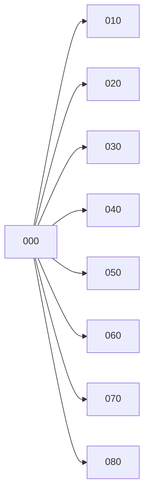

# Universal Transport System — Domain Taxonomy

*A structured semantic backbone for the ESSA, AMPEL360 and GAIA EU frameworks, defining functional categories that map to artefacts, evidences, roles, limits of use and certification processes.*

---

| Metadata         | Value                                             |
| ---------------- | ------------------------------------------------- |
| Document ID      | UTS-TAX-001                                       |
| Version          | 1.1                                               |
| Status           | DRAFT                                             |
| Author           | Amedeo Pelliccia                                  |
| Machine-readable | [`uts-taxonomy.yaml`](uts-taxonomy.yaml)          |
| Parent framework | IDEALE-ESG Aerospace pillar                       |
| Cross-references | ESSA/README.md, GAIA EU Domain Atlas, AMPEL360   |

---

## 1. Purpose

This document defines a **Universal Transport System (UTS) domain taxonomy** — a set of nine functional categories (codes 000–080) that serve as the semantic backbone for:

- **ESSA** — regulatory framework for civil space transportation,
- **AMPEL360** — hydrogen-electric aircraft architecture,
- **GAIA EU** — Domain Atlas model for AI admissibility and evidence governance.

Each category is a *functional space* that can be mapped to artefacts, evidences, roles, limits of use and processes.

---

## 2. Domain Categories

| Code  | Category                                     | Description                                                                                     |
| ----- | -------------------------------------------- | ----------------------------------------------------------------------------------------------- |
| **000** | **Human-Centric, Safety First, Use Experience** | Principles and cross-cutting requirements centred on people, safety and user experience.       |
| **010** | **Mission Systems**                           | Navigation, guidance, planning and mission execution support. Onboarding EGNOS and Galileo                                   |
| **020** | **Cyber & Connectivity**                      | Cybersecurity, communications, networks and resilient connectivity.                            |
| **030** | **Information & Intelligence**                | Sensors, perception, data fusion, inference and applied AI.                                    |
| **040** | **Digital Twin & Simulation**                 | Digital modelling, advanced simulation, virtual training and what-if analysis.                  |
| **050** | **Mechanics & Structure**                     | Mechanical engineering, structural integrity and physical loads.                               |
| **060** | **Energy & Materials**                        | Propulsion, energy generation/storage, advanced materials and reusability.                      |
| **070** | **Wiring & Integration**                      | Wiring, signal mapping, physical and logical subsystem integration.                            |
| **080** | **Transformations**                           | State conversion processes, interoperability, reconfiguration and technology adaptations.       |

---

## 3. Evidence & Artefact Mapping

Each category generates specific artefacts and minimum evidence requirements:

| Category | Artefact                        | Minimum evidence |
| -------- | ------------------------------- | ---------------- |
| 000      | Safety Impact Assessment        | SI-000           |
| 010      | Mission Profile & Trace         | MP-010           |
| 020      | Cybersecurity Compliance Report | CY-020           |
| 030      | Sensor Fusion Validation Report | IN-030           |
| 040      | Digital Twin Verification Pack  | DT-040           |
| 050      | Structural FEA Report           | MS-050           |
| 060      | Energy System Performance       | EN-060           |
| 070      | Integration Test Matrix         | WI-070           |
| 080      | Transformation Compliance Log   | TR-080           |

---

## 4. GAIA EU Domain Atlas Integration

Categories act as **axis dimensions** within the Domain Atlas, delimiting:

* which AI models are admissible,
* which evidence is required,
* which limits of use apply,
* which simulation and validation processes execute.

### Domain Cell Example

```yaml
domain_cell:
  cell_id: "CELL_030_040"
  axes:
    - code: "030"
      bounds: { metric: "perception_accuracy", min: 0.8, max: 1.0 }
    - code: "040"
      bounds: { metric: "sim_coverage", min: 0.5, max: 0.9 }
  admissibility:
    ai_use: "AI_ASSISTED"
    required_evidence:
      - "EV-030-001"
      - "EV-040-002"
  limits_of_use:
    - "LoU-030-005"
  signoff: "ESSA"
```

---

## 5. Pipeline Usage

### 5.1 Model Training Constraints

Define labelled training sets per category to guarantee adequate domain coverage during AI/ML model development.

### 5.2 Operational Limits & LoU

Each category associates with limits of use (LoU) and uncertainty metrics for adversarial AI controls.

### 5.3 Evidence Packaging

Evidence generated per category feeds *evidence packs* linked to an integral product certification bundle.

---

## 6. Extension Roadmap

The taxonomy can be extended for:

* **Sustainability / ESG** — impact metrics per category.
* **Human Factors** — subcategories for ergonomics and use within 000.
* **Hybrid Transport** — cross-category intersections for aero + space.
* **Autonomy & Assurance** — reliability and robustness attributes per category.

---

## 7. Operational Definitions

Enriched per-category definitions with key terms, units, interfaces and responsible roles.

### 000 — Human-Centric, Safety First, Use Experience

| Aspect     | Detail |
| ---------- | ------ |
| **Key terms** | Functional safety · Usability · User experience · Human ergonomics · Human factors |
| **Units** | Incidents per million hours · User Experience Score · Task completion time (s) |
| **Interfaces** | Human-system interfaces · Control panels · Operator HUDs · Status visualisation displays |
| **Roles** | Human Factors Engineer · Safety Assurance Lead · UX/Interaction Designer |

### 010 — Mission Systems

| Aspect     | Detail |
| ---------- | ------ |
| **Key terms** | Navigation · Guidance and control (GNC) · Mission planning · Real-time sensor integration |
| **Units** | Position (m) · Velocity (m/s) · Latency (ms) · Trajectory accuracy (m or deg) |
| **Interfaces** | GNSS/INS · Motion sensors · Aeronautical data buses |
| **Roles** | Mission Systems Engineer · GNC Specialist · Systems Integrator |

### 020 — Cyber & Connectivity

| Aspect     | Detail |
| ---------- | ------ |
| **Key terms** | Cybersecurity · Data communications · Resilient networks · Secure protocols · Firewalls |
| **Units** | Latency (ms) · Bandwidth (Mbps/Gbps) · Integrity/availability (% uptime) |
| **Interfaces** | Secure protocols (TLS/DTLS) · Network stacks · Aeronautical radios and data links |
| **Roles** | Cybersecurity Architect · Network Engineer · Connectivity Specialist |

### 030 — Information & Intelligence

| Aspect     | Detail |
| ---------- | ------ |
| **Key terms** | Perception · Sensor fusion · AI/ML inference · Contextual intelligence · Prediction |
| **Units** | Inference accuracy (%) · Detection rate (TPR/FPR) · Processing latency (ms) |
| **Interfaces** | Sensor APIs · Data ingestion pipelines · ML model endpoints |
| **Roles** | Data Scientist · AI/ML Engineer · Sensor Integration Engineer |

### 040 — Digital Twin & Simulation

| Aspect     | Detail |
| ---------- | ------ |
| **Key terms** | Digital twin · Real-time synchronised model · Simulation environments · Virtual training |
| **Units** | Prediction error (%) · Simulation-to-real-time ratio · Model validation metrics |
| **Interfaces** | Telemetry connectors · Simulation APIs · Synchronised physical/virtual models |
| **Roles** | Simulation Engineer · Digital Twin Architect · Integration Test Engineer |

### 050 — Mechanics & Structure

| Aspect     | Detail |
| ---------- | ------ |
| **Key terms** | Structural integrity · Static and dynamic loads · Durability |
| **Units** | Force (N) · Stress (Pa) · Strain (%) · Safety factor (dimensionless) |
| **Interfaces** | Strain gauges / load sensors · FEA structural models |
| **Roles** | Structural Engineer · Mechanics Specialist · FEA Analyst |

### 060 — Energy & Materials

| Aspect     | Detail |
| ---------- | ------ |
| **Key terms** | Energy propulsion · Energy storage · Advanced materials · Sustainability |
| **Units** | Energy (J, kWh) · Energy density (Wh/kg) · Energy efficiency (%) |
| **Interfaces** | Energy management systems (EMS/BMS) · System power supply interfaces |
| **Roles** | Energy Systems Engineer · Materials Scientist · Thermal Engineer |

### 070 — Wiring & Integration

| Aspect     | Detail |
| ---------- | ------ |
| **Key terms** | Wiring · Signal/data routing · Electrical integrity · Synchronisation |
| **Units** | Cable length (m) · Impedance (Ω) · Signal-to-noise ratio (SNR) |
| **Interfaces** | Data buses · E/E connectors · Integration protocols (ARINC/CAN) |
| **Roles** | Electrical Integration Engineer · Harness Specialist · E/E Architect |

### 080 — Transformations

| Aspect     | Detail |
| ---------- | ------ |
| **Key terms** | State transformations · Cross-domain interoperability · Adaptive configuration · Energy/data/physical-state conversion |
| **Units** | Transformation rate (% completed) · Transition latency (ms) |
| **Interfaces** | ETL/ELT pipelines · Interoperability services · Data transformation APIs |
| **Roles** | Process Integration Engineer · Transformation/Data Pipeline Engineer · Automation Engineer |

---

## 8. Taxonomy Visualisation



---

## Related Artefacts

| File                                                      | Purpose                                              |
| --------------------------------------------------------- | ---------------------------------------------------- |
| [`uts-taxonomy.yaml`](uts-taxonomy.yaml)                  | Machine-readable taxonomy specification              |
| [`../ESSA/README.md`](../ESSA/README.md)               | European Union Space Safety Agency spec  |
| [`../ESSA/essa-regulatory-framework.yaml`](../ESSA/essa-regulatory-framework.yaml) | ESSA machine-readable regulatory framework |
